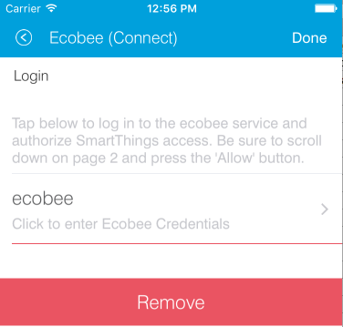
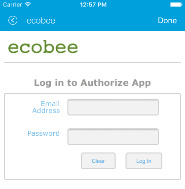
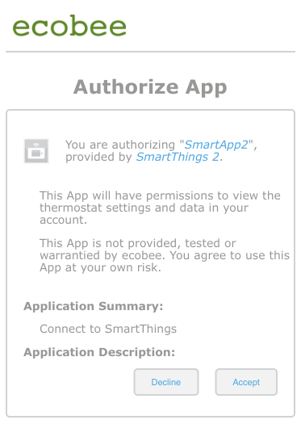
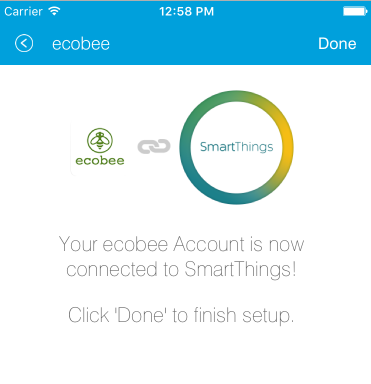

Building the Service Manager
============================

The Service Manager's responsibilities are to:

- Authenticate with the 3rd party cloud service
- Device discovery
- Add/Change/Delete device actions
- Handle sending any messages that require the authentication obtained.

We will look at a detailed example of what is outlined above. But first, let's see an example of how what we are trying to
accomplish would look like in the SmartThings application.

Authentication using OAuth
--------------------------

Web Browser Flow
~~~~~~~~~~~~~~~~

The experience for the end user will be fairly seamless. They will go
through the following steps (illustrated using the Ecobee Thermostat)

The user selects the Service Manager application from the SmartApps
within the SmartThings app. Upon selection, they are prompted with an
initial landing page, describing what the application does and a link to
configure.

.. figure:: ../../img/device-types/cloud-connected/building-cloud-connected-device-types/configure-screen.png
:alt: Thermostat

Authorization with the third party is the first part of the
configuration process. The user is driven to a page which tells them
about the authorization process and how it will work. They can then
click a link to move forward.

:alt: Thermostat

The user will be driven to a third party site, embedded within the
SmartThings application chrome. They will be required to put in their
username and password for the third party service.

:alt: Thermostat

The third party server will show what SmartThings will have access to
and give the user the opportunity to accept or decline.

:alt: Thermostat

Upon acceptance, the user will be redirected to another page within the
third party service. This page includes language about the end user
clicking done on the top right of the SmartThings chrome.

:alt: Thermostat

After done is clicked, the user will go back to the initial
configuration screen, seeing that their device is now connected. They
can then click next to continue, and any other configuration can be
done.

.. figure:: ../../img/device-types/cloud-connected/building-cloud-connected-device-types/st-authorization-complete.png
:alt: Thermostat

Password Flow
~~~~~~~~~~~~~

OAuth is the typical industry standard for authentication. The 3rd party service may use something other than OAuth.
In that case, it is up to you to consult their documentation and implement it. The basic concepts will be the same as
it is with OAuth. The following example will walk through what is necessary for OAuth authentication.

The overall idea is that you will create a page that will call out to
the third party API and then map a URL to a handlerLoads method to be
able to handle a response back with an access token.

Within your service manager preferences, you create a page for
authorization.

.. code-block:: groovy

    preferences {
        page(name: "Credentials", title: "Sample Authentication", content: "authPage", nextPage: "sampleLoggedInPage", install: false)
        ...
    }

and define it within a method below.

.. code-block:: groovy

    def authPage() {
        if(!state.sampleAccessToken)
            createAccessToken()
    }

The ``authPage`` method simply checks to see if there already is an access token. If not, we call a method to retrieve one.
Lets take a look at the ``createAccessToken`` method next.

.. code-block:: groovy

    def createAccessToken() {

        state.oauthInitState = UUID.randomUUID().toString()
        def oauthParams = [
            response_type: "token",
            client_id: "XXXXXXX",
            redirect_uri: "https://graph.api.smartthings.com/api/token/${state.accessToken}/smartapps/installations/${app.id}/receiveToken"
        ]
        def redirectUrl = "https://api.thirdpartysite.com/v1/oauth2/authorize?"+ toQueryString(oauthParams)

        return dynamicPage(name: "Credentials", title: "Sample", nextPage:"sampleLoggedInPage", uninstall: uninstallOption, install:false) {
            section {
                href url:redirectUrl, style:"embedded", required:false, title:"Sample", description:"Click to enter Sample Credentials."
            }
        }
    }

First, setup the params for your OAuth request. Then return a new page, created by the redirect URL. Finally, load up the OAuth
initialization URL embedded within the app.

Once the user has authenticated through the third-party, they will be
sent back to your SmartApp, and their callback needs to be handled
properly.

To handle the callback, you can map a URL within your service manager.
As specified, the callback will go to the following URL.

.. code-block:: groovy

    mappings {
        path("/receiveToken") {
            action: [
                POST: "receiveToken",
                GET: "receiveToken"
            ]
        }
    }

You also need to setup a relevant handler method that will take the
access\_token passed and save it in the state (which will persist over
time). This handler should also indicate to the end user that they need
to click the done button to exit the external third party flow and go
back to your SmartApp.

.. code-block:: groovy

    def receiveToken() {
        state.sampleAccessToken = params.access_token
        render contentType: 'text/html', data: "<html><body>Saved. Now click 'Done' to finish setup.</body></html>"
    }

Refreshing the OAuth Token
~~~~~~~~~~~~~~~~~~~~~~~~~~

OAuth tokens are available for a finite amount of time, so you will
often need to account for this, and if needed, refresh your
access\_token. To do this, you need to store the refresh\_token in your
state, like so:

.. code-block:: groovy

    def receiveToken() {
        state.sampleAccessToken = params.access_token
        state.sampleRefreshToken = params.refresh_token
        render contentType: 'text/html', data: "<html><body>Saved. Now click 'Done' to finish setup.</body></html>"
    }

If you run an API request and your access\_token is determined invalid, for example:

.. code-block:: groovy

    if (resp.status == 401 && resp.data.status.code == 14) {
        log.debug "Storing the failed action to try later"
        atomicState.action = "actionCurrentlyExecuting"
        log.debug "Refreshing your auth_token!"
        refreshAuthToken()
    }

you can use your refresh\_token to get a new access\_token. To do this,
you just need to post to a specified endpoint and handle the response
properly.

.. code-block:: groovy

    private refreshAuthToken() {
        def refreshParams = [
            method: 'POST',
            uri: "https://api.thirdpartysite.com",
            path: "/token",
            query: [grant_type:'refresh_token', code:"${state.sampleRefreshToken}", client_id:XXXXXXX],
        ]
        try{
            def jsonMap
            httpPost(refreshParams) { resp ->
                if(resp.status == 200)
                {
                    jsonMap = resp.data
                    if (resp.data) {
                        state.sampleRefreshToken = resp?.data?.refresh_token
                        state.sampleAccessToken = resp?.data?.access_token
                }
            }
        }
    }

There are some outbound connections in which we are using OAuth to
connect to a third party device cloud (Ecobee, Quirky, Jawbone, etc). In
these cases it is the third party device cloud that issues an OAuth
token to us so that we can call their APIs.

However these same third party device clouds also support webhooks and
subscriptions that allow us to receive notifications when something
changes in their cloud.

In this case and ONLY in this case the SmartApp (service manager) issues
its OWN OAuth token and embeds it in the callback URL as a way to
authenticate the post backs from the external cloud.

Discovery
---------

Identifying Devices in the Third-Party Device Cloud
~~~~~~~~~~~~~~~~~~~~~~~~~~~~~~~~~~~~~~~~~~~~~~~~~~~

The techniques you will use to identify devices in the third party
cloud will vary, because you are interacting with unique third party
APIs which all have unique parameters. Typically you will authenticate
with the third party API using OAuth. Then call an API specific method.
For example, it could be as simple as this:

.. code-block:: groovy

    def deviceListParams = [
        uri: "https://api.thirdpartysite.com",
        path: "/get-devices",
        requestContentType: "application/json",
        query: [token:"XXXX",type:"json" ]

    httpGet(deviceListParams) { resp ->
            //Handle the response here
    }

Creating Child-Devices
~~~~~~~~~~~~~~~~~~~~~~

Within a service manager SmartApp, you create child devices for all your
respective cloud devices.

.. code-block:: groovy

    settings.devices.each {deviceId->
        def device = state.devices.find{it.id==deviceId}
          if (device) {
            def childDevice = addChildDevice("smartthings", "Device Name", deviceId, null, [name: "Device.${deviceId}", label: device.name, completedSetup: true])
      }
    }

Getting Initial Device State
~~~~~~~~~~~~~~~~~~~~~~~~~~~~

Upon initial discovery of a device, you need to get the state of your
device from the third party API. This would be the current status of
various attributes of your device. You need to have a method defined in
your Service Manager that is responsible for connecting to the API and
checking for updates. You set this method to be called from a poll
method in your device type, and in this case, it is called immediately
on initialization. Here is a very simple example, which doesn't take
into account error checking for the http request.

.. code-block:: groovy

    def pollParams = [
        uri: "https://api.thirdpartysite.com",
        path: "/device",
        requestContentType: "application/json",
        query: [format:"json",body: jsonRequestBody]

    httpGet(pollParams) { resp ->
        state.devices = resp.data.devices { collector, stat ->
        def dni = [ app.id, stat.identifier ].join('.')
        def data = [
            attribute1: stat.attributeValue,
            attribute2: stat.attribute2Value
        ]
        collector[dni] = [data:data]
        return collector
        }
    }

Handling Adds, Changes, Deletes
-------------------------------

Implicit Creation of New Child Devices
~~~~~~~~~~~~~~~~~~~~~~~~~~~~~~~~~~~~~~

When you update your settings in a Service Manager to add additional
devices, the Service Manager needs to respond by adding a new device
in SmartThings.

.. code-block:: groovy

    updated(){
        initialize()
    }

    initialize(){
        settings.devices.each {deviceId ->
            try {
                def existingDevice = getChildDevice(deviceId)
                if(!existingDevice) {
                    def childDevice = addChildDevice("smartthings", "Device Name", deviceId, null, [name: "Device.${deviceId}", label: device.name, completedSetup: true])
                }
            } catch (e) {
                log.error "Error creating device: ${e}"
            }
        }
    }

Implicit Removal of Child Devices
~~~~~~~~~~~~~~~~~~~~~~~~~~~~~~~~~

Similarly when you remove devices within your Service Manager, they
need to be removed from SmartThings.

.. code-block:: groovy

    def delete = getChildDevices().findAll { !settings.devices.contains(it.deviceNetworkId) }

    delete.each {
        deleteChildDevice(it.deviceNetworkId)
    }

Also, when a Service Manager SmartApp is uninstalled, you need to remove
its child devices.

.. code-block:: groovy

    def uninstalled() {
        removeChildDevices(getChildDevices())
    }

    private removeChildDevices(delete) {
        delete.each {
            deleteChildDevice(it.deviceNetworkId)
        }
    }

.. note:: The addChildDevice, getChildDevices, and deleteChildDevice methods are a part of the :ref:`smartapp_ref` API

Changes in Device Name
~~~~~~~~~~~~~~~~~~~~~~

The device name is stored within the device and you need to monitor if
it changes in the third party cloud.

Explicit Delete Actions
~~~~~~~~~~~~~~~~~~~~~~~

When a user manually deletes a device within the Things screen on the
client device, you need to delete the child devices from within the
Service Manager.