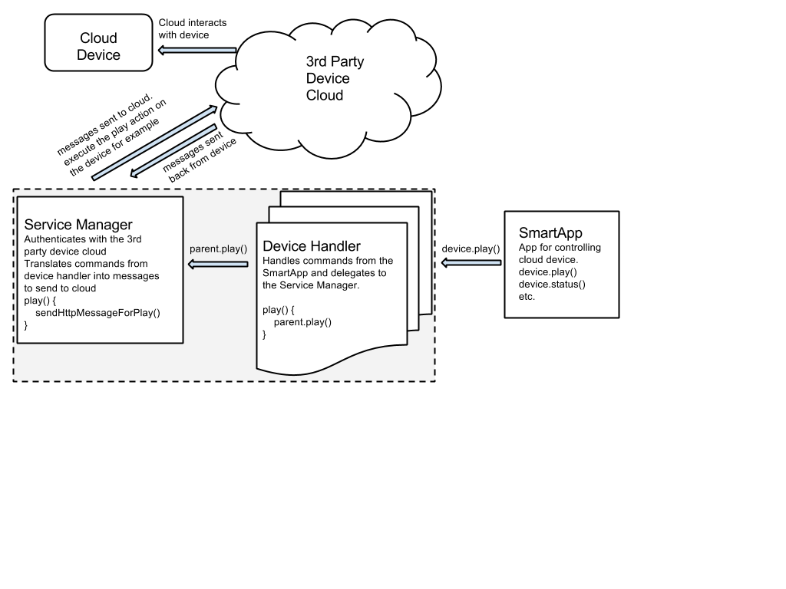

Division of Labor
=================

The cloud connected device paradigm consists of a Service Manager and Device Handlers. The purpose of this guide is
to introduce you to the core concepts of cloud connected device development, and provide some examples to help you get
started.

Service-Manager Responsibilities
--------------------------------

The service manager is responsible for the discovery of the devices. It
sends out a request to a third party cloud and parses through the
response, finding just the devices you are looking for. Upon discovery,
it allows you to add device(s) that it has found. From there, it saves
your connection to be able to make future interactions with the device.

Device Handler Responsibilities
-------------------------------

The device handler is responsible for creating and receiving device
specific messages, and allowing them to work within the SmartThings
infrastructure. It takes in a SmartApp specific command and outputs
device specific commands to be passed to the cloud. It also allows you
to subscribe to responses from the device and trigger other commands as
needed.

How It All Works
----------------

The following depiction gives a general overview of how a cloud connected device works. Take note of
the Service Manager and Device Handler. We will dive into how to build these next.

