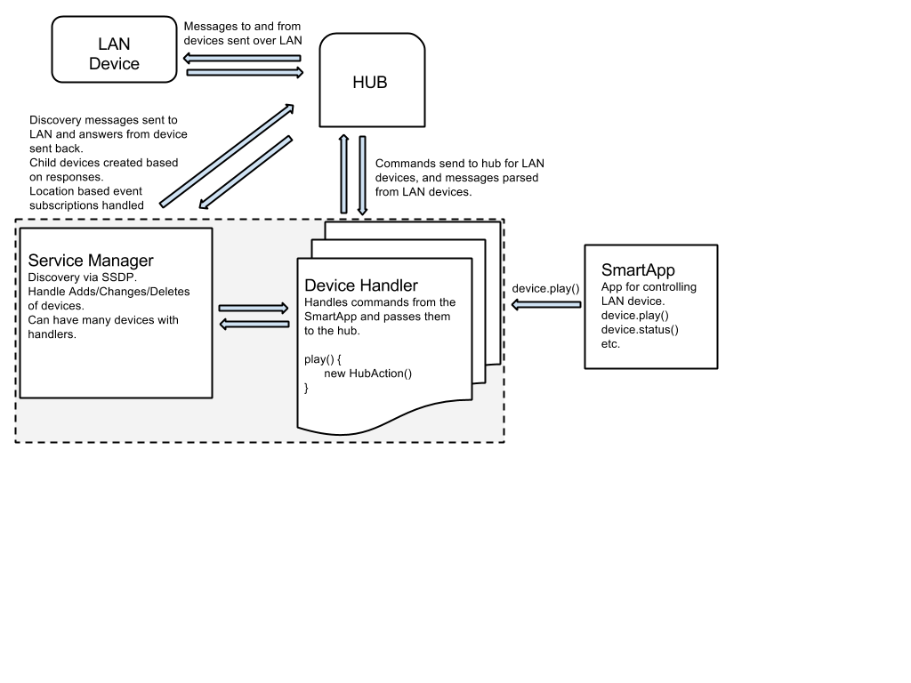

Division of Labor
=================

The LAN connected device paradigm consists of a Service Manager and Device Handlers. The purpose of this guide is
to introduce you to the core concepts of LAN connected device development, and provide some examples to help you get
started.

Service-Manager Responsibilities
--------------------------------

The service manager is responsible for the discovery of the devices. It
sends out a request and parses through the response, finding just the
devices you are looking for. Upon discovery, it allows you to add
device(s) that is has found. From there, it saves your connection to be
able to make future interactions with the device.

Device Handler Responsibilities
-------------------------------

The device type is responsible for creating and receiving device
specific messages, and allowing them to work within the SmartThings
infrastructure. It takes in a SmartApp specific command and outputs
device specific commands. It also allows you to subscribe to responses
from the device and trigger other commands as needed.

How It All Works
----------------

