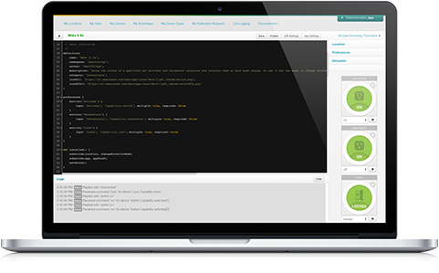

================
Writing the Docs
================

This document outlines how this documentation should be formatted.

----

Page Structure
--------------

Each document should be named with a ``.rst`` file extension.
Each page is composed of a title, followed by some short text outlining the purpose of the document.

Sections should be delimited by ``----``, to insert a line separator.

The structure should look like this:

.. code-block:: rst

    ==========
    Page Title
    ==========

    Some introductory material.

    ----

    Section 1
    ---------

    Section text.

    ----

    Section 2
    ---------

    Section text.

    Subsection 2.1
    ^^^^^^^^^^^^^^

    Subsection text.

Page Title
^^^^^^^^^^

Page titles appear at the top of the document, and have a row of ``===`` characters above and below.
Page titles should have title capitalization:

.. code-block:: rst

    ====================
    This is a Page Title
    ====================

Headings
^^^^^^^^

Top-level section headings are followed by a row of ``---`` characters.
They should also have title capitalization:

.. code-block:: rst

    This is a Section
    -----------------

Subsection headings are followed by a row of ``^^`` characters.
Only the first word of a subsection title should be capitalized.

.. code-block:: rst

    This is a Section
    -----------------

    This is a subsection
    ^^^^^^^^^^^^^^^^^^^^

.. note::

    Not all documents currently follow the guideline of using ``^^^`` for subsections.
    If you are editing a document and see a different heading syntax, feel free to change it.

----

reStructuredText Syntax
-----------------------

Links
^^^^^

Links to external targets look like this:

.. code-block:: rst

    `SmartThings <http://smartthings.com>`_

Links to sections within the document can be included like this:

.. code-block:: rst

    Section Name
    ------------

    See `Other Section`_ for more information.

    Other Section
    -------------

The ``:ref:`` target allows us to link to other documents or document sections.
It requires placing a label above a section, title, or image:

.. code-block:: rst

    .. _section_label:

    Some Section
    ------------

Another document can then link to ``Some Section`` like this:

.. code-block:: rst

    See :ref:`section_label` for more information.

Lists
^^^^^

Ordered lists appear like this:

.. code-block:: rst

    #. Item 1
    #. Item 2
    #. Item 3

Which results in:

#. Item 1
#. Item 2
#. Item 3

Unordered lists use a ``-`` or ``*`` character:

.. code-block:: rst

    - First bullet
    - Second bullet

Inline Markup
^^^^^^^^^^^^^

- Surround text with \* for *italics text*.
- Surround text with \** for **strong text**.
- Surround text with \`` for code samples (``someMethod()``).

When referring to method calls in the documentation, place ``()`` after the method name: ``methodName()``.
This helps distinguish methods from other code literals.

Code Examples
^^^^^^^^^^^^^

Code blocks can be included using the ``code-block`` directive.
Use the appropriate language for the code sample.
Code blocks may appear with line numbers (use ``:linenos:``) and may emphasize certain lines:

.. code-block:: rst

    .. code-block:: groovy
        :linenos:
        :emphasize-lines: 3

        def someMethod() {
            def myVar = 14
            doSomethingAmazing(myVar)
        }

The above code block renders as:

.. code-block:: groovy
    :linenos:
    :emphasize-lines: 3

    def someMethod() {
        def myVar = 14
        doSomethingAmazing(myVar)
    }

Images
^^^^^^

Images are found in the ``/img`` directory of the documentation, and can be included like this (you may need to alter the path depending on the location of the document):

.. code-block:: rst

    .. image:: ../img/getting-started/building-img.png

The above will render as:

Admonitions
^^^^^^^^^^^

Admonitions are ways of calling out certain bodies of text:

.. code-block:: rst

    .. note::

        A note provides more information about the content, in a side-bar like format.

    .. tip::

        A tip is some extra information that while not strictly necessary, may lead to the reader learning a new way of doing something.

    .. warning::

        A warning is just that - a warning of something that the reader should be aware of.

    .. error::

        An error is for error conditions.

The above results in:

.. note::

    A note provides more information about the content, in a side-bar like format.

.. tip::

    A tip is some extra information that while not strictly necessary, may lead to the reader learning a new way of doing something.

.. warning::

    A warning is just that - a warning of something that the reader should be aware of.

.. error::

    An error is for error conditions.

Tables
^^^^^^

Simple tables in RST look like this:

.. code-block:: rst

    ========= =========
    Heading 1 Heading 2
    ========= =========
    1.1       1.2
    2.1       2.2
    ========= =========

The above renders as:

========= =========
Heading 1 Heading 2
========= =========
1.1       1.2
2.1       2.2
========= =========

Grid tables can be written like this:

.. code-block:: rst

    +------------+------------+-----------+
    | Header 1   | Header 2   | Header 3  |
    +============+============+===========+
    | body row 1 | column 2   | column 3  |
    +------------+------------+-----------+
    | body row 2 | Cells may span columns.|
    +------------+------------+-----------+
    | body row 3 | Cells may  | - Cells   |
    +------------+ span rows. | - contain |
    | body row 4 |            | - blocks. |
    +------------+------------+-----------+

Which results in:

+------------+------------+-----------+
| Header 1   | Header 2   | Header 3  |
+============+============+===========+
| body row 1 | column 2   | column 3  |
+------------+------------+-----------+
| body row 2 | Cells may span columns.|
+------------+------------+-----------+
| body row 3 | Cells may  | - Cells   |
+------------+ span rows. | - contain |
| body row 4 |            | - blocks. |
+------------+------------+-----------+

----

Writing Style and Miscellaneous Tips
------------------------------------

- Spell check before committing.
- Show, don't tell - include example code.
- Place each sentence on a new line to help with review and readability.
- Not all documents currently follow these guidelines. See the `Contributing <https://github.com/SmartThingsCommunity/Documentation/blob/master/README.md>`_ guide to learn how you can contribute, and help address that. :)

----

Further Reading
---------------

- `Sphinx documentation <http://sphinx-doc.org/contents.html>`_
- `reStructuredText Reference <http://docutils.sourceforge.net/docs/user/rst/quickref.html>`_
