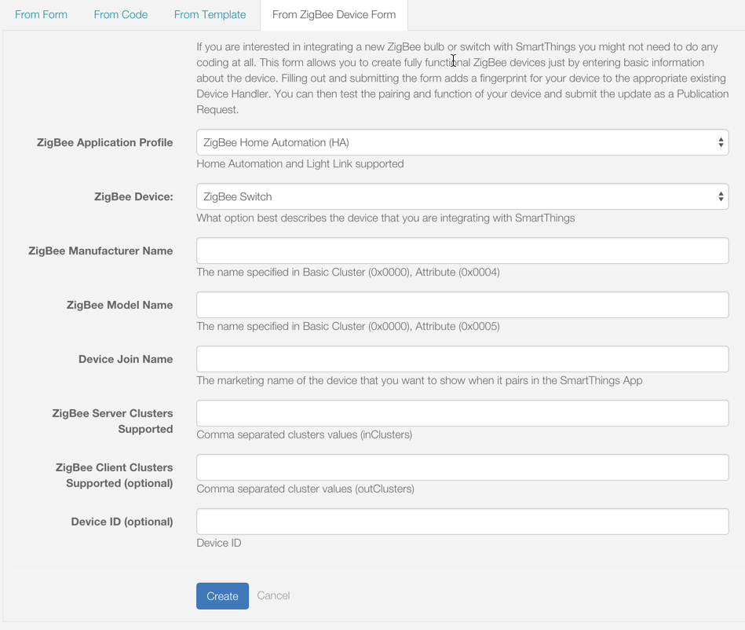

Building ZigBee Device Handlers
===============================

.. note::

    If you are integrating a new ZigBee switch or bulb with SmartThings, see the :ref:`zigbee_device_form` section below to learn how you can integrate these devices without the need to write code.


Commands
--------

SmartThings provides a library to make working with ZigBee easier.
Every Device Handler has a reference to this library injected into it, with the name ``zigbee``.

This library will be used in the examples below.
You can see the :ref:`zigbee_ref` for more detailed documentation.

There are four common ZigBee commands that you will use to integrate
SmartThings with your ZigBee Devices.

Read
````

Read gets the devices current state and is formatted like this:

.. code-block:: groovy

    def refresh() {
        zigbee.readAttribute(0x0B04, 0x050B)
    }

In this example, the device type (from the "CentraLite Switch" device
type) is calling the "refresh" function. It is sending a ZigBee Read
Attribute request via the ``readAttribute()`` method to read the current state (the active power draw). The
cluster we are reading here is Electrical Measurement (0xB04) and
specifically the Active Power Attribute (0x50B).

+-------------------------------+-----------------------------+
| Component                     | Description                 |
+===============================+=============================+
|0x0B04                         | Cluster                     |
+-------------------------------+-----------------------------+
|0x050B                         | Attribute                   |
+-------------------------------+-----------------------------+

Write
`````

Write sets an attribute of a ZigBee device and is formatted like this:

.. code-block:: groovy

    def configure() {
            zigbee.writeAttribute(8, 0x10, 0x21, 0x0014)
        }

In this example (from the "ZigBee Dimmer" device type) we are writing to
an attribute to set the amount of time it takes for a light to fully dim
on and off. Here we are using the Level Control Cluster (8) to write to
the attribute that defines on and off transition time (0x10). The value
we are using is formatted in an Unsigned 16-bit integer (0x21) with the
payload being in 1/10th of a second. In this case the payload ({0014})
translates to 2 seconds. Breaking the payload down we see that the hex value
of 0x0014 equals the decimal value of 20. 20 * 1/10 of a second equals 2 seconds.

.. note::
  The payload in the example above, {0014}, is a hex string. The length of the payload must be two times the length of the data type. For example, if the datatype is 16-bit, then the payload should be 4 hex digits.

+-------------------------------+-----------------------------+
| Component                     | Description                 |
+===============================+=============================+
|8                              |Cluster                      |
+-------------------------------+-----------------------------+
|0x10                           |Attribute Set                |
+-------------------------------+-----------------------------+
|0x21                           |Data Type                    |
+-------------------------------+-----------------------------+
|0x0014                         |Payload                      |
+-------------------------------+-----------------------------+

Command
```````

Command invokes a command on a ZigBee device and is formatted like this:

.. code-block:: groovy

    def on() {
        zigbee.command(0x0006, 0x01)
    }

In this example (from the "ZigBee Dimmer" device type) we are sending a
ZigBee Command to turn the device on. We use the On/Off Cluster (6) and
send the command to turn on (1). This commands has no payload, so we exclude
it from the passed in parameters.

+-------------------------------+-----------------------------+
| Component                     | Description                 |
+===============================+=============================+
|0x0006                         |Cluster                      |
+-------------------------------+-----------------------------+
|0x01                           |Command                      |
+-------------------------------+-----------------------------+

Configure
`````````

Configure reporting instructs a device to notify us when an attribute changes and is
formatted like this:

.. code-block:: groovy

    def configure() {
        configureReporting(0x0006, 0x0000, 0x10, 0, 600, null)
    }

In this example (using the "CentraLite Switch" device type), the bind
command is sent to the device using its Network ID which can be
determined using 0x${device.deviceNetworkId}. Then using source and
destination endpoints for the device and hub (1 1), we bind to the
On/Off Clusters (6) to get events from the device. The last part of the
message contains the hub's ZigBee id which is set as the location for
the device to send callback messages to. Note that not at all devices
support binding for events.

+-------------------------------+-----------------------------+
| Component                     | Description                 |
+===============================+=============================+
|0x0006                         |Cluster                      |
+-------------------------------+-----------------------------+
|0x0000                         |Attribute ID                 |
+-------------------------------+-----------------------------+
|0x10                           |Boolean data type            |
+-------------------------------+-----------------------------+
|0                              |Minimum report time          |
+-------------------------------+-----------------------------+
|600                            |Maximum report time          |
+-------------------------------+-----------------------------+
|null                           |Reportable change (discrete) |
+-------------------------------+-----------------------------+

----

ZigBee Utilities
----------------

In order to work with ZigBee you will need to use the ZigBee Cluster
Library extensively to look up the proper values to send back and forth
to your device. You can download this document
`here <http://www.zigbee.org/download/standards-zigbee-cluster-library/>`__.

There is also a ZigBee utility class covered in the :ref:`zigbee_ref`

----

Best Practices
--------------

- The use of 'raw ...' commands is deprecated. Instead use the documented methods on the zigbee library. If you need to do something that requires the use of a 'raw' command let us know and we will look at adding it to the zigbee library.
- Do not use sendEvent() in command methods. Sending events should be handled in the parse method.

----

.. _zigbee_device_form:

Using the ZigBee Device Form
----------------------------

To integrate a new ZigBee switch or bulb with SmartThings, you can use the *From ZigBee Device Form*.



What it does
````````````

By entering the ZigBee information for the device in the form, the appropriate existing Device Handler will be updated with the device's fingerprint.

Use it if
`````````

- You are the device manufacturer, or otherwise have access to the required ZigBee device information requested on the form.
- The device is best described as one of the following:

    - ZigBee Switch
    - ZigBee Switch with Power
    - ZigBee Dimmer/Bulb
    - ZigBee Dimmer/Bulb with Power
    - ZigBee Color Temperature Bulb

How to use
``````````

Simply fill out the required fields in the form with the information for the device, and click Create.

You will then see the updated Device Handler code in the IDE editor.
You can then test that your device pairs with SmartThings and functions as expected, and then make an update as a Publication Request.
