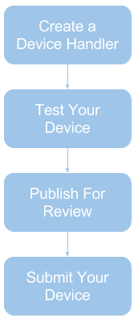

Device Certification Overview
=============================

Because we offer an open platform, a wide range of devices can be certified to work with SmartThings.  Currently, anybody can submit a device for certification at no cost.  Certifying your device will provide a great experience for users, meaning that your device works seamlessly with the rest of the SmartThings platform.

Examples of devices already certified to work with SmartThings can be viewed `here <https://www.smartthings.com/works-with-smartthings/>`_.

The device certification process consists of the following steps:

1. **Create** a virtual representation of your device using a :ref:`device_type_dev_guide`
2. **Test** the device handler by publishing it to your account and pairing your device with your hub
3. Once you’ve successfully tested your device handler, **submit** it for publication
4. The SmartThings certification team will contact you about how to **ship** your device to us and complete the certification process

|
|
|
|
|
|
|
|
|
|

We’re always looking for ways to improve and shorten the time it takes to certify devices.  Stay tuned for future improvements!
