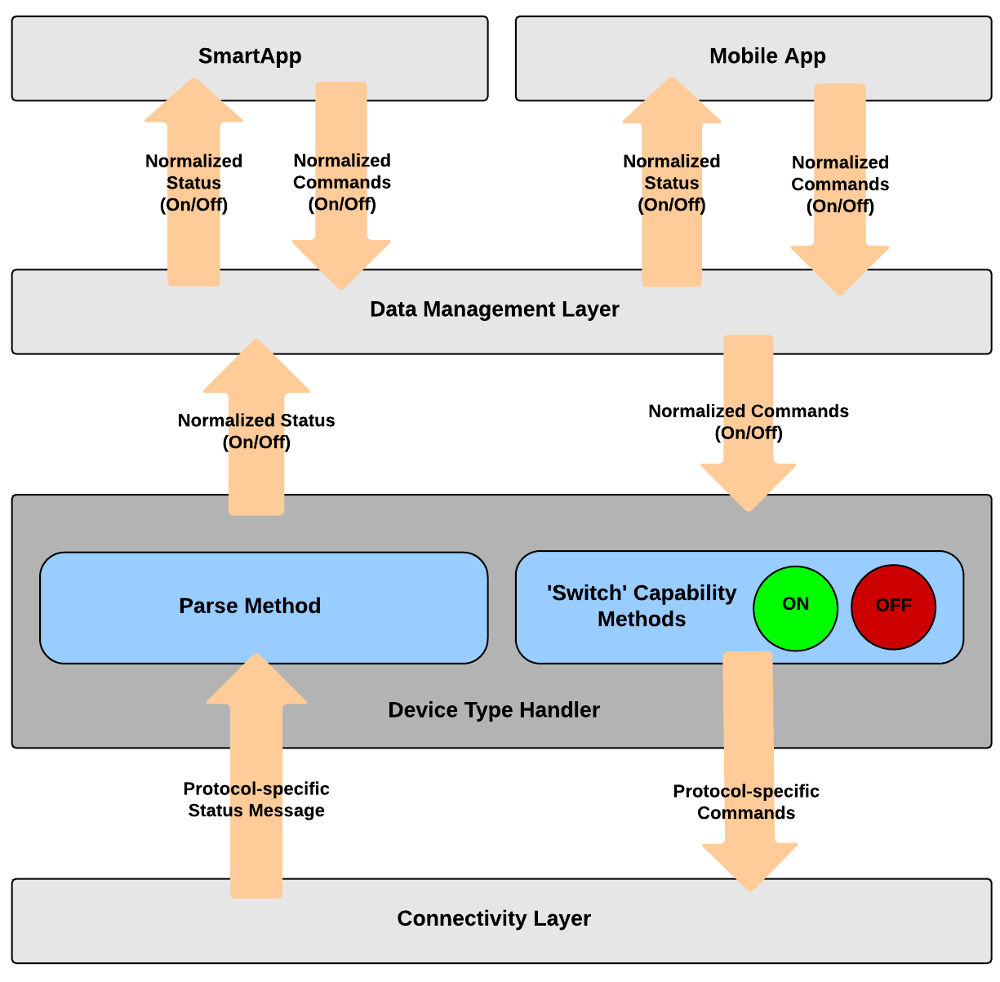

Overview
========

The SmartThings architecture provides a unique abstraction of devices
from their distinct capabilities and attributes in a way that allows
developers to build applications that are insulated from the specifics
of which device they are using. For example, there are lots of
wirelessly controllable “switches”. A switch is any device that can be
turned On or Off.

When a SmartApp interacts with the virtual representation of a device,
it knows that the device supports certain actions based on its
capabilities. A device that has the "switch" capability must support
both the "on" and "off" actions. In this way, all switches are the same,
and it doesn't matter to the SmartApp what kind of switch is actually
involved.

This virtual representation of the device is called a device handler, or SmartDevice.

.. note::

    This layer of abstraction is key to the successful function and flexibility of the SmartThings platform. Architecturally, device handlers are the bridge between generic capabilities and the device or protocol specific interface actually used to communicate with the device.

The diagram below depicts where device handlers sit in the
SmartThings architecture.

In the example shown above, the job of the device handler (that is
implementing the "switch" capability) is to parse incoming,
protocol-specific status messages from the device and turn them into
normalized "events". It is also responsible for accepting normalized
commands (such as "on" and "off") and turning those into the
protocol-specific commands that can be sent to the device to affect the
desired action.

For example, for a Z-Wave compatible on-off switch, the incoming status
messages used by the device to report an "on" or "off" state are as
shown below:

==============	=================================
Device Command	Protocol-Specific Command Message
==============	=================================
on				command: 2003, payload: FF
off				command: 2003, payload: 00
==============	=================================

Whereas the device status reported to the SmartThings platform for the
device is literally just a simple "on" or "off".

Similarly, when a SmartApp or the mobile app invoked an "on" or "off"
command for a switch device, the command that is sent to the device handler is just that simple: "on" or "off". The device handler must
turn that simple command into a protocol-specific message that can be
sent down to the device to affect the desired action.

The table below shows the actual Z-Wave commands that are sent to a
Z-Wave switch by the device handler.

==============	=================================
Device Command	Protocol-Specific Command Message

On				2001FF
Off				200100
==============	=================================

Core Concepts
-------------

To understand how device handlers work, a few core concepts need to be discussed.

Capabilities
~~~~~~~~~~~~

Capabilities are the interactions that a device allows. They provide an abstraction layer that allows SmartApps to work with devices based on the capabilities they support, and not be tied to a specific manufacturer or model.

Consider the example of the "Switch" capability. In simple terms, a switch is a device that can turn on and off. It may be that a switch in the traditional sense (for example an in-wall light switch), a connected bulb (a Hue or Cree bulb), or even a music player. All of these unique devices have a device handler, and those device handler's support the "Switch" capability. This allows SmartApps to only require a device that supports the "Switch" capability and thus work with a variety of devices including different manufacturer and model-specific "switches". The SmartApp can then interact with the device knowing that it supports the "on" and "off" command (more on commands below), without caring about the specific device being used.

This code illustrates how a SmartApp might interact with a device that supports the "Switch" capability:

.. code-block:: groovy

    preferences() {
        section("Control this switch"){
            input "theSwitch", "capability.switch", multiple: false
        }
    }

    def someEventHandler(evt) {
        if (someCondition) {
            theSwitch.on()
        } else {
            theSwitch.off()
        }

        // logs either "switch is on" or "switch is off"
        log.debug "switch is ${theSwitch.currentSwitch}"
    }

The above example illustrates how a SmartApp requests a device that supports the "Switch" capability. When installing the SmartApp, the user will be able to select any device that supports the "Switch" capability - be it an in-wall light switch, a connected bulb, a music player, or any other device that supports the "Switch" capability.

The :ref:`capabilities_taxonomy` outlines all the supported capabilities.

Device handlers typically support more than one capability. A device handler for a Hue bulb would support the "Switch" capability as well as the "Color Control" capability. This allows SmartApps to be written in a very flexible manner.

Commands and attributes deserve their own discussion - let's dive in.

Commands
~~~~~~~~

Commands are the actions that your device can do. For example, a switch can turn on or off, a lock can lock or unlock, and a valve can open or close. In the example above, we issue the "on" and "off" command on the switch by invoking the ``on()`` or ``off()`` methods.

Commands are implemented as methods on the device handler. When a device supports a capability, it is responsible for implementing all the supported command methods.

Attributes
~~~~~~~~~~

Attributes represent particular state values for your device. For example, the switch capability defines the attribute "switch", with possible values of "on" and "off".

In the example above, we get the value of the "switch" attribute by using the "current<attributeName>" property (``currentSwitch``).

Attribute values are set by creating events where the attribute name is the name of the event, and the attribute value is the value of the event. This is discussed more in the `Parse and Events documentation <parse.html#parse-events-and-attributes>`__

Like commands, when a device supports a capability, it is responsible for ensuring that all the capability's attributes are implemented.

Actuator and Sensor
~~~~~~~~~~~~~~~~~~~

If you look at the :ref:`capabilities_taxonomy` , you'll notice two capabilities that have no attributes or commands - "Actuator" and "Sensor".

These capabilities are "marker" or "tagging" capabilities (if you're familiar with Java, think of the Cloneable interface - it defines no state or behavior).

The "Actuator" capability defines that a device has commands. The "Sensor" capability defines that a device has attributes.

If you are writing a device handler, it is a best practice to support the "Actuator" capability if your device has commands, and the "Sensor" capability if it has attributes. This is why you'll see most device handlers supporting one of, or both, of these capabilities.

The reason for this is convention and forward-looking abilities - it can allow the SmartThings platform to interact with a variety of devices if they *do* something ("Actuator"), or if they report something ("Sensor").

Protocols
---------

SmartThings currently supports both the `Z-Wave <http://en.wikipedia.org/wiki/Z-Wave>`__ and `ZigBee <http://en.wikipedia.org/wiki/ZigBee>`__ wireless protocols.

Since the device handler is responsible for communicating between the device and the SmartThings platform, it is usually necessary to understand and communicate in whatever protocol the device supports. This guide will discuss both Z-Wave and ZibBee protocols at a high level.

Execution Location
------------------

With the original SmartThings hub, all Device handlers execute in the SmartThings cloud. With the new Samsung SmartThings hub, certain Device handlers may run locally on the hub or in the SmartThings cloud. Execution location varies depending on a variety of
factors, and is managed by the SmartThings internal team.

As a SmartThings developer, you should write your device handlers to satisfy their specific use cases, regardless of where the
handler executes. There is currently no way to specify or force a certain execution location.

Rate Limiting
-------------

Like SmartApps, Device Handlers are restricted to executing no more than 250 times in a 60 second window. Execution attempts exceeding this limit will be prevented, and a message will be logged indicating that the limit has been reached. The count will start over when the current time window closes, and the next begins.

Common causes for exceeding this limit are a SmartApp that sends many commands to one device by receiving a large number of event subscriptions (if that doesn’t first hit the limit for SmartApps). For example, DLNA players that are extremely chatty or devices that bind to frequently changing energy/power values may also encounter this limit.
