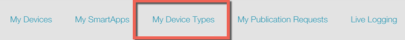
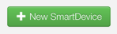
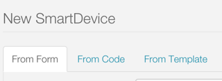
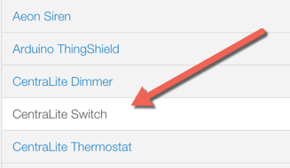
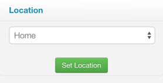
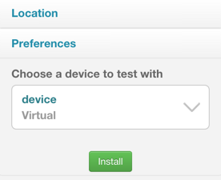
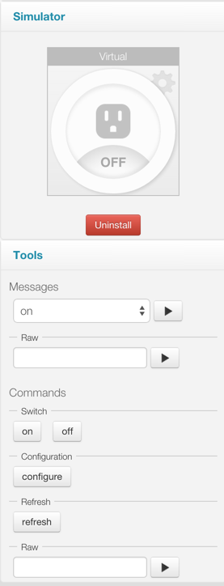

Quick Start
===========

Device handlers are the virtual representation of a physical device in the SmartThings platform. They are responsible for communicating between the actual device, and the SmartThings platform.

This guide will walk you through getting your first device handler running.

.. note::

    This guide assumes you have created a developer account, and are generally familiar with development in the SmartThings ecosystem.

    If you are new to SmartThings development, consider starting with the :ref:`Getting Started <get-started-overview>` material.

Go to My Device Types in IDE
----------------------------

Log in to the `Web IDE <https://graph.api.smartthings.com/>`__, and click on the "My Device Types" link on the top menu.

Here you will see all your device handers, if you have any.

Create a new Device Handler
---------------------------

Create a new device handler by clicking on the "New SmartDevice" button in the upper-right of the page.

You will see a form for creating a new device type. Note the tabs at the top of the form. You will see a few different options for creating a new device type:

To create a new device handler from a form, use the "From Form" tab. To create a new device handler from some code, use the "From Code" tab. To create a new device handler from a template, use the "From Template" tab.

Go ahead and browse the different forms if you wish, then select the "From Template" tab.

We are going to create a new device handler from the CentraLite Switch template. Select the "CentraLite Switch" template in the menu on the left, then click the "Create" button.

You will now see the code in the editor of the IDE.

Take a minute to look at the code and its structure. Don't worry about the details yet - the rest of this guide will address that. For now, just take note of the anatomy of the device handler:

.. figure:: ../img/device-types/device-type-anatomy.png

Make some Changes
-----------------

Because we installed from a template, we want to change some of the metadata.

In the definition method, change the ``name``, to be something like "MY CentraLite Switch", the ``namespace`` to be your github user account (or you can leave it blank), and the ``author`` to be your name.

While we're here, let's change some tile names so we see our changes reflected in the simulator (and in the mobile app).

Find the tile definition for the "switch" tile:

.. code-block:: groovy

        standardTile("switch", "device.switch", width: 2, height: 2,
                     canChangeIcon: true) {
            state "off", label: '${name}', action: "switch.on",
                   icon: "st.switches.switch.off", backgroundColor: "#ffffff"
            state "on", label: 'AM ON', action: "switch.off",
                  icon: "st.switches.switch.on", backgroundColor: "#79b821"
        }

Change the value of the ``label`` parameters from ``'${name}'`` to something like "MY ON" or "MY OFF". Feel free to be more creative than that. :)

Click the "Save" button above the editor.

Install with a Virtual Device
-----------------------------

In the right-hand side of the IDE, you will see a drop-down menu where you can choose any of your locations.

Choose a location, and click "Set Location".

You will now be able to choose a device to test with. For now, select the virtual device (it will likely be selected already).

Then click the "Install" button.

You will then see the simulator, with the device tile and Tools in the IDE.

Try clicking on the switch icon in the IDE (notice it should display the label that you changed above). The switch will "turn on", and you can note the logging in the logging window in the bottom of the IDE.

You can also test sending some messages by selecting a message in the drop-down, and clicking the *play* button.

Towards the bottom of the tools, you'll see some  buttons like "on" and "off".

These are the commands that your device handler supports. Notice that they are organized by the capability that defines those commands (e.g., "on" and "off" come from the "Switch" capability). You can test sending commands to your device handler. This simulates a SmartApp calling the ``on()`` command on your device, for example.

Feel free to make some changes, like logging some more information, then saving and re-installing in the simulator.

Bonus Step - Install on a Real Device
-------------------------------------

If you happen to have a CentraLite switch, you can swap in your new device handler for the default CentraLite switch device-handler.

Go to the `My Devices <https://graph.api.smartthings.com/device/list>`__ page in the IDE:

Find your device that has the type "CentraLite Switch", and click on the display name.

Towards the bottom of the page for the CentraLite Switch, click the "Edit" button. Find the "Type" field, and select your device handler. Click the "Update" button to save your changes.

Your switch is now using your device handler. If you refresh the mobile app (you may need to kill it and restart it), you should see the tile icons updated with whatever label you gave it.

If you make future changes to your device handler, don't forget to click the "Publish" button after you have saved.

Next Steps
----------

Now that you have created and installed your first device handler, use the rest of this guide to learn more. Start with the :doc:`overview`, and then learn about the various components.
