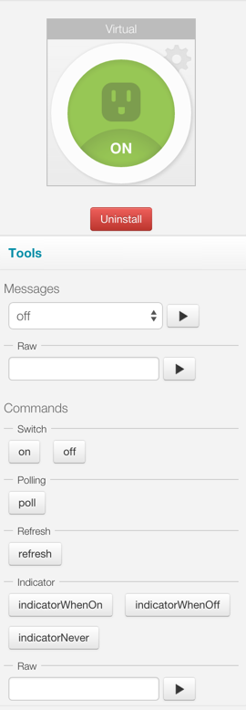

Simulator
=========

Using the IDE simulator, we can model the behavior of the device without actually requiring a physical device.

On the right-hand side of the IDE, after you install a device-type handler, you'll see the simulator. The image below is the simulator seen after installing the "Z-Wave Switch" device-type handler (available via the "Browse Device Templates" menu). 

Go ahead, try it out. Install the device-type handler in the IDE, and choose a virtual switch. Modify some of the simulator metadata as you read through this and see what happens.

The purpose of the simulator metadata is to model the behavior of the physical device. Using the simulator, we can test sending messages and commands to our device-type handler.

There are two types of simulator declarations to define in a device-type handler - "status" and "reply".

Status
------

The "status" declarations specify actions that result in a person physically actuating the device. In the case of the Z-Wave switch, for example, we have:

.. code-block:: groovy
    
    status "on":  "command: 2003, payload: FF"
    status "off": "command: 2003, payload: 00"

``status`` takes a map as an argument. The key ("on" in the example above) is just a name for the action. The value ("command: 2003, payload: FF") is the message that the device will send to the device type handler's ``parse(message)`` method when that action is taken on the physical device. 

In the simulator, each status key ("on" or "off" in the example above) will be an available message in the simulator.

Reply
-----

The "reply" declarations specify responses that the physical device will send to the device type handler when it receives a certain message from the hub. For a Z-Wave switch, for example, we specify:

.. code-block:: groovy

    reply "2001FF,delay 100,2502": "command: 2503, payload: FF"
    reply "200100,delay 100,2502": "command: 2503, payload: 00"

Just like ``status``, ``reply`` accepts a map as a parameter. The key is a comma-separate list of the raw commands sent to the device, i.e. what's returned from the device type's command methods. For example, the Z-Wave switch commands that send the above methods are:

.. code-block:: groovy

    def on() {
        delayBetween([
            zwave.basicV1.basicSet(value: 0xFF).format(),
            zwave.switchBinaryV1.switchBinaryGet().format()
        ])
    }

    def off() {
        delayBetween([
            zwave.basicV1.basicSet(value: 0x00).format(),
            zwave.switchBinaryV1.switchBinaryGet().format()
        ])
    }

Those methods will return the values in the first arguments of the reply declarations. The second argument in the reply declarations works the same way as the status declarations - they define messages sent to the parse method. But in this case it's in response to commands, not physical actuations.

Summary
-------

The purpose of these declarations is to allow a virtual device to function in the IDE simulator, without being attached to a physical device. The ``status`` method allows us to simulate physical actuation, while the ``reply`` method allows us to simulate sending messages to the device in response to a command from the hub.