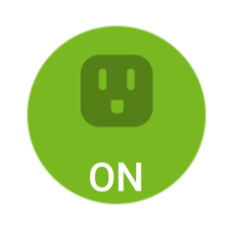
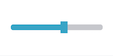
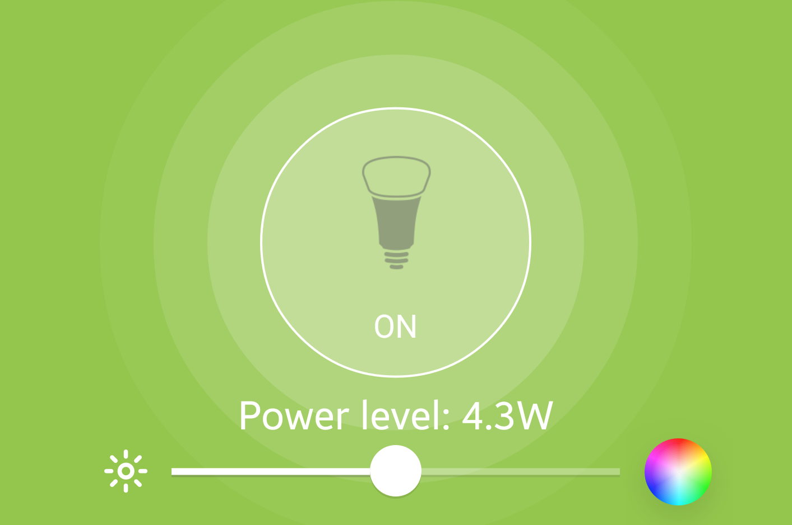
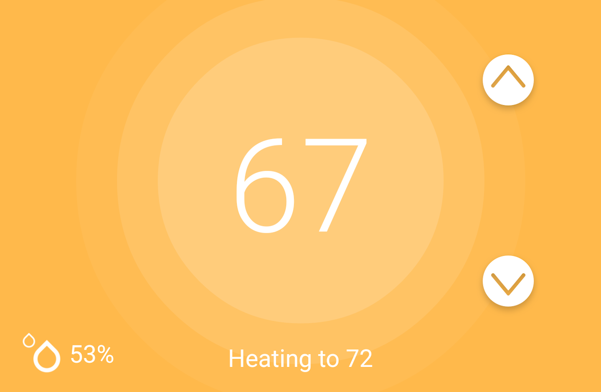
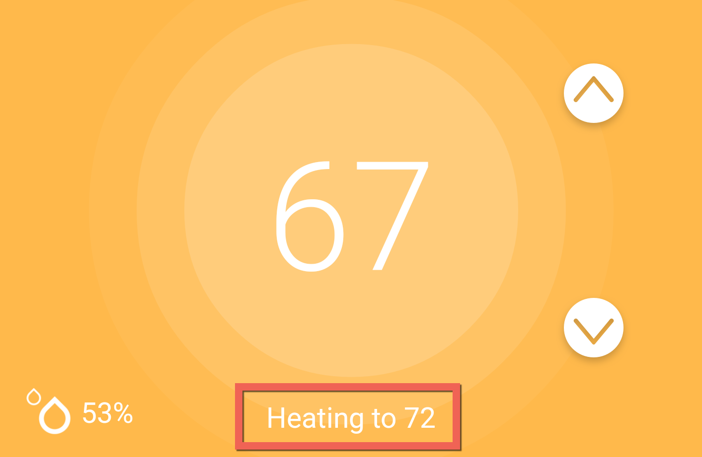
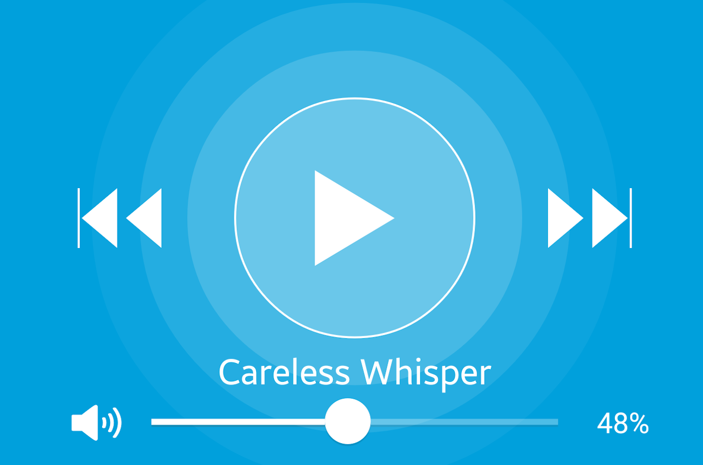
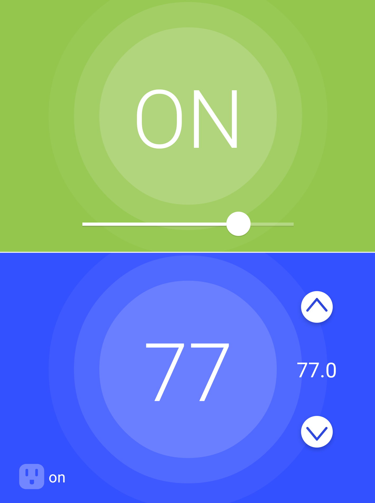

=====
Tiles
=====

Tiles define how devices are visually represented in the SmartThings mobile application.
Every Device Handler specifies how the device will appear in the mobile application by specifying one or more tiles.

----

Overview
--------

When a user goes to the Things view in the mobile app, they see all their devices listed:

.. image:: ../img/device-types/things-view.png
   :scale: 25

When tapping on one of the devices in the Things view, the user will see the Details view for that device:

.. image:: ../img/device-types/details-view.png
   :scale: 25

The Details view is where a user can get comprehensive information about the device, as well as actuate the device (if applicable) by interacting with the tile.

A tile may be display only, or can be configured to perform an action on the device when interacted with.

Each tile is associated with one or more attributes of the device.
Some tiles are display-only, while others allow the user to interact with the tile to actuate the device.

----

Tiles Basics
------------

.. tip::

    If you're the type that prefers to view and experiment with real code examples as you learn, check out the :ref:`tiles_examples`.

Tiles definition and layout is specified using the ``tiles()`` builder in the Device Handler's ``metadata``, and looks like this (we'll dive into the details shortly):

.. code-block:: groovy

    metadata {
        definition (
            ...
        }

        tiles(scale: 2) {
            // standard tile with actions named
            standardTile("switch", "device.switch", width: 2, height: 2, canChangeIcon: true) {
                state "off", label: '${currentValue}', action: "switch.on",
                      icon: "st.switches.switch.off", backgroundColor: "#ffffff"
                state "on", label: '${currentValue}', action: "switch.off",
                      icon: "st.switches.switch.on", backgroundColor: "#79b821"
            }

            // value tile (read only)
            valueTile("power", "device.power", decoration: "flat", width: 2, height: 2) {
                state "power", label:'${currentValue} Watts'
            }

            // the "switch" tile will appear in the Things view
            main("switch")

            // the "switch" and "power" tiles will appear in the Device Details
            // view (order is left-to-right, top-to-bottom)
            details(["switch", "power"])
        }
    }

It's important to understand that tiles configuration is part of the device's static metadata.
When the SmartThings platform executes the ``tiles()`` builder you have defined, it doesn't yet know anything about the actual device or the current device state.
Only later, when the device details screen is rendered in the mobile client, does the platform know information about the specific device.
For this reason, trying to conditionally configure tiles based on device state will not work.

Tiles are associated with attributes of a device.
Device tiles come in two varieties:

#. Single-attribute tiles. These tiles are associated with one attribute of the device.
#. Multi-attribute tiles. These tiles can display information about multiple attribute of a device.

Main and details tiles configuration
^^^^^^^^^^^^^^^^^^^^^^^^^^^^^^^^^^^^

The main tile is what appears in the Things view. It's configured in the ``tiles()`` builder with ``main()``:

.. code-block:: groovy
    :emphasize-lines: 5-6

    tiles(scale: 2) {
        standardTile(name: 'someTile', ...)
        controlTile(name: 'otherTile', ...)

        // tile with name 'someTile' appears in the Things view
        main('someTile')
    }

Use ``details()`` to specify all other tiles that should be available on the device details screen. The tiles will layout in left-to-right, top-to-bottom order beginning with the first argument:

.. code-block:: groovy
    :emphasize-lines: 7-9

    tiles(scale: 2) {
        standardTile(name: 'someTile', ...)
        controlTile(name: 'otherTile', ...)
        valueTile(name: 'valueTile', ...)

        main('someTile')
        // someTile is top left, then otherTile, then anotherTile,
        // all flowing left-to-right, top-to-bottom:
        details('someTile', 'otherTile', 'anotherTile')
    }

.. _tiles_grid_layout:

Grid layout
^^^^^^^^^^^

Tiles are rendered using a grid layout.
Tiles support either a **6 x Unlimited** (6 wide, unlimited height) or **3 x Unlimited** (3 wide, unlimited height) layout.
The grid system used is controlled by the ``scale`` argument to the ``tiles`` builder.
A value of ``1`` (the default) enables the *3 x Unlimited* grid; a value of ``2`` enables the *6 x Unlimited* grid:

.. code-block:: groovy

    // 3 x Unlimited grid
    tiles(scale: 1) {...}

    // 6 x Unlimited grid
    tiles(scale: 2) {...}

SmartThings recommends using the *6 x Unlimited* layout, as it offers a more attractive user experience.
Older versions of the SmartThings mobile application that do not support the *6 x Unlimited* layout will be scaled back.

Here you can see how the tiles defined above are laid out using the *6 x Unlimited* grid (using the ``scale: 2`` option):

.. image:: ../img/device-types/grid-layout.png
   :scale: 25

Tile size
^^^^^^^^^

Every tile can specify a ``width`` and a ``height``, which controls the size of the tile within the grid layout.
If not specified, the tile will default to a width and height of 1.

Allowing the user to change the icon
^^^^^^^^^^^^^^^^^^^^^^^^^^^^^^^^^^^^

We can specify the ``canChangeIcon: true`` option to allow the user to select an icon of their choosing when editing the device:

.. code-block:: groovy

    standardTile("switch", "device.switch", width: 2, height: 2, canChangeIcon: true) {...}

If not specified, ``canChangeIcon`` is assumed to be false.
Only the tile specified as the main tile should specify ``canChangeIcon``.

Tiles and Attribute State
-------------------------

Tiles display data about a device's attributes, and may allow those attributes to be updated through user interaction.

Let's explore how this works by considering an example.
Consider the case of a Switch - it could be a smart outlet, an in-wall switch, or a smart bulb.
Regardless of the specific device, we want to display a tile that shows the current state of the switch (on or off), and allows the user to toggle the switch by pressing the tile.
We accomplish this by associating one or more states for a tile definition.

When we define a tile, we associate it with a specific attribute of the device.
In our Switch example, this would be the "switch" attribute of the :ref:`switch` capability:

.. code-block:: groovy

    standardTile("tileName", "device.switch", width: 2, height: 2) {...}

Now that we've associated the tile with the switch attribute, we need to configure how it will display for the attribute's possible states.
For single-attribute tiles (``standardTile`` is a single-attribute tile), we do this using ``state``.
Multi-attribute tiles use ``attributeState``, which is used in the same way.

For attributes that have a finite, discrete set of possible values (for example, "on" or "off", "wet" or "dry", "open" or "closed"), we create a ``state`` definition for each possible value.
Each ``state`` definition can be configured to customize the display and what should happen (if anything) when the tile is pressed by the user.
For attributes whose value are not finite values (examples include "temperature", "power", or the "level" of a dimmable switch), we simply use one ``state`` for the attribute:

.. code-block:: groovy

    valueTile("tileName", "device.level", width: 2, height: 2) {
        state "level", label: '${currentValue}'
    }

(You can learn more about using dynamic state labels (``'${currentValue}'`` above) :ref:`here <state_labels>`.

In the case of the "switch" attribute, we need to define two states, one for "on" and one for "off":

.. code-block:: groovy

    standardTile("tileName", "device.switch", width: 2, height: 2) {
        state "off", label: "off", icon: "st.switches.switch.off", backgroundColor: "#ffffff"
        state "on", label: "on", icon: "st.switches.switch.on", backgroundColor: "#79b821"
    }

The above tile definition is pretty self-explanatory.
When the "switch" attribute is "off", the label of the tile will be "off", the icon will be "st.switches.switch.off", and the background color will be white (#ffffff).
It's similarly easy to understand how the tile will appear when the switch is "on".

State actions
^^^^^^^^^^^^^

Tile states can define what should happen when the tile is interacted with by specifying an ``action``.
For example, to allow a switch to be toggled when pressed, we specify what should happen for each attribute state:

.. code-block:: groovy

    standardTile("tileName", "device.switch", width: 2, height: 2) {
        state "off", label: "off", icon: "st.switches.switch.off", backgroundColor: "#ffffff", action: "switch.on"
        state "on", label: "on", icon: "st.switches.switch.on", backgroundColor: "#79b821", action: "switch.off"
    }

The value of the ``action`` can be formatted in one of two ways:

#. In the form ``"<capability>.<command>"``.
#. In the simpler form ``"<command>"``. This form is required for custom (non-capability) commands.

We are showing the form ``"<capability>.<command>"`` form above, which translates to ``action: "switch.on"``.
We could also simply specify the command, which would look like: ``action: "on"``.

If you're curious about commands that take parameters (``on()`` and ``off()`` do not), you do **not** need to specify parameters in the ``action``.
Any parameters will be populated and passed to the command method by the specific tile control.

.. note::

    While both action forms are supported, you'll most frequently see the form ``"<capability>.<command>"`` in Device Handlers.
    This form can be somewhat confusing when the capability has a space in its name; consider this example that would call the ``setLevel`` command on a "Switch Level" capability:

    .. code-block:: groovy

        action: "switch level.setLevel"

    The above reads awkwardly for many, and can cause confusion.

    Because of this, we prefer the short form of ``action: "<command>"``.

Transition states
^^^^^^^^^^^^^^^^^

We can use the ``nextState`` option in ``state`` (single-attribute tiles) or ``attributeState`` (Multi-Attribute Tiles) to show that the device is transitioning to a next state.
This is useful to provide visual feedback that the device state is transitioning.
When the attribute's state does change, the tile will be updated according to the state defined for that attribute.

To define a transition state, simply define a ``state`` for the transition, and reference that state using the ``nextState`` option.

Here's an example that uses a transition state for the "switch" attribute:

.. code-block:: groovy

    standardTile("switch", "device.switch", width: 2, height: 2) {
        state "off", label:'Off', action:"switch.on", icon:"st.switches.switch.off", backgroundColor:"#ffffff", nextState:"turningOn"
        state "on", label:'On', action:"switch.off", icon:"st.switches.switch.on", backgroundColor:"#79b821", nextState:"turningOff"
        state "turningOn", label:'Turning on', icon:"st.switches.switch.on", backgroundColor:"#79b821", nextState: "turningOff"
        state "turningOff", label:'Turning off', icon:"st.switches.switch.off", backgroundColor:"#ffffff", nextState: "turningOn"
    }

.. _state_labels:

State labels
^^^^^^^^^^^^

We can hard-code a label for state values, or use the state name or current value of the attribute.
The following label values can be used to display real-time information about the device:

============================= ============
Label                         Description
============================= ============
``label: '${currentValue}'``  The current value of this attribute's state. This is used when the attribute doesn't have a discrete value set, like temperature or power.
``label: '${name}'``          The name of the attribute state. This is useful when the attribute state is a discreet value, like "on" or "off".
============================= ============

Here's an example of using the state name as the label:

.. code-block:: groovy

    standardTile("switch", "device.switch") {
        // use the state name as the label ("off" and "on")
        state "off", label:'${name}', action:"switch.on", icon:"st.switches.switch.off", backgroundColor:"#ffffff"
        state "on", label:'${name}', action:"switch.off", icon:"st.switches.switch.on", backgroundColor:"#79b821"
    }

When using the current attribute value, the attribute value must be set by sending an event.
For simplicity, the code examples in this documentation typically will not show the attribute value being set.
Just know that if a label is set like this:

.. code-block:: groovy

    valueTile("power", "device.power") {
        // label will be the current value of the power attribute
        state "power", label: '${currentValue} W'
    }

The Device Handler needs to send an event for the ``"power"`` attribute somewhere:

.. code-block:: groovy

    sendEvent(name: "power", value: 42)

.. important::

    Dynamic device state values like ``'${currentValue}'`` and ``'${name}'`` **must be used inside single quotes**. This is in contrast to Groovy's string interpolation that requires double quotes.

    This is required because when the platform executes the ``tiles()`` builder, it doesn't know anything about the actual device yet.
    Using single quotes will allow the platform to manually substitute the actual value when the device is rendered on the mobile app.

Background color
^^^^^^^^^^^^^^^^

We've seen in the examples above that states can be configured to appear a certain color using ``backgroundColor``.
The value to the ``backgroundColor`` option is a hexadecimal value of the color.

We can also specify an array of background colors for attribute values that fall along a range.
This allows for greater user feedback for a given attribute value, since we can specify the background color for various values.
When the value is between the specified ranges, the resulting color will be a shade between the two specified colors.
The "temperature" attribute is a common example of this.
It's typical to see a tile definition for temperature like this:

.. code-block:: groovy

    valueTile("temperature", "device.temperature", width: 2, height: 2) {
        state("temperature", label:'${currentValue}', unit:"dF",
            backgroundColors:[
                [value: 31, color: "#153591"],
                [value: 44, color: "#1e9cbb"],
                [value: 59, color: "#90d2a7"],
                [value: 74, color: "#44b621"],
                [value: 84, color: "#f1d801"],
                [value: 95, color: "#d04e00"],
                [value: 96, color: "#bc2323"]
            ]
        )
    }

The argument to ``backgroundColors`` is a list of maps, where each map specifies the hexadecimal color a specific value.
When the attribute value matches a value specified, the color specified will be the background color of the tile.
When the value is between two specified values, the color will be a linear interpolation between the specified ranges.

In the example above, we defined that at 84 degrees the background color will be a shade of green ("#44b621").
When the temperature reaches 95 degrees, the color will be a shade of yellow ("f1d801").
When the temperature is between 84 and 95 degrees, the background color will be between green and yellow.
Increasing the temperature causes the color to become progressively more yellow, until arriving at 95 degrees.
Similarly, decreasing the temperature causes the color to become more and more green, until arriving at 84 degrees.

Once an upper or lower bound has been reached, the background color will no longer change.
In the example above, that means that decreasing the temperature below 31 degrees or above 96 degrees will not cause the background color to change from the colors specified at those values.

State selection algorithm
^^^^^^^^^^^^^^^^^^^^^^^^^

The following algorithm is used to determine which state to display, when there are multiple states:

#. If a state is defined for the attribute's current value, it will render that.
#. If no state exists for the attribute value, it will render a state that has specified ``defaultState: true``. Use this in place of the "default" state name that you may see in some Device Handlers.
#. If no state matches the above rules, it will render the first state declaration.

Icons
^^^^^

A tile's state may specify an icon to render using the ``icon`` option:

.. code-block:: groovy

    tileAttribute ("device.power", key: "SECONDARY_CONTROL") {
        attributeState "power", label:'${currentValue}W', icon: "st.Appliances.appliances17"
    }

We can use an icon provided by SmartThings as above, or an accessible URL to an icon.

.. note::

    Using icons is `discussed frequenly <https://community.smartthings.com/t/where-are-the-tile-icons/40086>`__ in the SmartThings developer community forums.

----

Single-Attribute Tiles
----------------------

Single-attribute tiles are associated with a single device attribute.
There are several different single-attribute tiles available for use, as documented below.

.. _single_attr_single_tile:

Standard Tile
^^^^^^^^^^^^^

Use a Standard Tile for attributes that have discrete, specific values.
For example, a switch is either "on" or "off"; a moisture sensor is "wet" or "dry"; a contact sensor is "open" or "closed".

Here's a standard tile that shows if a switch is on or off.

.. code-block:: groovy

    standardTile("actionFlat", "device.switch", width: 2, height: 2, decoration: "flat") {
        state "off", label: '${currentValue}', action: "switch.on", icon: "st.switches.switch.off", backgroundColor: "#ffffff"
        state "on", label: '${currentValue}', action: "switch.off", icon: "st.switches.switch.on", backgroundColor: "#79b821"
    }

The above tile definition would render as (when the switch is on):

Standard Tiles may be styled with a ring (the default), or flat, by using the ``decoration`` option:

.. code-block:: groovy

    // standard tile with actions
    standardTile("actionRings", "device.switch", width: 2, height: 2, canChangeIcon: true) {
        state "off", label: '${currentValue}', action: "switch.on", icon: "st.switches.switch.off", backgroundColor: "#ffffff"
        state "on", label: '${currentValue}', action: "switch.off", icon: "st.switches.switch.on", backgroundColor: "#79b821"
    }

    // standard flat tile without actions
    standardTile("noActionFlat", "device.switch", width: 2, height: 2, canChangeIcon: true) {
        state "off", label: '${currentValue}',icon: "st.switches.switch.off", backgroundColor: "#ffffff"
        state "on", label: '${currentValue}', icon: "st.switches.switch.on", backgroundColor: "#79b821"
    }

The above tiles definition renders as below, with the tile on the left being the ring decoration:

.. image:: ../img/device-types/standard-tile-decoration.png
    :scale: 35

.. tip::

    Check out the :ref:`tiles_examples` to see it in action!

Value Tile
^^^^^^^^^^

Use a Value Tile for attributes that have non-discrete values.
Typical examples include temperature, humidity, or power values.

The following shows a few examples of the Value Tile:

.. code-block:: groovy

    tiles(scale: 2) {
        valueTile("integerFloat", "device.integerFloat", width: 2, height: 2) {
            state "val", label:'${currentValue}', defaultState: true
        }

        valueTile("pi", "device.pi", width: 2, height: 2) {
            state "val", label:'${currentValue}', defaultState: true
        }

        valueTile("floatAsText", "device.floatAsText", width: 2, height: 2) {
            state "val", label:'${currentValue}', defaultState: true
        }

        valueTile("bgColor", "device.integer", width: 2, height: 2) {
            state "val", label:'${currentValue}', backgroundColor: "#e86d13", defaultState: true
        }

        valueTile("bgColorRange", "device.integer", width: 2, height: 2) {
            state "val", label:'${currentValue}', defaultState: true, backgroundColors: [
                [value: 10, color: "#ff0000"],
                [value: 90, color: "#0000ff"]
            ]
        }
    }

    def installed() {
    	sendEvent(name: "integer", value: 47)
    	sendEvent(name: "integerFloat", value: 47.0)
    	sendEvent(name: "pi", value: 3.14159)
    	sendEvent(name: "floatAsText", value: "3.14159")
    }

This renders as:

.. figure:: ../img/device-types/value-tile.png
    :scale: 25

.. note::

    While it's possible to specify an action for a Value Tile, that is not the intended purpose.
    If your tile should support an action, use a Standard Tile.
    Value Tiles are intended to be used for display-only attributes.

.. tip::

    Check out the :ref:`tiles_examples` to see it in action!

Slider Control Tile
^^^^^^^^^^^^^^^^^^^

Use a Slider Control Tile to display a tile that shows a value along a range, and allows the user to adjust the value using the slider control.

These tiles are useful for attributes like the level of a dimmable bulb.

Here's an example of a Slider Control Tile:

.. code-block:: groovy

    controlTile("levelSliderControl", "device.level", "slider",
                height: 1, width: 2) {
        state "level", action:"switch level.setLevel"
    }

This renders as:

By default, the range of the slider will be 0-100.
You can specify a custom range by using a ``range`` parameter.
It is a string, in the form ``"(<lower bound>..<upper bound>)"``.
Only integers (negative and positive) are supported for custom ranges; decimal values will not work.

.. code-block:: groovy

    controlTile("levelSliderControl", "device.level", "slider", height: 1,
                 width: 2, inactiveLabel: false, range:"(20..80)") {
        state "level", action:"switch level.setLevel"
    }

.. tip::

    Check out the :ref:`tiles_examples` to see it in action!

Color Control Tile
^^^^^^^^^^^^^^^^^^

If your device supports the :ref:`color_control` capability, you can use a Control Tile that displays a color wheel.
The user can then set the color by interacting with the control.

Here's an example of a color control tile:

.. code-block:: groovy

    controlTile("rgbSelector", "device.color", "color", height: 6, width: 6,
                inactiveLabel: false) {
        state "color", action: "color control.setColor"
    }

The tile may render differently depending on the mobile OS.
The command method specified by ``action`` will be called with a map that looks like this:

.. code-block:: groovy

        [red:241, hex:#F1E3FF, saturation:10.980392, blue:255, green:227, hue:75.0]

The values are summarized in the table below:

============== ===========
Key            Description
============== ===========
``red``        The red value chosen in the standard RGB color space
``hex``        The hexacecimal representation of the color chosen
``saturation`` The saturation value of the value chosen, between 0 and 100
``blue``       The blue value chosen in the standard RGB color space
``green``      The green value chosen in the standard RGB color space
``hue``        The hue value of the color chosen, between 0 and 100
============== ===========

You may also see a ``level`` and ``alpha`` attribute returned from the color control.
These values are not controlled by the color control tile, so are not useful.

.. note:

    A Color Control tile should be configured as a 6x6 tile.

.. tip::

    Check out the :ref:`tiles_examples` to see it in action!

Carousel Tile
^^^^^^^^^^^^^

A Carousel Tile is often used in conjunction with the :ref:`image_capture` capability, to allow users to scroll through recent pictures.

Many of the camera Device Handlers will make use of the ``carouselTile()``.

.. code-block:: groovy

    carouselTile("cameraDetails", "device.image", width: 3, height: 2) { }

.. figure:: ../img/device-types/carouselTile.jpg

----

Multi-Attribute Tiles
---------------------

Multi-Attribute Tiles combine multiple attributes into a single tile presented with a rich UI.
Here are some of the types of tiles that you can create:

==================================================    ==================================================    ===================================================
Lighting                                              Thermostat                                            Multimedia
.. image:: ../img/device-types/lighting-tile.png      .. image:: ../img/device-types/thermostat-tile.png     .. image:: ../img/device-types/multimedia-tile.png
==================================================    ==================================================    ===================================================

Basics
^^^^^^

Multi-Attribute Tiles must be given a width of 6 and a height of 4.
To enable this, the ``tiles`` builder of your Device Handler must use the new *6 X Unlimited* grid layout by specifying ``scale: 2``:

.. code-block:: groovy

    tiles(scale: 2) {
        multiAttributeTile(name:"switch", type: "lighting", width: 6, height: 4, canChangeIcon: true) {
            ...
        }
    }

Multi-Attribute Tile types
^^^^^^^^^^^^^^^^^^^^^^^^^^

Multi-Attribute Tiles specify a ``type``:

.. code-block:: groovy

    multiAttributeTile(name:"switch", type: "lighting", width: 6, height: 4) { ... }

The following types are supported, and each type is documented in detail below:

- ``"lighting"``
- ``"thermostat"``
- ``"mediaPlayer"``
- ``"generic"``

Attribute state and control keys
^^^^^^^^^^^^^^^^^^^^^^^^^^^^^^^^

Like Single-Attribute Tiles, Multi-Attribute Tiles are associated with device attributes.
As the name suggests, Multi-Attribute Tiles can be associated with more than one attribute, using ``tileAttribute()`` and ``attributeState()``:

.. code-block:: groovy

    multiAttributeTile(name:"switch", type: "lighting", width: 6, height: 4, canChangeIcon: true) {
        tileAttribute ("device.switch", key: "PRIMARY_CONTROL") {
            attributeState "on", label:'${name}', action:"switch.off", icon:"st.lights.philips.hue-single", backgroundColor:"#79b821", nextState:"turningOff"
            attributeState "off", label:'${name}', action:"switch.on", icon:"st.lights.philips.hue-single", backgroundColor:"#ffffff", nextState:"turningOn"
            attributeState "turningOn", label:'${name}', action:"switch.off", icon:"st.lights.philips.hue-single", backgroundColor:"#79b821", nextState:"turningOff"
            attributeState "turningOff", label:'${name}', action:"switch.on", icon:"st.lights.philips.hue-single", backgroundColor:"#ffffff", nextState:"turningOn"
        }
        tileAttribute ("device.power", key: "SECONDARY_CONTROL") {
            attributeState "power", label:'Power level: ${currentValue}W', icon: "st.Appliances.appliances17"
        }
        tileAttribute ("device.level", key: "SLIDER_CONTROL") {
            attributeState "level", action:"switch level.setLevel"
        }
        tileAttribute ("device.color", key: "COLOR_CONTROL") {
            attributeState "color", action:"setAdjustedColor"
        }
    }

The key difference between the Multi-Attribute Tile ``tileAttribute`` and the single-attribute ``state`` is the ``key`` option for ``attributeState``.
The key informs the platform the type of control for the tile attribute, which is then used to render the appropriate control.
The keys commonly used for each type of tile will be discussed below, and a complete reference list is :ref:`also available <control_ref>`

Every Multi-Attribute Tile must specify a ``PRIMARY_CONTROL``.
This is the main control, and will control the background color for the entire Multi-Attribute Tile (except for the :ref:`therm_multi_attr_tile`).

.. _lighting_multi_attr_tile:

Lighting Multi-Attribute Tile
^^^^^^^^^^^^^^^^^^^^^^^^^^^^^

The lighting Multi-Attribute Tile makes it easy to create rich tiles for lighting devices.
There are several ways a lighting Multi-Attribute Tile can be configured, depending on the type of bulb and its supported capabilities.

Consider the following Multi-Attribute Tile for a bulb that supports the :ref:`switch`, :ref:`color_control`, :ref:`power_meter`, and :ref:`switch_level` capabilities:

.. code-block:: groovy

    multiAttributeTile(name:"switch", type: "lighting", width: 6, height: 4, canChangeIcon: true) {
        tileAttribute ("device.switch", key: "PRIMARY_CONTROL") {
            attributeState "on", label:'${name}', action:"switch.off", icon:"st.lights.philips.hue-single", backgroundColor:"#79b821", nextState:"turningOff"
            attributeState "off", label:'${name}', action:"switch.on", icon:"st.lights.philips.hue-single", backgroundColor:"#ffffff", nextState:"turningOn"
            attributeState "turningOn", label:'${name}', action:"switch.off", icon:"st.lights.philips.hue-single", backgroundColor:"#79b821", nextState:"turningOff"
            attributeState "turningOff", label:'${name}', action:"switch.on", icon:"st.lights.philips.hue-single", backgroundColor:"#ffffff", nextState:"turningOn"
        }
        tileAttribute ("device.power", key: "SECONDARY_CONTROL") {
            attributeState "power", label:'Power level: ${currentValue}W', icon: "st.Appliances.appliances17"
        }
        tileAttribute ("device.level", key: "SLIDER_CONTROL") {
            attributeState "level", action:"switch level.setLevel"
        }
        tileAttribute ("device.color", key: "COLOR_CONTROL") {
            attributeState "color", action:"setColor"
        }
    }

This tile renders (on Android) as:

.. note::

    Android will display the ``SECONDARY_CONTROL`` and ``SLIDER_CONTROL`` attribute values as a marquee when used in conjunction with ``COLOR_CONTROL``.

The ``tileAttribute`` keys and their description used for the lighting Multi-Attribute Tile are summarized in the following table:

=====================  ===========
Key                    Description
=====================  ===========
``PRIMARY_CONTROL``    Displays the status of the switch, and allows the switch state to be toggled when pressed.
``SECONDARY_CONTROL``  Used to display textual information. Often used to display power usage.
``SLIDER_CONTROL``     For bulbs that support the :ref:`switch_level` capability, allows the user to set the switch level.
``COLOR_CONTROL``      For bulbs that support the :ref:`color_control` capability, allows the user to select a color.
=====================  ===========

The command method specified by ``action`` will be called with a map that looks like this:

.. code-block:: groovy

        [red:241, hex:#F1E3FF, saturation:10.980392, blue:255, green:227, hue:75.0]

The values are summarized in the table below:

============== ===========
Key            Description
============== ===========
``red``        The red value chosen in the standard RGB color space
``hex``        The hexacecimal representation of the color chosen
``saturation`` The saturation value of the value chosen, between 0 and 100
``blue``       The blue value chosen in the standard RGB color space
``green``      The green value chosen in the standard RGB color space
``hue``        The hue value of the color chosen, between 0 and 100
============== ===========

You may also see a ``level`` and ``alpha`` attribute returned from the color control.
These values are not controlled by the color palette, so are not useful.

.. note::

    You may some code for Color Control bulbs that adjusts the Hue using some magic numbers and fun math.

    This is an artifact of the original Hue bulb sacrificing the ability to render greens in favor of more pleasant whites.
    This tradeoff threw off the actual colors version the apparent color on the color wheel.
    These calculations compensated for this behavior somewhat so that when you selected blue on the color wheel you actually saw blue on the bulb.

    These adjustments would not apply to other color bulbs.

.. tip::

    Check out the :ref:`tiles_examples` to see it in action!

.. _therm_multi_attr_tile:

Thermostat Multi-Attribute Tile
^^^^^^^^^^^^^^^^^^^^^^^^^^^^^^^

The Thermostat Multi-Attribute Tile allows for rich viewing and control of :ref:`thermostat` devices.
Here's an image of a thermostat tile (when heating):

The tiles configuration for the above tile is:

.. code-block:: groovy

    multiAttributeTile(name:"thermostatFull", type:"thermostat", width:6, height:4) {
        tileAttribute("device.temperature", key: "PRIMARY_CONTROL") {
            attributeState("default", label:'${currentValue}', unit:"dF")
        }
        tileAttribute("device.temperature", key: "VALUE_CONTROL") {
            attributeState("VALUE_UP", action: "tempUp")
            attributeState("VALUE_DOWN", action: "tempDown")
        }
        tileAttribute("device.humidity", key: "SECONDARY_CONTROL") {
            attributeState("default", label:'${currentValue}%', unit:"%")
        }
        tileAttribute("device.thermostatOperatingState", key: "OPERATING_STATE") {
            attributeState("idle", backgroundColor:"#44b621")
            attributeState("heating", backgroundColor:"#ffa81e")
            attributeState("cooling", backgroundColor:"#269bd2")
        }
        tileAttribute("device.thermostatMode", key: "THERMOSTAT_MODE") {
            attributeState("off", label:'${name}')
            attributeState("heat", label:'${name}')
            attributeState("cool", label:'${name}')
            attributeState("auto", label:'${name}')
        }
        tileAttribute("device.heatingSetpoint", key: "HEATING_SETPOINT") {
            attributeState("default", label:'${currentValue}', unit:"dF")
        }
        tileAttribute("device.coolingSetpoint", key: "COOLING_SETPOINT") {
            attributeState("default", label:'${currentValue}', unit:"dF")
        }
    }

The below table summarizes the basic controls for a Thermostat Multi-Attribute Tile:

===================== ===========
Key                   Description
===================== ===========
``PRIMARY_CONTROL``   Used to display the current temperature.
``VALUE_CONTROL``     Renders controls for increasing or decreasing the temperature.
``SECONDARY_CONTROL`` Used to display textual data about the thermostat, like humidity. Appears on the bottom-left of the tile.
===================== ===========

In addition to the controls above, there are four additional controls that work together to show the status label at the bottom of the tile:

This label provides users with more information on the state of the thermostat.
Additionally, thermostat tiles also look to the ``OPERATING_STATE`` attribute for its background color, falling back on the colors for ``PRIMARY_CONTROL``.

In order to provide the relevant data to present the label, there are four additional attributes you should include:

====================  ============================================  ================================================================================================================
Value                 Description                                   Notes
====================  ============================================  ================================================================================================================
``OPERATING_STATE``   What the thermostat is doing                  The label will not show if ``OPERATING_STATE`` is omitted, as this is the baseline amount of meaningful information
``THERMOSTAT_MODE``   Thermostat mode (i.e. Heat, Cool, or Auto)    This allows the user to know the mode (and temperature) if the system is idle (e.g. "Idle—Heat at 66°")
``HEATING_SETPOINT``  At which point the system will begin heating  Informs the user when heating will start (or stop, if currently heating)
``COOLING_SETPOINT``  At which point the system will begin cooling  Informs the user when cooling will start (or stop, if currently cooling)
====================  ============================================  ================================================================================================================

.. note::

    Only ``OPERATING_STATE`` is required to present the status label, but providing all four attributes will ensure the best experience for your users.

.. tip::

    Check out the :ref:`tiles_examples` to see it in action!

.. _media_multi_attr_tile:

Multimedia Multi-Attribute Tile
^^^^^^^^^^^^^^^^^^^^^^^^^^^^^^^

The Multimedia Multi-Attribute Tile is intended for devices that support the :ref:`music_player` capability.
It can render controls for playing, pausing, next/previous tracks, and volume levels for a music player.
It can also display information about the currently playing track.

    
The code for this tiles configuration is shown below:

.. code-block:: groovy

    tiles(scale: 2) {
        multiAttributeTile(name: "mediaMulti", type:"mediaPlayer", width:6, height:4) {
            tileAttribute("device.status", key: "PRIMARY_CONTROL") {
                attributeState("paused", label:"Paused",)
                attributeState("playing", label:"Playing")
                attributeState("stopped", label:"Stopped")
            }
            tileAttribute("device.status", key: "MEDIA_STATUS") {
                attributeState("paused", label:"Paused", action:"music Player.play", nextState: "playing")
                attributeState("playing", label:"Playing", action:"music Player.pause", nextState: "paused")
                attributeState("stopped", label:"Stopped", action:"music Player.play", nextState: "playing")
            }
            tileAttribute("device.status", key: "PREVIOUS_TRACK") {
                attributeState("status", action:"music Player.previousTrack", defaultState: true)
            }
            tileAttribute("device.status", key: "NEXT_TRACK") {
                attributeState("status", action:"music Player.nextTrack", defaultState: true)
            }
            tileAttribute ("device.level", key: "SLIDER_CONTROL") {
                attributeState("level", action:"music Player.setLevel")
            }
            tileAttribute ("device.mute", key: "MEDIA_MUTED") {
                attributeState("unmuted", action:"music Player.mute", nextState: "muted")
                attributeState("muted", action:"music Player.unmute", nextState: "unmuted")
            }
            tileAttribute("device.trackDescription", key: "MARQUEE") {
                attributeState("trackDescription", label:"${currentValue}", defaultState: true)
            }
        }

        main "mediaMulti"
        details(["mediaMulti"])
    }

The ``tileAttribute`` control keys and their description used for the Multimedia Multi-Attribute Tile are summarized in the following table:

===================  ===========
Key                  Description
===================  ===========
``PRIMARY_CONTROL``  Necessary to render the background of the tile.
``MEDIA_STATUS``     Used to display and control the current play status (playing, paused, stopped)
``PREVIOUS_TRACK``   Renders a control for going to the previous track
``NEXT_TRACK``       Renders a control for going to the next track
``SLIDER_CONTROL``   Renders a control to select a volume level
``MEDIA_MUTED``      Allows the user to press the volume icon to mute
``MARQUEE``          Will display the currently playing track description below the ``PRIMARY_CONTROL``
===================  ===========

.. note::

    The background color of the media Multi-Attribute Tile defaults to blue, and cannot be overridden.

.. tip::

    Check out the :ref:`tiles_examples` to see it in action!

.. _generic_multi_attr_tile:

Generic Multi-Attribute Tile
^^^^^^^^^^^^^^^^^^^^^^^^^^^^

If none of the predefined Multi-Attribute Tile types fit our needs, we can use the Generic Multi-Attribute Tile.
The supported tile attribute types for the Generic Multi-Attribute Tile are shown in the following table:

====================  ===========
Key                   Description
====================  ===========
``PRIMARY_CONTROL``   The primary control tile for this device, controls the background color
``SECONDARY_CONTROL`` Displays textual data below the primary control
``VALUE_CONTROL``     Renders Up and Down buttons for increasing or decreasing values
``SLIDER_CONTROL``    Renders a slider control for selecting a value along a range
``COLOR_CONTROL``     Renders the color picker that allows users to select a color (useful for Color Control devices)
====================  ===========

Here's an example of a generic tile:

.. code-block:: groovy

    multiAttributeTile(name:"sliderTile", type:"generic", width:6, height:4) {
        tileAttribute("device.switch", key: "PRIMARY_CONTROL") {
            attributeState "on", label:'${name}', backgroundColor:"#79b821", nextState:"turningOff"
            attributeState "off", label:'${name}', backgroundColor:"#ffffff", nextState:"turningOn"
            attributeState "turningOn", label:'${name}', backgroundColor:"#79b821", nextState:"turningOff"
            attributeState "turningOff", label:'${name}', backgroundColor:"#ffffff", nextState:"turningOn"
        }
        tileAttribute("device.level", key: "SECONDARY_CONTROL") {
            attributeState "default", icon: 'st.Weather.weather1', action:"randomizeLevel"
        }
        tileAttribute("device.level", key: "SLIDER_CONTROL") {
            attributeState "default", action:"switch level.setLevel"
        }
    }
    multiAttributeTile(name:"valueTile", type:"generic", width:6, height:4) {
        tileAttribute("device.level", key: "PRIMARY_CONTROL") {
            attributeState "default", label:'${currentValue}', backgroundColors:[
                [value: 0, color: "#ff0000"],
                [value: 20, color: "#ffff00"],
                [value: 40, color: "#00ff00"],
                [value: 60, color: "#00ffff"],
                [value: 80, color: "#0000ff"],
                [value: 100, color: "#ff00ff"]
            ]
        }
        tileAttribute("device.switch", key: "SECONDARY_CONTROL") {
            attributeState "on", label:'${name}', action:"switch.off", icon:"st.switches.switch.on", backgroundColor:"#79b821", nextState:"turningOff"
            attributeState "off", label:'${name}', action:"switch.on", backgroundColor:"#ffffff", nextState:"turningOn"
            attributeState "turningOn", label:'…', action:"switch.off", icon:"st.switches.switch.on", backgroundColor:"#79b821", nextState:"turningOff"
            attributeState "turningOff", label:'…', action:"switch.on", backgroundColor:"#ffffff", nextState:"turningOn"
        }
        tileAttribute("device.level", key: "VALUE_CONTROL") {
            attributeState "VALUE_UP", action: "levelUp"
            attributeState "VALUE_DOWN", action: "levelDown"
        }
    }

The above tiles render as:

.. tip::

    Check out the :ref:`tiles_examples` to see it in action!

Controls summary
^^^^^^^^^^^^^^^^

The table below summarizes all the available control types.
Not all controls are supported for all tile types; see the tile-specific documentation for more information.

=====================  ===========
Key                    Description
=====================  ===========
``COLOR_CONTROL``      Displays a color palette for the user to select a color from.
``COOLING_SETPOINT``   Used by the :ref:`therm_multi_attr_tile`.
``HEATING_SETPOINT``   Used by the :ref:`therm_multi_attr_tile`.
``MARQUEE``            Displays a rotating marquee message beneath the ``PRIMARY_CONTROL``.
``MEDIA_MUTED``        Allows the user to press the volume icon to mute on a :ref:`media_multi_attr_tile`.
``MEDIA_STATUS``       Used to display and control the current play status (playing, paused, stopped) on a :ref:`media_multi_attr_tile`.
``NEXT_TRACK``         Renders a control for going to the next track on a :ref:`media_multi_attr_tile`.
``OPERATING_STATE``    Used by the :ref:`therm_multi_attr_tile`.
``PREVIOUS_TRACK``     Renders a control for going to the previous track on a :ref:`media_multi_attr_tile`.
``PRIMARY_CONTROL``    All tiles must define a ``PRIMARY_CONTROL``. Controls the background color of tile (except for the :ref:`therm_multi_attr_tile`), and specifies the attribute to show on the Device list views.
``SECONDARY_CONTROL``  Used to display textual information below the ``PRIMARY_CONTROL``.
``SLIDER_CONTROL``     Displays a slider input; typically useful for attributes like bulb level or volume.
``THERMOSTAT_MODE``    Used by the :ref:`therm_multi_attr_tile`.
``VALUE_CONTROL``      Renders Up and Down controls for increasing and decreasing an attribute's value by 1.
=====================  ===========

----

.. _additional_info:

Additional Information
----------------------

- If using the ``SECONDARY_CONTROL``, ``SLIDER_CONTROL``, and ``COLOR_CONTROL`` controls in the same Multi-Attribute Tile, the values for the secondary and slider control will display as a Marquee on Android.
- When specifying a Multi-Attribute Tile as the ``main`` tile, the ``PRIMARY_CONTROL`` tile attribute will display on the details list.
- Tiles may not render the same across all mobile platforms. While we strive for a degree of consistency, it is still recommended to test your tiles on a variety of devices.
- Remember that when tile definitions are consumed by the platform, the platform has no knowledge of device state, etc. Tiles are static in nature; keep this in mind as you design your Device Handler.
- *6 x 1* tiles will actually render the tile that is used for the device in the Device List views. This is almost surely not what is desired, so it's recommended not to use *6 x 1* tiles.

----

.. _tiles_examples:

Examples
--------

===================================================== ===================================================== ==================================================== ==================================================
.. image:: ../img/device-types/standard-tile-full.png .. image:: ../img/device-types/lighting-tile-full.png .. image:: ../img/device-types/generic-tile-full.png .. image:: ../img/device-types/media-tile-full.png
===================================================== ===================================================== ==================================================== ==================================================

We've created several Device Handlers for all the tiles discussed in this documentation.
These are a great reference for seeing various tiles in action.

They are located in the  `tiles-ux <https://github.com/SmartThingsCommunity/SmartThingsPublic/tree/master/devicetypes/smartthings/tile-ux>`__ package in the SmartThingsPublic GitHub Repository.
Refer to the README in the package for information on installing and using the example devices.
