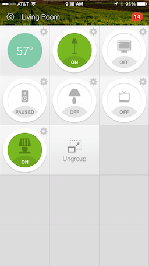
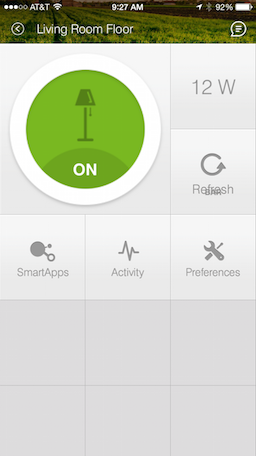
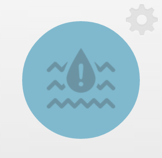
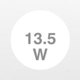

Tiles
=====

When creating a device type, you define how it will appear for the user on their "Things" screen. This is done by configuring different tiles. 

Tiles are rendered using a grid system that has three columns and unlimited rows. If you look in your "Things" view in the mobile app, those are tiles:

Clicking the settings icon will show the details view, which includes additional tiles:

Tiles are defined inside the metadata block.

Overview
--------

The tiles block is composed of tile definitions, and layout information (the ``main`` and ``details`` method). There are three types of tiles that you can use within your device types. Each tile serves a different purpose.

Consider this example for a switch:

.. code-block:: groovy

    tiles {
        standardTile("switchTile", "device.switch", width: 2, height: 2, 
                     canChangeIcon: true) {
            state "off", label: '${name}', action: "switch.on", 
                  icon: "st.switches.switch.off", backgroundColor: "#ffffff"
            state "on", label: '${name}', action: "switch.off", 
                  icon: "st.switches.switch.on", backgroundColor: "#E60000"
        }
        valueTile("powerTile", "device.power", decoration: "flat") {
            state "power", label:'${currentValue} W'
        }
        standardTile("refreshTile", "device.power", decoration: "ring") {
            state "default", label:'', action:"refresh.refresh", 
                  icon:"st.secondary.refresh", 
        }

        main "switchTile"
        details(["switchTile","powerTile","refreshTile"])
    }

The first argument to the tile methods is the name of the tile. This is used to identify the tile when specifying the tile layout.

The second argument is the attribute this tile is associated with. Each tile is associated with an attribute of the device. 

In the example above, a *standardTile* (more on that later) is created with the name "switchTile", for the "switch" attribute. The convention is to prefix the attribute name with "device" - so the format is "device.<attributeName>".

The switch attribute has two possible values: "on", and "off". Since we want the display to change depending on if the switch is on and off, and we want to allow the user to toggle the switch by pressing the icon, we define a state for each. The ``state`` method allows us to specify display information like icon and background color for each state, as well as specify what action should happen when the tile is pressed in this state. 

The ``state`` method is discussed later in this document.

Common Tile Parameters
~~~~~~~~~~~~~~~~~~~~~~

All tiles support the following parameters:

*width*
    number - controls how wide this tile is. Default is 1.
*height*
    number - controls how tall this tile tile is. Default is 1.
*canChangeIcon*
    boolean - ``true`` to allow the user to pick their own icon. Defaults to ``false``.
*canChangeBackground*
    boolean - ``true`` to allow a user to choose their own background image for the tile. Defaults to ``false``.
*decoration*
    String - specify "flat" for the tile to render without a ring. Defaults to "ring".

.. note::

    You may see device-type handlers that use the *inactiveLabel* property. This is deprecated and has no effect.

State
-----

Each tile can have on more *state* definitions. 

Back to our switch example, consider the switch tile definition:

.. code-block:: groovy

    standardTile("switchTile", "device.switch", width: 2, height: 2, 
                 canChangeIcon: true) {
        state "off", label: '${name}', action: "switch.on", 
              icon: "st.switches.switch.off", backgroundColor: "#ffffff"
        state "on", label: '${name}', action: "switch.off", 
              icon: "st.switches.switch.on", backgroundColor: "#E60000"
    }

The "switch" attribute specifies two possible values - "on" and "off". We define a state for each possible value. The first argument to the ``state`` method should be the value of the attribute this state applies to (there is an exception to this rule discussed below).

When the switch is off, and the user presses on the tile on their mobile device, we want to turn the switch on. We specify this action using the ``action`` parameter. 

The value of the ``action`` parameter should be the name of the command to invoke. The convention is to prefix the command name with the capability, so in the example above we have "switch.on".

State Selection
~~~~~~~~~~~~~~~

The following algorithm is used to determine which state to display, when there are multiple states:

#. If a state is defined for the attribute's current value, it will render that.
#. If no state exists for the attribute value, it will render a state that has specified ``defaultState: true``. Use this in place of the "default" state name that you may see in some device-type handlers.
#. If no state matches the above rules, it will render the first state declaration.

State Parameters
~~~~~~~~~~~~~~~~

The valid parameters are:

*action*
    String - The action to take when this tile is pressed. The form is <tileName>.<command>. 
*backgroundColor*
    String or List - A hexadecimal color code to use for the background color.
    Use a string for one background color all the time for this state. You can also pass a list of maps to specify different colors for different values.This is often useful for numeric data like temperature or humidity. Values between two specified values will render as a gradient between the specified colors. See the example below for more information. 
*defaultState*
    boolean - Specify ``true`` if this state should be the active state displayed for this tile. See the `State Selection`_ topic above for more information.
*icon*
    String - The identifier of the icon to use for this tile. You can view the icon options `here <http://scripts.3dgo.net/smartthings/icons>`__. iOS devices support specifying a URL to a custom image (not currently supported on Android)
*label*
    String - The label for this state.

.. note::

    The example above uses some attributes within our state method. We use the ``name`` and ``currentValue`` attributes to make our state definition more dynamic.

Tile Definitions
----------------

standardTile()
~~~~~~~~~~~~~~

Use a standard tile to display current state information. For example, to show that a switch is on or off, or that there is or is not motion.

.. code-block:: groovy

    standardTile("water", "device.water", width: 2, height: 2) {
        state "dry", icon:"st.alarm.water.dry", backgroundColor:"#ffffff"
        state "wet", icon:"st.alarm.water.wet", backgroundColor:"#53a7c0"
    }

The above tile definition would render as (when wet):

controlTile()
~~~~~~~~~~~~~

Use a control tile to display a tile that allows the user to input a value within a range. A common use case for a control tile is a light dimmer.

In addition to name and attribute parameters, ``controlTile`` requires a third argument to specify the type of control. The valid arguments are "slider" and "color".

*name*
    Name of this tile.
*attribute*
    Attribute that this tile displays
*type*
    The type of control. Valid types are "slider" and "color"

.. code-block:: groovy

    controlTile("levelSliderControl", "device.level", "slider", 
                height: 1, width: 2) {
        state "level", action:"switch level.setLevel"
    }

This renders as:

.. figure:: ../img/device-types/control-tile.png

valueTile()
~~~~~~~~~~~

Use a value tile to display a tile that displays a specific value. Typical examples include temperature, humidity, or power values.

.. code-block:: groovy

    valueTile("power", "device.power", decoration: "flat") {
        state "power", label:'${currentValue} W'
    }

This renders as:

.. note::

    You may see other tile types in existing device-type handlers. Tile types that are not documented here should be considered experimental, and subject to change. 

    When they are ready to be opened up for wider community development, we will document them.

Tile Layouts
------------

To control which tile shows up on the things screen, use the ``main`` method in the ``tiles`` closure. The ``details`` method defines an ordered list (will render from left-to-right, top-to-bottom) of tiles to display on the tile details screen.

.. code-block:: groovy

    tiles {
        // tile definitions. Assume tiles named "tileName1"
        // and "tileName2" created here.

        main "tileName1"
        details(["tileName1", "tileName2"])
    }

Example
-------

Here's an example of a thermostat application that uses all the tiles discussed.

.. code-block:: groovy

    tiles {
        valueTile("temperature", "device.temperature", width: 2, height: 2) {
            state("temperature", label:'${currentValue}°',
                backgroundColors:[
                    [value: 31, color: "#153591"],
                    [value: 44, color: "#1e9cbb"],
                    [value: 59, color: "#90d2a7"],
                    [value: 74, color: "#44b621"],
                    [value: 84, color: "#f1d801"],
                    [value: 95, color: "#d04e00"],
                    [value: 96, color: "#bc2323"]
                ]
            )
        }
        
        standardTile("mode", "device.thermostatMode", decoration: "flat") {
            state "off", label:'${name}', action:"switchMode"
            state "heat", label:'${name}', action:"switchMode"
            state "emergencryHeat", label:'${name}', action:"switchMode"
            state "cool", label:'${name}', action:"switchMode"
            state "auto", label:'${name}', action:"switchMode"
        }

        standardTile("fanMode", "device.thermostatFanMode",decoration: "flat") {
            state "fanAuto", label:'${name}', action:"switchFanMode"
            state "fanOn", label:'${name}', action:"switchFanMode"
            state "fanCirculate", label:'${name}', action:"switchFanMode"
        }

        controlTile("heatSliderControl", "device.heatingSetpoint", "slider", 
                    height: 1, width: 2) {
            state "setHeatingSetpoint", 
                   action:"thermostat.setHeatingSetpoint", 
                   backgroundColor:"#d04e00"
        }

        valueTile("heatingSetpoint", "device.heatingSetpoint", 
                  decoration: "flat") {
            state "heat", label:'${currentValue}° heat', 
                  backgroundColor:"#ffffff"
        }
        
        controlTile("coolSliderControl", "device.coolingSetpoint", "slider", 
                    height: 1, width: 2) {
            state "setCoolingSetpoint", 
                  action:"thermostat.setCoolingSetpoint", 
                  backgroundColor: "#1e9cbb"
        }
        
        valueTile("coolingSetpoint", "device.coolingSetpoint",
                  decoration: "flat") {
            state "cool", label:'${currentValue}° cool', 
                  backgroundColor:"#ffffff"
        }

        main "temperature"

        details(["temperature", "mode", "fanMode", "heatSliderControl", 
                "heatingSetpoint", "coolSliderControl", "coolingSetpoint"])
    }

This builds the following interface:

.. figure:: ../img/device-types/thermostat.png
   :alt: Thermostat

