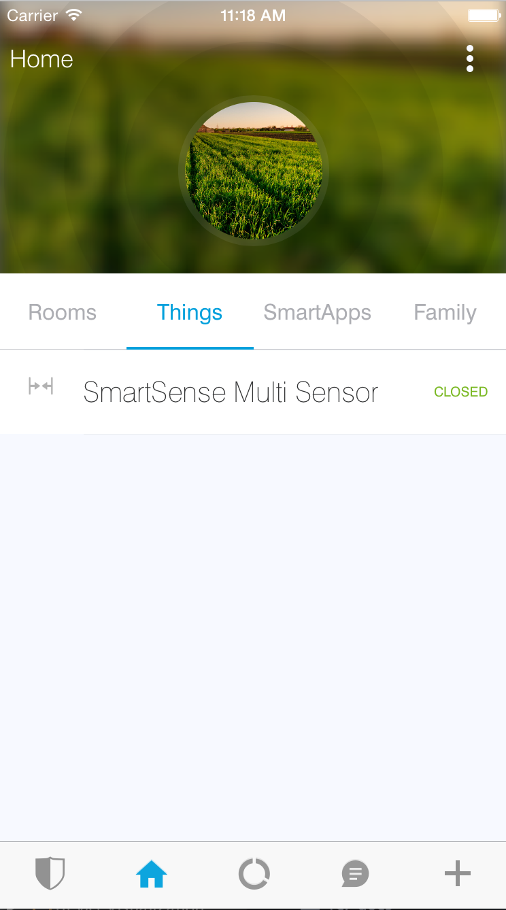
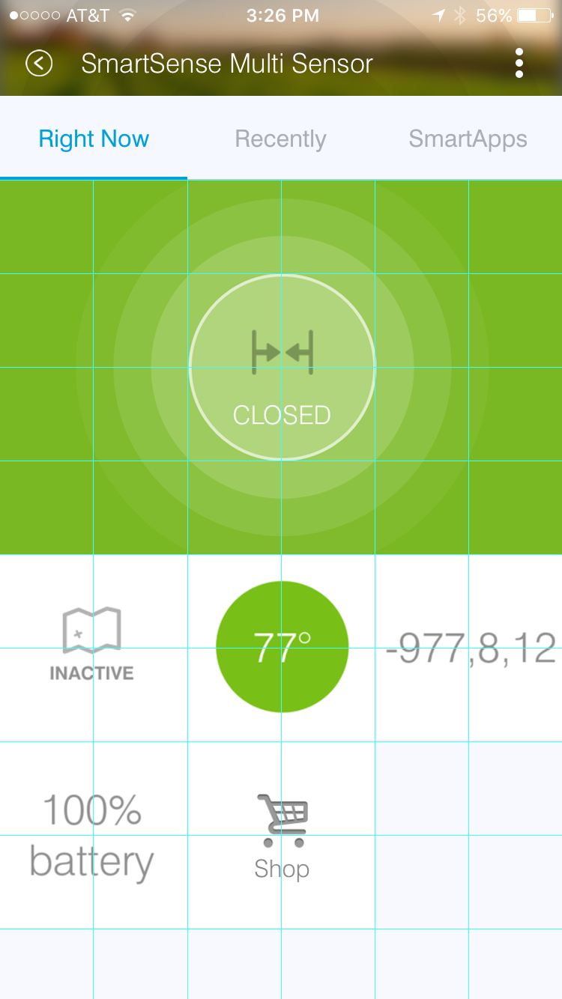
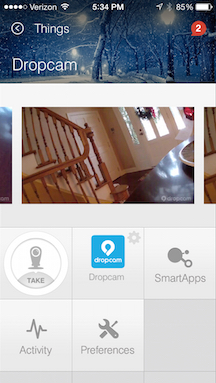
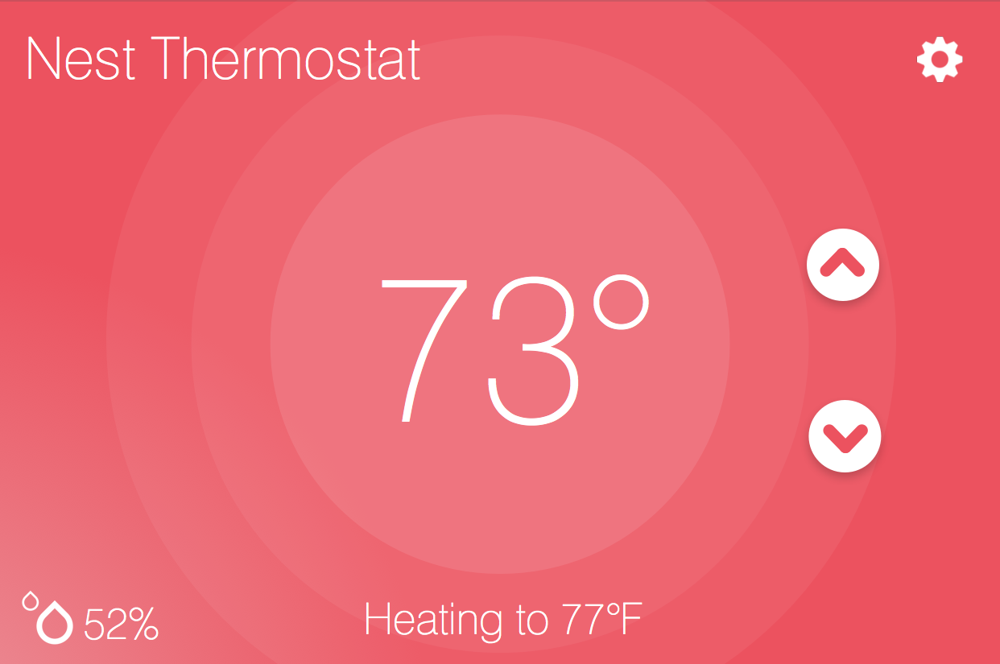

.. _device-tiles:

=====
Tiles
=====

Tiles define how devices are represented in the SmartThings mobile application. There are currently two main areas where devices are viewed.

.. note::
  Be sure to check out `multiAttributeTile()`_ below for new tile layout options.

The Things view is where you can see all of your devices listed.

When tapping on one of the devices in the Things view, you will be presented with the Details view for the device.

.. image:: ../img/device-types/details-view.png
   :width: 30%

When creating a Device Handler, you define how it will appear for the user on their Details screen by defining and configuring different Tiles.

Tiles are defined inside the metadata block of device handlers. Let's take a look at how we can define Tiles in our device handlers.

Overview
--------

Developers have control over the look and feel of the Details view by defining Tiles.

Tiles are defined in the Device Handler by calling the ``tiles()`` method. The ``tiles()`` method is composed of tile definitions, and layout information (the ``main`` and ``details`` method). There are five types of tiles that you can use within your Device Handler. Each tile serves a different purpose.

Consider this tiles block for the Multipurpose Sensor from the screenshot above:

.. code-block:: groovy

    tiles(scale: 2) {
        multiAttributeTile(name:"status", type: "generic", width: 6, height: 4){
            tileAttribute ("device.status", key: "PRIMARY_CONTROL") {
                attributeState "open", label:'${name}', icon:"st.contact.contact.open", backgroundColor:"#ffa81e"
                attributeState "closed", label:'${name}', icon:"st.contact.contact.closed", backgroundColor:"#79b821"
                attributeState "garage-open", label:'Open', icon:"st.doors.garage.garage-open", backgroundColor:"#ffa81e"
                attributeState "garage-closed", label:'Closed', icon:"st.doors.garage.garage-closed", backgroundColor:"#79b821"
            }
        }
        standardTile("contact", "device.contact", width: 2, height: 2) {
            state("open", label:'${name}', icon:"st.contact.contact.open", backgroundColor:"#ffa81e")
            state("closed", label:'${name}', icon:"st.contact.contact.closed", backgroundColor:"#79b821")
        }
        standardTile("acceleration", "device.acceleration", width: 2, height: 2) {
            state("active", label:'${name}', icon:"st.motion.acceleration.active", backgroundColor:"#53a7c0")
            state("inactive", label:'${name}', icon:"st.motion.acceleration.inactive", backgroundColor:"#ffffff")
        }
        valueTile("temperature", "device.temperature", width: 2, height: 2) {
            state("temperature", label:'${currentValue}°',
                backgroundColors:[
                    [value: 31, color: "#153591"],
                    [value: 44, color: "#1e9cbb"],
                    [value: 59, color: "#90d2a7"],
                    [value: 74, color: "#44b621"],
                    [value: 84, color: "#f1d801"],
                    [value: 95, color: "#d04e00"],
                    [value: 96, color: "#bc2323"]
                ]
            )
        }
        valueTile("3axis", "device.threeAxis", decoration: "flat", wordWrap: false, width: 2, height: 2) {
            state("threeAxis", label:'${currentValue}', unit:"", backgroundColor:"#ffffff")
        }
        valueTile("battery", "device.battery", decoration: "flat", inactiveLabel: false, width: 2, height: 2) {
            state "battery", label:'${currentValue}% battery', unit:""
        }
        standardTile("refresh", "device.refresh", inactiveLabel: false, decoration: "flat", width: 2, height: 2) {
            state "default", action:"refresh.refresh", icon:"st.secondary.refresh"
        }

        main "status"
        details(["status", "acceleration", "temperature", "3axis", "battery", "refresh"])
    }

Tiles are defined with either a ``scale: 1`` (default) or ``scale: 2`` argument. The value of ``2`` will enable the *6 X Unlimited* grid layout. If the ``scale`` argument is not supplied, it will be set to the default value of ``1``.

Here you can see how the tiles defined above are laid out using the *6 X Unlimited* grid (using the ``scale: 2`` option):

.. note::

  The grid layout can be a 3 column, unlimited row, grid system or a *6 X Unlimited* grid to be more visually appealing and to give developers more flexibility when defining layouts. New *6 X Unlimited* tiles will be scaled back on older versions of the SmartThings mobile app that do not support the *6 X Unlimited* grid layout.

The first argument to the tile methods (``standardTile()``, ``valueTile()``, etc.) is the name of the tile. This is used to identify the tile when specifying the tile layout.

The second argument is the attribute this tile is associated with. Each tile is associated with an attribute of the device.

In the example above, a ``standardTile()`` (more on that later) is created with the name ``"contact"``, for the "contact" attribute. The convention is to prefix the attribute name with ``"device"`` - so the format is ``"device.<attributeName>"``.

The contact attribute has two possible values: "open", and "closed". Since we want the display to change depending on if the contact is open or closed, we define a state for each. The ``state()`` method allows us to specify display information like icon and background color for each state, as well as specify what action should happen when the tile is interacted with in its current state.

The ``state()`` method is discussed later in this document.

Common Tile Parameters
~~~~~~~~~~~~~~~~~~~~~~

All tiles support the following parameters:

*width*
    number - controls how wide this tile is. Default is 1.
*height*
    number - controls how tall this tile tile is. Default is 1.
*canChangeIcon*
    boolean - ``true`` to allow the user to pick their own icon. Defaults to ``false``.
*canChangeBackground*
    boolean - ``true`` to allow a user to choose their own background image for the tile. Defaults to ``false``.
*decoration*
    String - specify "flat" for the tile to render without a ring.

.. note::

    You may see Device Handlers that use the ``inactiveLabel`` property. This is deprecated and has no effect.

State
-----

Each tile can have one or more ``state()`` definitions.

Let's consider a switch tile definition example:

.. code-block:: groovy

    standardTile("switchTile", "device.switch", width: 2, height: 2,
                 canChangeIcon: true) {
        state "off", label: '${name}', action: "switch.on",
              icon: "st.switches.switch.off", backgroundColor: "#ffffff"
        state "on", label: '${name}', action: "switch.off",
              icon: "st.switches.switch.on", backgroundColor: "#E60000"
    }

.. important::

    Notice anything strange about the ``label`` value for state? It appears to be using Groovy's string interpolation syntax (``${}``), but with a **single quote**. In Groovy, String interpolation is only possible for strings defined in double quotes. So, what gives?

    When the SmartThings platform executes the ``tiles()`` method you have defined, it doesn't yet know anything about the actual devices. Only later, when the device details screen is rendered in the mobile client, does the platform know information about the specific devices.

    So, we use single quotes for the label (``${name}``) because the platform can then manually substitute the actual value later, when it is available.

    Long story short - the above is not a typo. Use single quotes for interpolated string values in the tiles definition.

The "switch" attribute specifies two possible values - "on" and "off". We define a state for each possible value. The first argument to the ``state()`` method should be the value of the attribute this state applies to (there is an exception to this rule discussed below).

When the switch is off, and the user presses on the tile on their mobile device, we want to turn the switch on. We specify this action using the ``action`` parameter.

The value of the ``action`` parameter should be the name of the command to invoke. The convention is to prefix the command name with the capability, so in the example above we have "switch.on". Custom commands not related to a capability may also be called as an action, for example ``myCommand``, provided that a corresponding ``command`` declaration is present in the description metadata. In this case, use the ``action: "myCommand"`` syntax.

State Selection
~~~~~~~~~~~~~~~

The following algorithm is used to determine which state to display, when there are multiple states:

#. If a state is defined for the attribute's current value, it will render that.
#. If no state exists for the attribute value, it will render a state that has specified ``defaultState: true``. Use this in place of the "default" state name that you may see in some device handlers.
#. If no state matches the above rules, it will render the first state declaration.

State Parameters
~~~~~~~~~~~~~~~~

The valid parameters are:

*action*
    String - The action to take when this tile is pressed. The form is <capabilityReference>.<command>.
*backgroundColor*
    String - A hexadecimal color code to use for the background color. This has no effect if the tile has ``decoration: "flat"``.
*backgroundColors*
     List - Specify a list of maps of attribute values and colors. The mobile app will match and interpolate between these entries to select a color based on the value of the attribute.
*defaultState*
    boolean - Specify ``true`` if this state should be the active state displayed for this tile. See the `State Selection`_ topic above for more information.
*icon*
    String - The identifier of the icon to use for this state. You can view the icon options `here <http://scripts.3dgo.net/smartthings/icons>`__. iOS devices support specifying a URL to a custom image.
*label*
    String - The label for this state.

.. note::

    The example above uses some attributes within our state method. We use the ``name`` and ``currentValue`` attributes to make our state definition more dynamic.

Tile Definitions
----------------

standardTile()
~~~~~~~~~~~~~~

Use a standard tile to display current state information. For example, to show that a switch is on or off, or that there is or is not motion.

.. code-block:: groovy

    standardTile("water", "device.water", width: 2, height: 2) {
        state "dry", icon:"st.alarm.water.dry", backgroundColor:"#ffffff"
        state "wet", icon:"st.alarm.water.wet", backgroundColor:"#53a7c0"
    }

The above tile definition would render as (when wet):

.. figure:: ../img/device-types/moisture-tile.png

controlTile()
~~~~~~~~~~~~~

Use a control tile to display a tile that allows the user to input a value within a range. A common use case for a control tile is a light dimmer.

In addition to name and attribute parameters, ``controlTile()`` requires a third argument to specify the type of control. The valid arguments are "slider" and "color".

*name*
    Name of this tile.
*attribute*
    Attribute that this tile displays
*type*
    The type of control. Valid types are "slider" and "color"

.. code-block:: groovy

    controlTile("levelSliderControl", "device.level", "slider",
                height: 1, width: 2) {
        state "level", action:"switch level.setLevel"
    }

This renders as:

.. figure:: ../img/device-types/control-tile.png

You can also specify a custom range by using a ``range`` parameter. It is a string, and is in the form ``"(<lower bound>..<upper bound>)"``

.. code-block:: groovy

    controlTile("levelSliderControl", "device.level", "slider", height: 1,
                 width: 2, inactiveLabel: false, range:"(0..100)") {
        state "level", action:"switch level.setLevel"
    }

valueTile()
~~~~~~~~~~~

Use a value tile to display a tile that displays a specific value. Typical examples include temperature, humidity, or power values.

.. code-block:: groovy

    valueTile("power", "device.power", decoration: "flat") {
        state "power", label:'${currentValue} W'
    }

This renders as:

.. figure:: ../img/device-types/value-tile-power.png

carouselTile()
~~~~~~~~~~~~~~

A carousel tile is often used in conjunction with the Image Capture capability, to allow users to scroll through recent pictures.

Many of the camera Device Handlers will make use of the ``carouselTile()``.

.. code-block:: groovy

    carouselTile("cameraDetails", "device.image", width: 3, height: 2) { }

multiAttributeTile()
~~~~~~~~~~~~~~~~~~~~

.. warning::
     Currently there is a parity issue between Android and iOS platforms in regard to how multiAttribute tiles work. There is currently work being done on the Android platform to address this. In the meantime, some things stated here about multiAttributeTiles may not work as expected on the Android platform.

Multi-Attribute Tiles combine multiple attributes into a single tile presented with a rich UI. Here are some of the types of tiles that you can create:

==================================================    ==================================================    ==================================================    ==================================================
Lighting                                              Thermostat                                            Video Player                                          Generic (Default)
.. image:: ../img/device-types/lighting.png           .. image:: ../img/device-types/thermostattile.png     .. image:: ../img/device-types/video.png              .. image:: ../img/device-types/generic.png
==================================================    ==================================================    ==================================================    ==================================================

Multi-Attribute Tiles must be given a width of 6 and a height of 4. To enable this, the ``tiles`` block of your Device Handler must use the new *6 X Unlimited* grid layout.

.. code-block:: groovy

  tiles(scale: 2) {
    ...
  }

The ``multiAttributeTile()`` method works much like any of the other tile methods currently available. Let's look at an example of a simple generic tile for a contact sensor.

.. code-block:: groovy

  tiles(scale: 2) {
    multiAttributeTile(name:"richcontact", type:"generic", width:6, height:4) {
      tileAttribute("device.contact", key: "PRIMARY_CONTROL") {
        attributeState "open", label: '${name}', icon:"st.contact.contact.open", backgroundColor:"#ffa81e"
        attributeState "closed", label:'${name}', icon:"st.contact.contact.closed", backgroundColor:"#79b821"
      }
    }

    main "richcontact"
    details "richcontact"
  }

The above code renders a device details page looking like this:

.. image:: ../img/device-types/contact.png
   :width: 30%

The ``multiAttributeTile()`` method accepts the same parameters as any other tile, with the notable addition of ``type``. Valid options for ``type`` are ``"generic"``, ``"lighting"``, ``"thermostat"``, and ``"video"``.

.. note::

    The only ``multiAttributeTile()`` ``type`` option that exhibits special behavior today is ``"thermostat"`` (see below). While the other options are currently only placeholders, we recommend you use the proper type for your given Device Handler.

    Also worth noting is that you may see other types of tiles in existing Device Handlers. Tiles that are not documented here should be considered experimental, and subject to change.

The power of Multi-Attribute Tiles comes from its child method parameter, ``tileAttribute()``. Each ``tileAttribute()`` declaration defines an attribute that should be visible on the multi attribute tile. The ``tileAttribute()`` method currently supports two parameters:

*tileAttribute(attribute, key)*

- The ``attribute`` parameter is the device attribute that the tile attribute represents. For example, device.contact or device.level.
- the ``key`` parameter can have the following values:

===================  ====================================  =====================================================
Value                Meaning                               Example
===================  ====================================  =====================================================
PRIMARY_CONTROL      Main control in middle                .. image:: ../img/device-types/PRIMARY_CONTROL.png
SECONDARY_CONTROL    Textual status message                .. image:: ../img/device-types/SECONDARY_CONTROL.png
SLIDER_CONTROL       Slider above primary control          .. image:: ../img/device-types/SLIDER_CONTROL.png
COLOR_CONTROL        Color palette button                  .. image:: ../img/device-types/COLOR_CONTROL.png
VALUE_CONTROL        Up and down buttons (see note below)  .. image:: ../img/device-types/VALUE_CONTROL.png
===================  ====================================  =====================================================

.. note::

  The color of the multi-attribute tile is controlled by the PRIMARY_CONTROL tile attribute, or in the case of a ``"thermostat"`` type, the OPERATING_STATE attribute will be used (see below). It will default to a light gray color. If the PRIMARY_CONTROL attribute contains states that change the color, the color of the multi attribute tile will also change.

The last piece of the puzzle is *state*. ``tileAttribute()`` can support *states* just like other tile types. This is done with the new method ``attributeState()``. From the contact example above:

.. code-block:: groovy

  tileAttribute("device.contact", key: "PRIMARY_CONTROL") {
    attributeState "open", label: '${name}', icon:"st.contact.contact.open", backgroundColor:"#ffa81e"
    attributeState "closed", label:'${name}', icon:"st.contact.contact.closed", backgroundColor:"#79b821"
  }

This will render the main control in the middle (because ``key`` is ``"PRIMARY_CONTROL"``), with one of two states: "open" label, open icon, and yellow color; or "closed" label, closed icon, and green color.

``attributeState()`` accepts all the same parameters as the ``state()`` method for all other tiles. This means you can supply actions just as you would for ``state()``, to trigger actions when tapping on the control.

A word on the ``VALUE_CONTROL`` attribute
~~~~~~~~~~~~~~~~~~~~~~~~~~~~~~~~~

As of client version 2.1.0 (iOS and Android), the ``VALUE_CONTROL`` attribute has been improved to allow device type handlers to perform discrete actions for the Up and Down buttons. You can improve your device type handlers by specifying two states with specific names: ``VALUE_UP`` and ``VALUE_DOWN``. The actions associated with these two states will be used for each of the buttons. If you don't change your device type handler, the old approach will still work, though this may be deprecated and eliminated in the future.

Multi-Attribute Tiles With ``type: "thermostat"``
~~~~~~~~~~~~~~~~~~~~~~~~~~~~~~~~~

As you can see in the image above, the main distinction thermostat tiles have over the other documented types is the presence of a status label at the bottom of the tile. This label provides users with more information on the state of their thermostat. Additionally, thermostat tiles also look to the OPERATING_STATE attribute for its background color, falling back on PRIMARY_CONTROL's color(s).

In order to provide the relevant data to present the label, we've created four additional attributes you should include.

===================  ============================================  ================================================================================================================
Value                Meaning                                       Notes
===================  ============================================  ================================================================================================================
OPERATING_STATE      What the thermostat is doing                  The label will not show if OPERATING_STATE is omitted, as this is the baseline amount of meaningful information.
THERMOSTAT_MODE      Thermostat mode (i.e. Heat, Cool, or Auto)    This allows the user to know the mode (and temperature) if the system is idle (e.g. "Idle—Heat at 66°")
HEATING_SETPOINT     At which point the system will begin heating  Informs the user when heating will start (or stop, if currently heating)
COOLING_SETPOINT     At which point the system will begin cooling  Informs the user when cooling will start (or stop, if currently cooling)
===================  ============================================  =====================================================

.. note::

  Only OPERATING_STATE is required to present the status label, but providing all four attributes will ensure the best experience for your users.

Here is an example of a fully-attributed thermostat. Try to model your own device handler after the following for best results.

.. code-block:: groovy

  multiAttributeTile(name:"thermostatMulti", type:"thermostat", width:6, height:4) {
    tileAttribute("device.temperature", key: "PRIMARY_CONTROL") {
      attributeState("default", label:'${currentValue}', unit:"dF")
    }
    tileAttribute("device.temperature", key: "VALUE_CONTROL") {
      attributeState("VALUE_UP", action: "temperatureUp")
      attributeState("VALUE_DOWN", action: "temperatureDown")
    }
    tileAttribute("device.humidity", key: "SECONDARY_CONTROL") {
      attributeState("default", label:'${currentValue}%', unit:"%")
    }
    tileAttribute("device.thermostatOperatingState", key: "OPERATING_STATE") {
      attributeState("idle", backgroundColor:"#44b621")
      attributeState("heating", backgroundColor:"#ffa81e")
      attributeState("cooling", backgroundColor:"#269bd2")
    }
    tileAttribute("device.thermostatMode", key: "THERMOSTAT_MODE") {
      attributeState("off", label:'${name}')
      attributeState("heat", label:'${name}')
      attributeState("cool", label:'${name}')
      attributeState("auto", label:'${name}')
    }
    tileAttribute("device.heatingSetpoint", key: "HEATING_SETPOINT") {
      attributeState("default", label:'${currentValue}', unit:"dF")
    }
    tileAttribute("device.coolingSetpoint", key: "COOLING_SETPOINT") {
      attributeState("default", label:'${currentValue}', unit:"dF")
    }
  }

Tile Layouts
------------

To control which tile shows up on the things screen, use the ``main`` method in the ``tiles`` closure.
The ``details`` method defines an ordered list (will render from left-to-right, top-to-bottom) of tiles to display on the tile details screen.

.. code-block:: groovy

    tiles {
        // tile definitions. Assume tiles named "tileName1"
        // and "tileName2" created here.

        main "tileName1"
        details(["tileName1", "tileName2"])
    }

Examples
--------

All Devices define ``tiles``, but here are a few examples (ordered from simpler to more complex) that illustrate using many of the tiles discussed above:

- `SmartSense Multi Sensor`_
- `CentraLite Dimmer`_
- `Hue Bulb`_

.. _SmartSense Multi Sensor: https://github.com/SmartThingsCommunity/SmartThingsPublic/blob/master/devicetypes/smartthings/smartsense-multi-sensor.src/smartsense-multi-sensor.groovy
.. _CentraLite Dimmer: https://github.com/SmartThingsCommunity/SmartThingsPublic/blob/master/devicetypes/smartthings/centralite-dimmer.src/centralite-dimmer.groovy
.. _Hue Bulb: https://github.com/SmartThingsCommunity/SmartThingsPublic/blob/master/devicetypes/smartthings/hue-bulb.src/hue-bulb.groovy
