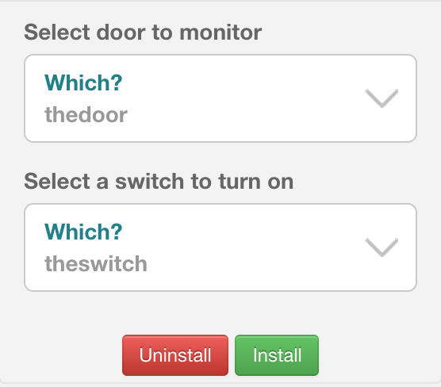

.. _first-smartapp-tutorial:

Writing Your First SmartApp
===========================

.. role:: strike
    :class: strike

This tutorial will guide you through writing your first SmartApp. Once you've read through the Getting Started material, this should be your next stop.

At the end of this tutorial, you will know:

- How to create a SmartApp using the web-based IDE.
- The key components of a SmartApp.
- How to gather input from a user to configure the SmartApp.
- How to subscribe to changes in a device's state.
- How to control devices.
- How to use the simulator to test your SmartApp.
- How to publish your SmartApp and install it on your mobile phone.
- :strike:`How to achieve world domination, without even trying`

The SmartApp we will create will be fairly simple, but will teach you some core concepts of SmartThings, and get you familiar with the development process.

The purpose of the SmartApp is to turn a switch on when a door opens.

Prerequisites
-------------

Before completing this tutorial, you should have read the :ref:`get-started-overview`, and registered for an account as discussed in the :ref:`quick-start` page.

The SmartApp will utilize an open-closed sensor and a smart switch. If you don't have these devices, or even a hub, you can still complete the majority of this tutorial. We will call out any special steps required if you don't have the hardware.

Some programming experience is assumed in this tutorial. You don't have to be an expert in Groovy, or even know what it is. But we do assume you've programmed before.

Create a SmartApp
-----------------

In the developer tools, navigate to the *My SmartApps* page.

.. image:: ../img/tutorials/first-smartapp/my-smartapps.png
   :width: 70%

This will bring you to a page that shows all of the SmartApps that you have created. This is also where you can create a new SmartApp. Click on the "New SmartApp" button.

.. image:: ../img/tutorials/first-smartapp/new-smartapp.png
   :width: 70%

Three options are presented for creating a new SmartApp, "From Form", "From Code", and "From Template".

.. image:: ../img/tutorials/first-smartapp/smartapp-form.png
   :width: 70%

The "From Form" option will ask for some details about your SmartApp and create a SmartApp with some boiler plate code. The "From Code" option will create a new SmartApp out of code that you paste into the input box. And finally, the "From Template" option will let you select an already existing SmartApp and use its code as a starting point. This is useful when you want to change or enhance a SmartApp that already exists, and it also a great way to look at examples.

For our SmartApp, let's stick to the "From Form" option.

Fill out the form as follows:

*Name*: A name for your SmartApp. Call it something like "My First SmartApp"

*Namespace*: This field uniquely identifies your SmartApp in the event that someone else has written a SmartApp with the exact same name. Usually we recommend using your GitHub id.

*Author*: This is you. Populate this field with your handle.

*Description*: This describes the intent and functionality of your SmartApp. The better the description, the less confusing it is to other people looking at your SmartApp.

*Category*: SmartApps are categorized based on functionality. This will also determine where you can find your SmartApp in the mobile app. Pick a suitable category. For this exercise, We recommend "My Apps".

Leave the rest of the fields as they are for now and click the "Create" button at the bottom. This will create the SmartApp and populate it with some skeleton code. In the next section we will dive into using the editor to begin writing your first SmartApp.

Editor
------

Once you've created your SmartApp, you'll be taken to the editor and simulator. Before we look at the code, it's worth becoming familiar with some of the basic features.

Above the code window, there are four buttons:

.. image:: ../img/tutorials/first-smartapp/editor-buttons.png

Save
    This button does exactly as you'd think - it saves your SmartApp.

Publish
    This allows you to publish your SmartApp for yourself to install on your mobile phone, as well as to submit it to the SmartThings team for publication into the SmartThings catalog.

IDE Settings
    Here you can make changes to personalize the editor to your liking. You can choose from a variety of themes to control the look and feel, specify your preferred keymapping, and set the font size.

App Settings
    This takes you back to the form that you created this SmartApp from, where you can view the values entered when you created the SmartApp, as well as edit certain properties about the SmartApp.

On the upper-right side of the IDE, you'll see a drop-down titled *Browse SmartApp Templates*. If you click this, you'll see a variety of SmartApps that you can browse to learn from, or use as the starting point of a new SmartApp.

Simulator
---------

On the right side of the IDE is the simulator. This is where you can install your SmartApp to test it, either using physical devices, or simulated devices. We will walk you through installing the SmartApp using this later in the tutorial.

.. image:: ../img/tutorials/first-smartapp/simulator-1.png

.. note::

    If your simulator does not look like the one above, but instead displays a message about needing a location, don't worry. We'll cover creating a location if you don't have one later in this tutorial.

SmartApp Basics
---------------

The first thing to know is that there are actually a few different types of SmartApps.
Some SmartApps may manage the connection of a cloud-connected or LAN-connected device (called Service Manager SmartApps).
Some may provide a dashboard-like user interface in the mobile application (Solution Module SmartApps) [1]_.
The most common type of a SmartApp is one that monitors the user's devices for certain changes (or simply execute on a defined schedule), and then take certain action ("Turn a light on when motion is detected"). These are called Event-Handler SmartApps.

This tutorial will walk you through building an Event-Handler SmartApp, but the core principles you will learn are applicable to all types of SmartApps.

Regardless of what type of SmartApp you are writing, there are a few core principles that apply to all SmartApps:

- SmartApps are not continuously running. They are executed in response to various events or schedules.
- With the exception of Solution Module SmartApps, SmartApps do not have any user interface, except for the preferences page that allows the user to configure the SmartApp (more on this in a bit).
- The code that defines a SmartApp does not run on the user's mobile phone. SmartApps may execute in the SmartThings cloud, or on the hub - but the location of execution has no bearing on how we write SmartApps. The mobile application uses some information from the SmartApp to drive the experience in the app.

<architecture diagram perhaps that shows how/where a SmartApp executes?>

In your editor, you can see that there is some code already written for you. This defines the basic structure and skeleton for your SmartApp. We will discuss each key component as we build our SmartApp.

Definition
----------

Every SmartApp must have a ``definition`` method call. This provides metadata about the SmartApp itself. The ``definition`` method simply expects a map of parameters. If you look at the code in the editor, you'll see that these values are already set from the values you entered when creating your SmartApp:

.. code-block:: groovy

    definition(
        name: "My First SmartApp",
        namespace: "mygithubusername",
        author: "Peter Gregory",
        description: "This is my first SmartApp. Woot!",
        category: "My Apps",
        iconUrl: "https://s3.amazonaws.com/smartapp-icons/Convenience/Cat-Convenience.png",
        iconX2Url: "https://s3.amazonaws.com/smartapp-icons/Convenience/Cat-Convenience@2x.png",
        iconX3Url: "https://s3.amazonaws.com/smartapp-icons/Convenience/Cat-Convenience@2x.png")

We don't need to change anything here, so let's move on to defining our preferences.

Preferences
-----------

The ``preferences`` method is where we define what information our SmartApp needs from the user. When a user installs a SmartApp on their mobile device, they will be taken to a screen (or screens) where they can configure the SmartApp. The content of these screens are derived from our ``preferences`` definition.

Preferences can be displayed as a simple, single screen, or multiple screens. This tutorial will use a simple preferences definition, with only one screen.

In the editor, there is a ``preferences`` definition stubbed in for us:

.. code-block:: groovy

    preferences {
    	section("Title") {
    		// TODO: put inputs here
    	}
    }

.. tip::

    Those new to Groovy might be a bit thrown off by the ``{`` after the ``preferences`` statement. You might even be tempted to think that that is some Groovy way of invoking a method with parameters, just as languages that use parentheses do. That's not the case, however.

    The first thing to note is that in Groovy, surrounding arguments with parenthesis is not always required. The above code could be written as:

    .. code-block:: groovy

        preferences ({
            section("Title") ({
                // TODO: put inputs here
            })
        })

    Parentheses are *always* required when a method has no parameters.

    We typically do not use the parentheses unless we have to, or if it improves the readability of the code.

    So, what is the ``{}``? It's Groovy's notation for defining a closure. If you don't know what a closure is, that's ok. For now, just think of it as a way to define a block of code that we can pass around.

    To summarize, the ``preferences`` method accepts one parameter, a closure (defined inside the ``{}``), and we do not use the parentheses around the argument.

Recall that the purpose of our SmartApp is to turn a switch on when a door opens (by using an open-closed sensor to detect when a door is open or closed). Our SmartApp needs to know which switch and open-closed sensor to work with. Update  ``preferences`` with this code:

.. code-block:: groovy

    preferences {
        section("Select door to monitor") {
            input "thedoor", "capability.contactSensor", required: true
        }
        section("Select a switch to turn on") {
            input "theswitch", "capability.switch", required: true
        }
    }

Notice that we defined two ``section`` calls. Sections allow us to group related inputs, and can have a text description ("Select a switch to turn on").

We use the ``input`` method to specify what types of devices we want the user to choose from. Let's break down in detail the ``input`` for the switch:

.. code-block:: groovy

    input "theswitch", "capability.switch", required: true

The first argument to ``input`` is what we - inside our SmartApp - want to refer to the device as. In this case, we use ``"theswitch"``. This becomes the identifier for the device in our SmartApp, so that we can refer to the contact sensor as ``theswitch`` (without the quotes). We'll see this in action shortly.

The second argument is the type of device our SmartApp will work with. ``"capability.switch"`` states that our SmartApp is requesting the user to pick from *any* device that supports the Switch *capability*. The concept of capabilities is core to SmartThings, and requires a bit more explanation.

First, consider that the catalog of connected devices is growing at a rapid pace. New devices arrive on the market almost daily. Many of these devices do similar things, and some do multiple things.

SmartThings abstracts devices into their *capabilities* - that is, what the device is capable of. This allows us to build SmartApps that can work with *any* device that supports a given capability. In this way, we can build robust SmartApps that will work with any device integrated with SmartThings that supports a given capability.

Capabilities are broken down into the things the device can do (commands), and things it can report on (attributes).  Every capability defines its commands and attributes, and devices that support a given capability must support those commands and attributes.

.. note::

    A device may (and typically do) support multiple capabilities. For example, a Phillips Hue Bulb supports the Switch capability, because it can turn on and off. It also supports the Color Control capability, since the bulb can change colors. In our example, a Hue bulb could be selected by the user since it supports the Switch capability.

    But, our SmartApp is only requesting that a user select a device that supports the Switch capability, so even if the user selects a device that can do more (such as a Hue bulb), we cannot assume that in our SmartApp. All we can know is that the device supports the Switch capability.

With capabilities, we can be assured that even if a new device supporting the Switch capability is added after we've written and published our SmartApp, there's no need to update any code!

Capabilities are created and maintained by the SmartThings internal team. You can view the reference documentation for capabilities in the  :ref:`capabilities_taxonomy`.

The last thing to note in our ``input`` method call is the ``required: true`` argument. This specifies that the user must select a device in order to install the SmartApp.

.. important::

    By requiring users to select which devices the SmartApp will work with, SmartThings is providing a basic security feature - SmartThings can only control those devices which a user explicitly chooses. SmartApps cannot control devices which the user did not select, and this is by design.

To summarize, when the user installs the SmartApp on their mobile phone, they will be prompted to select a device that supports the switch capability. The mobile app will provide them with a list of devices for this user's location that support the switch capability. The device chosen will then be be identified within the SmartApp as ``theswitch``.

We covered a lot of information for such a small amount of code, but it's important that you understand the importance of ``preferences`` and capabilities.

For additional information about preferences, see the :ref:`prefs_and_settings` chapter of the SmartApp guide.

Now that you've updated the ``preferences`` method, make sure to save your SmartApp by clicking the *Save* button.

Events and Callback Methods
---------------------------

Our SmartApp needs to turn a switch on when a door opens. To turn the switch on, we first need to know when the door opens!

SmartApps can subscribe to various events, so that when that event happens, our SmartApp will be notified. We do this by using the ``subscribe`` method.

In your editor, below the ``preferences``, you'll see some methods already defined:

.. code-block:: groovy

    def installed() {
    	log.debug "Installed with settings: ${settings}"
    	initialize()
    }

    def updated() {
    	log.debug "Updated with settings: ${settings}"
    	unsubscribe()
    	initialize()
    }

    def initialize() {
    	// TODO: subscribe to attributes, devices, locations, etc.
    }

    // TODO: implement event handlers

Every SmartApp must define methods named ``installed()`` and ``updated()``. When  a user installs a SmartApp by clicking on the *Install* button in the mobile application (after filling out any required preferences inputs), the ``installed()`` method we define in our SmartApp will be called. This is where SmartApps can subscribe to any device changes we are interested in, as well as set up any scheduled tasks we want our SmartApp to perform.

Similarly, the ``updated()`` method is called when a user updates their installation of the SmartApp by changing any of the preferences inputs. For example, a user may want to change which switch is turned on after they have installed the SmartApp. So, they open the SmartApp settings, select a different switch, and then update the SmartApp. At this point, the ``updated()`` method is called.

In our ``updated()`` method, notice that the first thing we do (aside from some logging, which is discussed shortly), is to call a method called ``unsubscribe()``. This method is provided by the SmartThings platform, and simply removes any existing subscriptions this SmartApp has created. This is important, since the user has just changed their preferences for this SmartApp. If we didn't do this, we might still be subscribed to events for devices that the user has removed from the SmartApp.

Also, note that both ``installed()`` and ``updated()`` call a method named ``initialize()``. Since both ``installed()`` and ``upated()`` typically both create subscriptions or schedules, we can reduce code duplication by using a helper method.

Finally, a note about the ``log`` statement. SmartThings does not currently provide a debugger within the IDE. We can use the built-in ``log()`` method to log information that may be useful for debugging our SmartApp.

Also note that we reference a variable named ``settings`` in our log statement. Remember the preference inputs we defined? Every preference input gets stored in a map called ``settings``. We can get the values of the various inputs by indexing into the ``settings`` map with the name of the input (e.g., ``settings.theswitch``).

.. tip::

    Wondering about the ``${}`` syntax inside our logging message?

    That's the Groovy way performing of string substitution. The contents inside the brackets is a Groovy expression that evaluates to a string. The result of the expression will be used in the surrounded string.

    The brackets (``{}``) can be omitted if we are simply referencing a property. For example, we could replace the logging statement that just logs the settings with ``"Installed with settings: $settings"``. If we want to do anything more than simply reference a property, however, we need the brackets: ``"settings.theswitch: ${settings.theswitch}"``.

Now that you understand the purpose and importance of the ``installed()`` and ``updated()`` methods, we need to subscribe to any events that we are interested in. In our case, we need to know when the contact sensor reports that it is open.

In the editor, update the ``initialize()`` method with this:

.. code-block:: groovy

    def initialize() {
        subscribe(thedoor, "contact.open", doorOpenHandler)
    }

The ``subscribe()`` method accepts three parameters: The thing we want to subscribe to (``thedoor``), the specific attribute and its state we care about (``"contact.open"``), and the name of the method that should be called when this event happens.

How do you know what attribute and what state we can subscribe to? We refer to the :ref:`capabilities_taxonomy` to find out the available attributes the capability supports. In the case of the Contact Sensor capability, we see that it supports the ``"contact"`` attribute. In this case, it has two discreet possible values - "open" and "closed".

Since the ``"contact"`` attribute value is either open or closed, we can subscribe to either of those specific changes by using the format ``"<attribute>.<value>"``. This will cause the specified event handler method to be called any time the ``"contact"`` attribute value changes to ``"open"`` (the door opens).

If an attribute doesn't have discreet possible values (i.e., it could be any value), or if we want to know if the value of the attribute changed at all, we can subscribe to any change in the attribute's value by not specifying the state:

.. code-block:: groovy

    subscribe(thedoor, "contact", doorOpenHandler)

The above subscription would cause the ``doorOpenHandler`` to be called every time the ``"contact"`` attribute changed (either open or closed).

Now that we've created our subscription, we need to define the event handler method.

Event Handler Methods
---------------------

Add the following method to your SmartApp. We'll fill in the real meat of the method later.

.. code-block:: groovy

    def doorOpenHandler(evt) {
        log.debug "doorOpenHandler called: $evt"
    }

Every event handler method must accept a single parameter, which is an Event object that contains information about the event, such as the event's value, time it occurred, and other information.

Since we subscribed to the ``"open"`` state of the contact sensor, we know that our event handler method will only be called when the contact sensor changes from open to closed.

Now that we know the door has opened, we need to turn the light on!

Controlling Devices
-------------------

Recall that capabilities support commands (things the device can do), as well as attributes (things the attribute knows). To turn the switch on requires only one line of code to be added to our event handler:

.. code-block:: groovy
    :emphasize-lines: 3

    def doorOpenHandler(evt) {
        log.debug "doorOpenHandler called: $evt"
        theswitch.on()
    }

Simple, right? But how do we know that we can call the ``on()`` method on the switch? By looking at the :ref:`Switch Capability Reference <switch>`, we see that the Switch capability supports the ``on()`` and ``off()`` commands. These turn the switch on and off, respectively (shocking, we know).

Also note that we referred to the switch selected by the user by the name we provided in the ``input`` inside ``preferences`` (theswitch).

Using the Simulator
-------------------

Save your SmartApp by clicking the "Save" button at the top of the IDE. On the right hand side you will notice a location section.

.. image:: ../img/tutorials/first-smartapp/ide-location.png
   :width: 25%

SmartApps get installed to a location in your SmartThings account. If you have not set up a SmartThings hub, and thus do not have a location, the simulator will provide a default "Home" location for you. By clicking the "Set Location" button, you are telling the simulator that you want to install this SmartApp into the chosen location.

After you have selected the location, you will see the preferences section appear.

This is where you can choose devices that the SmartApp will use. Here we see that it asks for a door to monitor, and a switch. These two inputs directly correspond to what we have in the preferences section in our SmartApp. SmartThings will provide a "Virtual Device" when it can. When you do not have a physical device to choose from this is a very useful option. By default the virtual devices will be selected. Click the "Install" button, and the SmartApp will be installed into the location you selected above.

Now we see the simulator section appear.

.. image:: ../img/tutorials/first-smartapp/ide-simulator-unactuated.png
   :width: 25%

We have two devices. A door, and a switch. We can manipulate the door by choosing "open" or "close" and clicking the play button. The same with the switch, it can be "on" or "off". We wrote our SmartApp to turn the switch on when the door opens. So let's give that a try. Choose "open" if its not already selected and then hit the play button. You should see some log messages in the console, and the switch should go on.

.. image:: ../img/tutorials/first-smartapp/ide-simulator-actuated.png
   :width: 25%

.. note:: If you pick a mix and match of physical and virtual devices, everything will still work. For example, pick a physical switch device instead of the virtual switch. Now toggle the virtual door. The switch in the physical world will come on!

Publishing and Installing
-------------------------

Cool! We can now see our first SmartApp in action in the simulator. The next question is how can we use this SmartApp on our mobile devices in the SmartThings app? To accomplish this, we need to publish the SmartApp.

.. image:: ../img/tutorials/first-smartapp/publish.png
   :width: 70%

If you press the "Publish" button, a "For Me" option will appear. Select it. This means that the SmartApp will only be published for your account and not be visible for everyone in the SmartThings community.

.. note:: If you have a SmartApp that you do want to publish publicly, you can do that via the "My Publication Requests" link at the top of the page. For more information on this, see :ref:`submitting_smartapps_for_publication`

Now you should be able to see your SmartApp in the application if you browse to the My Apps category.

============================================================   =====================================================================
.. image:: ../img/tutorials/first-smartapp/mobile-myapps.png   .. image:: ../img/tutorials/first-smartapp/mobile-myfirstsmartapp.png
============================================================   =====================================================================

The Missing Link
----------------

Now that we understand how to write a SmartApp, you may be wondering how exactly the method switch.on() turns on the switch. The answer is Device Type Handlers.

Device Type Handlers are software much the same way SmartApps are. They define what actually happens when you call switch.on(). Let's look at an example to further understand this.

When you connect a new device to your SmartThings hub, a Device Type Handler is picked for it based on the signature the device delivered to the hub as part of its pairing communication. The Device Type Handler will have methods defined in it that support that device. So in our case, a door, or rather an open/close sensor, will have ``on()`` and ``off()`` methods. The actual implementation of these methods are very low level as they will ultimately contain the Z-Wave or Zigbee device commands to issue to the device.

So when ``switch.on()`` gets executed from your SmartApp, the SmartThings platform will look up the Device Type Handler associated with the device and call its ``on()`` method, which will in turn send the Z-Wave or Zigbee specific command through the hub to the device. Super simple right? I'm sure you do not have any questions about this quick and dirty explanation, but if you do, head over to the :ref:`device_type_dev_guide` for further reading.

Next Steps
----------

More SmartApp topics:

* More about development tools and the IDE in the :ref:`tools_ide` guide.

* How to write SmartApps for LAN and Cloud connected devices (for example a Sonos) in the :ref:`cloud_lan_device_type_guide` guide.

* How to turn your SmartApp into a web service in the :ref:`smartapp_web_services_guide` guide.

* More about Device Type Handlers in the :ref:`device_type_dev_guide` guide.
