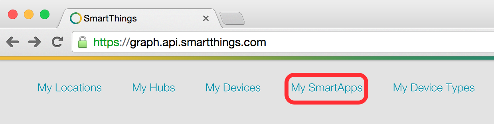
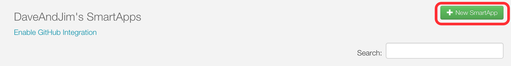
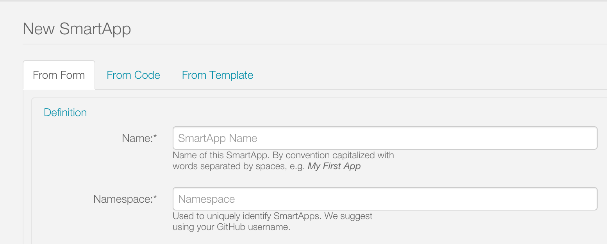
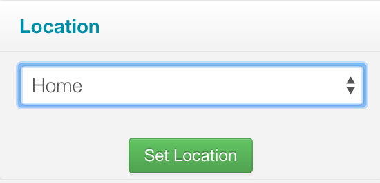
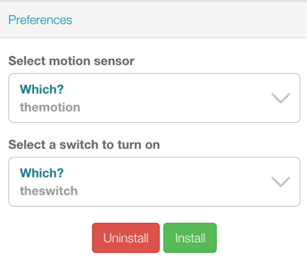
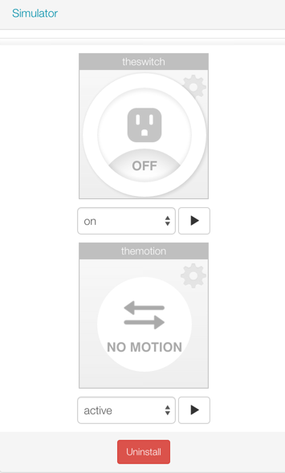
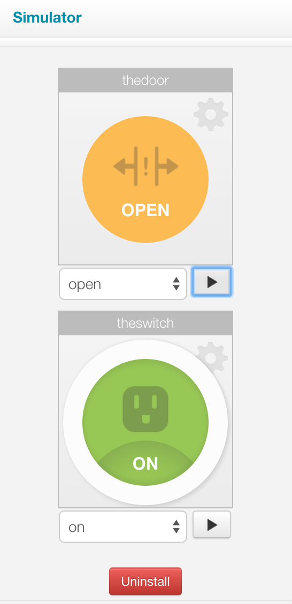
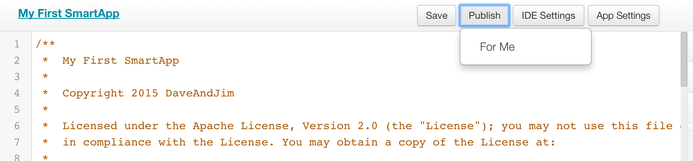
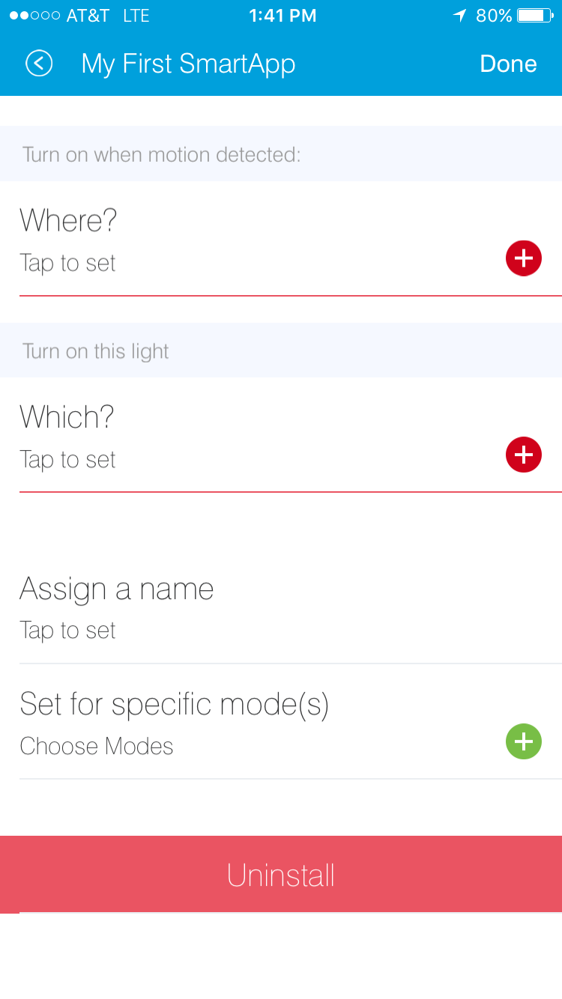

.. _first-smartapp-tutorial:

Writing Your First SmartApp
===========================

.. role:: strike
    :class: strike

This tutorial will guide you through writing your first SmartApp. Once you've read through the Getting Started material, this should be your next stop.

----

Goals
-----

At the end of this tutorial, you will know:

- How to create a SmartApp using the web-based IDE.
- The key components of a SmartApp.
- How to gather input from a user to configure the SmartApp.
- How to subscribe to changes in a device's state.
- How to control devices.
- How to schedule a SmartApp to execute in the future.
- How to use the simulator to test your SmartApp.
- How to publish your SmartApp and install it on your mobile phone.
- :strike:`How to achieve world domination, without even trying`

The SmartApp we will create will be fairly simple, but will teach you some core concepts of SmartThings, and get you familiar with the development process.

The purpose of the SmartApp we'll write is to turn a switch on when motion is detected, and turn it off when motion stops.

----

Prerequisites
-------------

Before completing this tutorial, you should have read the :ref:`get-started-overview`, and registered for an account as discussed in the :ref:`quick-start` page. It's recommended that you are at least familiar with the basic Groovy concepts discussed in the :ref:`groovy-basics` and :ref:`groovy-for-smartthings` tutorials.

The SmartApp will utilize a motion sensor and a smart switch. If you don't have these devices, or even a hub, you can still complete the majority of this tutorial. We will call out any special steps required if you don't have the hardware.

----

Create a SmartApp
-----------------

In the developer tools, navigate to the *My SmartApps* page.

This will bring you to a page that shows all of the SmartApps that you have created. This is also where you can create a new SmartApp. Click on the "New SmartApp" button.

Three options are presented for creating a new SmartApp, "From Form", "From Code", and "From Template".

The "From Form" option will ask for some details about your SmartApp and create a SmartApp with some boiler plate code. The "From Code" option will create a new SmartApp out of code that you paste into the input box. And finally, the "From Template" option will let you select an already existing SmartApp and use its code as a starting point. This is useful when you want to change or enhance a SmartApp that already exists, and it also a great way to look at examples.

For our SmartApp, let's stick to the "From Form" option.

Fill out the form as follows:

Name
    A name for your SmartApp. Call it something like "My First SmartApp"

Namespace
    This field uniquely identifies your SmartApp in the event that someone else has written a SmartApp with the exact same name. This should be your GitHub username (or if you don't have a GitHub account, some other unique identifier).

Author
    This is you. Populate this field with your handle.

Description
    This describes the intent and functionality of your SmartApp. This appears in the SmartApp marketplace, so the better the description, the less confusing it is to users.

Category
    SmartApps are categorized based on functionality. This is used by the mobile applications. When publishing SmartApps for your own use (which is what we will be doing), all SmartApps will appear in "My Apps" category. Just to be complete, go ahead and select "My Apps".

Leave the rest of the fields as they are, and click the "Create" button at the bottom. This will create the SmartApp and populate it with some skeleton code. In the next section we will dive into using the editor to begin writing your first SmartApp.

----

Editor
------

Once you've created your SmartApp, you'll be taken to the editor and simulator. Before we look at the code, it's worth becoming familiar with some of the basic features.

Above the code window, there are five buttons:

Save
    This button does exactly as you'd think - it saves your SmartApp.

Publish
    This allows you to publish your SmartApp for yourself to install on your mobile phone, as well as to submit it to the SmartThings team for publication into the SmartThings catalog.

IDE Settings
    Here you can make changes to personalize the editor to your liking. You can choose from a variety of themes to control the look and feel, specify your preferred keymapping, and set the font size.

App Settings
    This takes you back to the form that you created this SmartApp from, where you can view the values entered when you created the SmartApp, as well as edit certain properties about the SmartApp.

Simulator
    This button toggles the display of the online simulator. We'll discuss the simulator more next.

.. tip::

    On the upper-right side of the IDE, you'll see a drop-down titled *Browse SmartApp Templates*. If you click this, you'll see a variety of SmartApps that you can browse to learn from, or use as the starting point of a new SmartApp.

----

Simulator
---------

On the right side of the IDE is the simulator. This is where you can install your SmartApp to test it, either using physical devices, or simulated devices. We will walk you through installing the SmartApp using this later in the tutorial.

.. image:: ../img/getting-started/first-smartapp/simulator-1.png

If you don't have a location yet, the simulator will show a message instructing you to create one. Follow the steps there to create a location.

----

SmartApp Basics
---------------

The first thing to know is that there are actually a few different types of SmartApps.
Some SmartApps may manage the connection of a cloud-connected or LAN-connected device (called *Service Manager SmartApps*).
Some may provide a dashboard-like user interface in the mobile application (called *Solution Module SmartApps*) [1]_.

The most common type of a SmartApp is one that monitors the user's devices for certain changes (or simply execute on a defined schedule), and then take certain action ("Turn a light on when motion is detected"). These are called *Event-Handler SmartApps*.

This tutorial will walk you through building a simple Event-Handler SmartApp, but the core principles you will learn are applicable to all types of SmartApps.

Regardless of what type of SmartApp you are writing, there are a few core principles that apply to all SmartApps:

- SmartApps are not continuously running. They are executed in response to various events or schedules.
- SmartApps are installed into a user's Location, and a user may install multiple instances of a SmartApp into the same location.
- With the exception of Solution Module SmartApps, SmartApps do not have any user interface, except for the preferences page that allows the user to configure the SmartApp (more on this in a bit).
- The code that defines a SmartApp does not run on the user's mobile phone. SmartApps may execute in the SmartThings cloud, or on the hub. The mobile application uses some information from the SmartApp to drive the experience in the app.

In your editor, you can see that there is some code already written for you. This defines the basic structure and skeleton for your SmartApp. We will discuss each key component as we build our SmartApp.

----

Definition
----------

Every SmartApp must have a ``definition`` method call. This provides metadata about the SmartApp itself. The ``definition`` method simply expects a map of parameters. If you look at the code in the editor, you'll see that these values are already set from the values you entered when creating your SmartApp:

.. code-block:: groovy

    definition(
        name: "My First SmartApp",
        namespace: "mygithubusername",
        author: "Peter Gregory",
        description: "This is my first SmartApp. Woot!",
        category: "My Apps",
        iconUrl: "https://s3.amazonaws.com/smartapp-icons/Convenience/Cat-Convenience.png",
        iconX2Url: "https://s3.amazonaws.com/smartapp-icons/Convenience/Cat-Convenience@2x.png",
        iconX3Url: "https://s3.amazonaws.com/smartapp-icons/Convenience/Cat-Convenience@2x.png")

We don't need to change anything here, so let's move on to defining our preferences. If you do need to change some of your SmartApp's metadata, you can change these values later.

----

Preferences
-----------

The ``preferences`` method is where we define what information our SmartApp needs from the user. When a user installs a SmartApp on their mobile device, they will be taken to a screen (or screens) where they can configure the SmartApp. The content of these screens are derived from our ``preferences`` definition.

Preferences can be displayed as a simple, single screen, or multiple screens. This tutorial will use a simple preferences definition, with only one screen.

In the editor, there is a ``preferences`` definition stubbed in for us:

.. code-block:: groovy

    preferences {
    	section("Title") {
    		// TODO: put inputs here
    	}
    }

Recall that the purpose of our SmartApp is to turn a switch on when motion is detected. Our SmartApp needs to know which switch and motion sensor to work with. Update  ``preferences`` with this code:

.. code-block:: groovy

    preferences {
        section("Turn on when motion detected:") {
            input "themotion", "capability.motionSensor", required: true, title: "Where?"
        }
        section("Turn on this light") {
            input "theswitch", "capability.switch", required: true
        }
    }

Notice that we defined two ``section`` calls. Sections allow us to group related inputs, and can have a text description ("Select a switch to turn on").

We use the ``input`` method to specify what types of devices we want the user to choose from. Let's break down in detail the ``input`` for the switch:

.. code-block:: groovy

    input "theswitch", "capability.switch", required: true

The first argument to ``input`` is what we - inside our SmartApp - want to refer to the device as. In this case, we use ``"theswitch"``. This becomes the identifier for the device in our SmartApp, so that we can refer to the switch as ``theswitch`` (without the quotes). We'll see this in action shortly.

The second argument is the type of device our SmartApp will work with. ``"capability.switch"`` states that our SmartApp is requesting the user to pick from *any* device that supports the Switch *capability*. The concept of capabilities is core to SmartThings, and requires a bit more explanation.

First, consider that the catalog of connected devices is growing at a rapid pace. New devices arrive on the market almost daily. Many of these devices do similar things, and some do multiple things.

SmartThings abstracts devices into their *capabilities* - that is, what the device is capable of. This allows us to build SmartApps that can work with *any* device that supports a given capability. In this way, we can build robust SmartApps that will work with any device integrated with SmartThings that supports a given capability.

Capabilities are broken down into the things the device can do (commands), and things it can report on (attributes).  Every capability defines its commands and attributes, and devices that support a given capability must support those commands and attributes.

.. note::

    A device may (and typically does) support multiple capabilities. For example, a Phillips Hue Bulb supports the Switch capability, because it can turn on and off. It also supports the Color Control capability, since the bulb can change colors. In our example, a Hue bulb could be selected by the user since it supports the Switch capability.

    But, our SmartApp is only requesting that a user select a device that supports the Switch capability, so even if the user selects a device that can do more (such as a Hue bulb), we cannot assume that in our SmartApp. All we can know is that the device supports the Switch capability.

With capabilities, we can be assured that even if a new device supporting the Switch capability is added after we've written and published our SmartApp, there's no need to update any code!

Capabilities are created and maintained by SmartThings. You can view the reference documentation for capabilities in the  :ref:`capabilities_taxonomy`.

The last thing to note in our ``input`` method call is the ``required: true`` argument. This specifies that the user must select a device in order to install the SmartApp.

.. important::

    By requiring users to select which devices the SmartApp will work with, SmartThings is providing a basic security feature - SmartThings can only control those devices which a user explicitly chooses. SmartApps cannot control devices which the user did not select, and this is by design.

To summarize, when the user installs the SmartApp on their mobile phone, they will be prompted to select a device that supports the switch capability. The mobile app will provide them with a list of devices for this user's location that support the switch capability. The device chosen will then be be identified within the SmartApp as ``theswitch``.

We covered a lot of information for such a small amount of code, but it's important that you understand the importance of ``preferences`` and capabilities.

For additional information about preferences, see the :ref:`prefs_and_settings` chapter of the SmartApp guide.

Now that you've updated the ``preferences`` method, make sure to save your SmartApp by clicking the *Save* button.

----

Events and Callback Methods
---------------------------

Our SmartApp needs to turn a switch on when motion is detected. To turn the switch on, we first need to know when motion is detected!

SmartApps can subscribe to various events, so that when that event happens, our SmartApp will be notified. We do this by using the :ref:`smartapp_subscribe` method.

In your editor, below the ``preferences``, you'll see some methods already defined:

.. code-block:: groovy

    def installed() {
    	log.debug "Installed with settings: ${settings}"
    	initialize()
    }

    def updated() {
    	log.debug "Updated with settings: ${settings}"
    	unsubscribe()
    	initialize()
    }

    def initialize() {
    	// TODO: subscribe to attributes, devices, locations, etc.
    }

    // TODO: implement event handlers

Every SmartApp must define methods named :ref:`smartapp_installed` and :ref:`smartapp_updated`. When  a user installs a SmartApp by clicking on the *Install* button in the mobile application (after filling out any required preferences inputs), the ``installed()`` method we define in our SmartApp will be called. This is where SmartApps can subscribe to any device changes we are interested in, as well as set up any scheduled tasks we want our SmartApp to perform.

Similarly, the ``updated()`` method is called when a user updates their installation of the SmartApp by changing any of the preferences inputs. For example, a user may want to change which switch is turned on after they have installed the SmartApp. So, they open the SmartApp settings, select a different switch, and then update the SmartApp. At this point, the ``updated()`` method is called.

In our ``updated()`` method, notice that the first thing we do (aside from some logging, which is discussed shortly), is to call a method called :ref:`smartapp_unsubscribe`. This method is provided by the SmartThings platform, and simply removes any existing subscriptions this SmartApp has created. This is important, since the user has just changed their preferences for this SmartApp. If we didn't do this, we might still be subscribed to events for devices that the user has removed from the SmartApp.

Also, note that both ``installed()`` and ``updated()`` call a method named ``initialize()``. Since both ``installed()`` and ``upated()`` typically both create subscriptions or schedules, we can reduce code duplication by using a helper method.

We also use the built-in logger (``log``) to log information. SmartThings does not currently have a debugger within the IDE, so use the ``log()`` method to log information that might be useful for debugging. The logs are available by clicking *Live Logging* at the top of the IDE.

Finally, note that we reference a variable named ``settings`` in our log statement. Remember the preference inputs we defined? Every preference input gets stored in a read-only map called ``settings``. We can get the values of the various inputs by indexing into the ``settings`` map with the name of the input (e.g., ``settings.theswitch``).

Now that you understand the purpose and importance of the ``installed()`` and ``updated()`` methods, we need to subscribe to any events that we are interested in. In our case, we need to know when the motion sensor reports that it detected motion.

In the editor, update the ``initialize()`` method with this:

.. code-block:: groovy

    def initialize() {
        subscribe(themotion, "motion.active", motionDetectedHandler)
    }

The ``subscribe()`` method accepts three parameters: The thing we want to subscribe to (``themotion``), the specific attribute and its state we care about (``"motion.active"``), and the name of the method that should be called when this event happens.

How do you know what attribute and what state we can subscribe to? We refer to the :ref:`capabilities_taxonomy` to find out the available attributes the capability supports. In the case of the Motion Sensor capability, we see that it supports the ``"motion"`` attribute. In this case, it has two discreet possible values - "active" and "inactive".

Since the ``"motion"`` attribute value is either active or inactive, we can subscribe to either of those specific changes by using the format ``"<attribute>.<value>"``. This will cause the specified event handler method to be called any time the ``"motion"`` attribute value changes to ``"active"`` (motion is detected).

Now that we've created our subscription, we need to define the event handler method.

----

Event Handler Methods
---------------------

Add the following method to your SmartApp. We'll fill in the real meat of the method later.

.. code-block:: groovy

    def motionDetectedHandler(evt) {
        log.debug "motionDetectedHandler called: $evt"
    }

Every event handler method must accept a single parameter, which is an :ref:`event_ref` object that contains information about the event, such as the event's value, time it occurred, and other information.

Since we subscribed to the ``"active"`` state of the motion sensor, we know that our event handler method will only be called when the motion sensor changes from inactive to active.

Now that we know motion has been detected, we need to turn the light on!

----

Controlling Devices
-------------------

Recall that capabilities support commands (things the device can do), as well as attributes (things the attribute knows). To turn the switch on requires only one line of code to be added to our event handler:

.. code-block:: groovy
    :emphasize-lines: 3

    def motionDetectedHandler(evt) {
        log.debug "motionDetectedHandler called: $evt"
        theswitch.on()
    }

Simple, right? But how do we know that we can call the ``on()`` method on the switch? By looking at the :ref:`Switch Capability Reference <switch>`, we see that the Switch capability supports the ``on()`` and ``off()`` commands. These turn the switch on and off, respectively (shocking, we know).

Also note that we referred to the switch selected by the user by the name we provided in the ``input`` inside ``preferences`` (theswitch).

----

Using the Simulator
-------------------

Save your SmartApp by clicking the *Save* button at the top of the IDE. On the right-hand side you will notice a location section:

SmartApps get installed to a location in your SmartThings account. By clicking the *Set Location* button, you are telling the simulator that you want to install this SmartApp into the chosen location.

After you have selected the location, you will see the preferences section appear:

This is where you can choose devices that the SmartApp will use. Here we see that it asks for a motion sensor to monitor, and a switch. These two inputs directly correspond to what we have in the preferences section in our SmartApp. SmartThings will provide a "Virtual Device" when it can. When you do not have a physical device to choose from this is a very useful option. By default the virtual devices will be selected. Click the *Install* button, and the SmartApp will be installed into the location you selected above.

Now we see the simulator section appear:

We have two devices. A motion sensor, and a switch. We can manipulate the motion sensor by choosing "active" or "inactive" and clicking the play button. The same with the switch, it can be "on" or "off". We wrote our SmartApp to turn the switch on when motion is detected, so let's give that a try. Choose "active" if it's not already selected and then hit the play button. You should see some log messages in the console, and the switch should go on:

----

Publishing and Installing
-------------------------

Cool! We can now see our first SmartApp in action in the simulator. The next question is how can we use this SmartApp on our mobile devices in the SmartThings app? To accomplish this, we need to publish the SmartApp.

If you press the "Publish" button, a "For Me" option will appear. Select it. This means that the SmartApp will only be published for your account and not be visible for everyone in the SmartThings community.

.. note:: If you have a SmartApp that you do want to publish publicly, you can do that via the "My Publication Requests" link at the top of the page. For more information on this, see :ref:`submitting_smartapps_for_publication`

Now you should be able to see your SmartApp in the mobile app if you browse to the My Apps category of the marketplace:

==================================================================   =====================================================================
.. image:: ../img/getting-started/first-smartapp/mobile-myapps.png   .. image:: ../img/getting-started/first-smartapp/mobile-myfirstsmartapp.png
==================================================================   =====================================================================

After selecting your SmartApp, you will be brought to the preferences screen where you can select the devices to work with this SmartApp:

You can see the sections and inputs we defined in the ``preferences`` here. Notice how the inputs are marked in red, to indicate that the user must set values for these inputs in order to install the SmartApp.

Tap the fields to select a motion sensor and switch. If you have devices that support the requested capability, you'll see an option to select them.

You'll also see that some other inputs were added for us. For single page preferences, every SmartApp receives an input to allow the user to assign a name of their choosing for this installation. The name that they choose will then be displayed as the name of the SmartApp. Also by default, the user can select to only execute this SmartApp when the location is in certain :ref:`modes`. It also includes the ability for the user to uninstall this SmartApp.

.. note::

    A SmartApp may be installed into a location multiple times. For example, a person may have multiple rooms for which they want a light to come on when motion is detected.

    Even though the code is the same, each installation is unique, and must also be removed by the user individually.

----

Turn Off When Motion Inactive
-----------------------------

We now have a simple SmartApp that turns a switch on when motion is detected. Let's extend this further, and turn the switch off when the motion stops.

In our SmartApp, we need to subscribe to not only the motion sensor being active, but also inactive.

Recall that our subscription looks like this:

.. code-block:: groovy

    subscribe(themotion, "motion.active", motionDetectedHandler)

We will also subscribe the ``"motion.inactive"`` event in a similar way. Add this subscription to the ``initialize()`` method:

.. code-block:: groovy

    subscribe(themotion, "motion.inactive", motionStoppedHandler)

.. note::

    We could also subscribe to *any* change in the motion sensor, by simply specifying the attribute we want to monitor (e.g., ``"motion"`` instead of ``"motion.active"``). This would then call the specified handler method when there is any reported change to the ``"motion"`` attribute. For attributes that don't have a discrete set of possible values (for example, temperature readings), this is how we subscribe to changes for that attribute.

    We can then get the value of the event in the event handler by looking at the ``value`` of the passed-in Event. If we were to do this in our SmartApp, it would look like this:

    .. code-block:: groovy

        def initialize() {
            subscribe(themotion, "motion", motionHandler)
        }

        def motionHandler(evt) {
            if (evt.value == "active") {
                // motion detected
            } else if (evt.value == "inactive") {
                // motion stopped
            }
        }

    Our SmartApp will use separate subscriptions and event handlers, but you are free to modify it to use a single subscription and handle the different values in your event handler method.

We need to define the ``motionStoppedHandler`` event handler method - add this method to your SmartApp:

.. code-block:: groovy

    def motionStoppedHandler(evt) {
        log.debug "motionStoppedHandler called: $evt"
        theswitch.off()
    }

Save your SmartApp in the IDE, publish it again for yourself, and then install it again in the simulator. Now when you change the motion to "inactive", the switch will turn off.

----

Going Further - Adding Flexibility
----------------------------------

Our SmartApp now turns a switch on when motion is detected, then turns it off when motion stops. But consider this scenario:

- A person enters a room, the motion sensors reports that motion is active, and our SmartApp turns the light on.
- The person then sits down, or stands still enough for the motion sensor to report motion is inactive, and our SmartApp turns the light off.
- The person than moves again, causing the motion sensor to again report active motion, and our SmartApp turns the light on again.

As you can imagine, this could be quite annoying! It would be better if we could allow the user to specify a number of minutes *after motion stops* to turn the light off. Then, once motion stops, if no motion is detected within the specified number of minutes, the SmartApp will turn the light off. If motion is detected within this time window, the switch will not turn off.

We can add this flexibility into our SmartApp fairly easily. The first thing we need to do is update our ``preferences`` to let the user specify the number of minutes without motion being detected until the light is turned off.

Replace the ``preferences`` in our SmartApp with the following:

.. code-block:: groovy
    :emphasize-lines: 5-7

    preferences {
        section("Turn on when motion detected:") {
            input "themotion", "capability.motionSensor", required: true, title: "Where?"
        }
        section("Turn off when there's been no movement for") {
            input "minutes", "number", required: true, title: "Minutes?"
        }
        section("Turn on/off this light") {
            input "theswitch", "capability.switch", required: true
        }
    }

Preferences inputs can be more than just devices - we can ask users to enter in numeric values, text values, booleans, enumerated lists, and more. You can learn about the various options for preferences inputs :ref:`here <prefs_and_settings>`.

Now that the user can specify the number of minutes to wait without motion before turning the light off, we need to implement the logic to do so.

Our ``motionStoppedHandler()`` method will be called whenever the motion sensor reports that motion has stopped. Before turning the light off, we need to check that there is no motion detected for the specified number of minutes in the future. But since SmartApps are not continuously running, how can we handle checking for future states? The answer is by using methods that allow us to schedule a SmartApp for future execution.

The first thing we need to do is update our ``motionStoppedHandler()`` to execute a method in the number of minutes specified by the user. This method will then check to see if there has been motion reported within the time interval, and turn the light off if there has been no motion.

Let's stub in some skeleton code to do this, and we'll fill in the details later. First, update the ``motionStoppedHandler()`` method and add a new method as shown below:

.. code-block:: groovy

    def motionStoppedHandler(evt) {
    	log.debug "motionStoppedHandler called: $evt"
        runIn(60 * minutes, checkMotion)
    }

    def checkMotion() {
        log.debug "In checkMotion scheduled method"
    }

We use the :ref:`smartapp_run_in` method to schedule our ``checkMotion()`` method to be called in the number of minutes specified by the user. We pass ``runIn()`` the number of seconds (from the time of the call) to schedule the call, and the name of the method we want executed.

When motion stops, our ``checkMotion()`` method will be called in the number of minutes specified by the user. Now, inside our ``checkMotion()`` method, we need to see if there has been any motion detected in the time window specified. We can use some date/time utility methods, along with information about the device state, to determine if we should turn the switch off.

Here's the logic we need to implement:

- If the motion sensor is currently reporting active motion, do nothing.
- If the motion sensor is reporting inactive motion, check to see what time the motion sensor reported inactive motion.
- If the motion sensor reported that motion has been inactive for longer than the time specified by the user, turn the switch off.

And here's the full method definition for ``checkMotion()``. Update your SmartApp with the code below:

.. code-block:: groovy

    def checkMotion() {
    	log.debug "In checkMotion scheduled method"

        // get the current state object for the motion sensor
    	def motionState = themotion.currentState("motion")

        if (motionState.value == "inactive") {
    		// get the time elapsed between now and when the motion reported inactive
            def elapsed = now() - motionState.date.time

            // elapsed time is in milliseconds, so the threshold must be converted to milliseconds too
            def threshold = 1000 * 60 * minutes

    		if (elapsed >= threshold) {
                log.debug "Motion has stayed inactive long enough since last check ($elapsed ms):  turning switch off"
                theswitch.off()
        	} else {
            	log.debug "Motion has not stayed inactive long enough since last check ($elapsed ms):  doing nothing"
            }
        } else {
        	// Motion active; just log it and do nothing
        	log.debug "Motion is active, do nothing and wait for inactive"
        }
    }

The first thing to note is that we get a :ref:`state_ref` object for the motion sensor, by using the ``currentState()`` method with ``"motion"`` as the attribute we're interested in. This object encapsulates information about an attribute at a particular moment in time. In our case, we want the current state.

From this object, we can determine when this state record was created. This will be the time that the motion sensor reported it is inactive. Using the :ref:`smartapp_now` method, we can get the current time (in milliseconds), and then see if the motion stopped within the threshold specified by the user. If the time elapsed since the motion stopped exceeds the threshold, we turn the switch off.

Go ahead and save and publish your SmartApp again, and try it out!

----

Complete Code Listing
---------------------

Here is the entire code for our SmartApp:

.. code-block:: groovy

    definition(
            name: "My First SmartApp",
            namespace: "mygithubusername",
            author: "Peter Gregory",
            description: "This is my first SmartApp. Woot!",
            category: "My Apps",
            iconUrl: "https://s3.amazonaws.com/smartapp-icons/Convenience/Cat-Convenience.png",
            iconX2Url: "https://s3.amazonaws.com/smartapp-icons/Convenience/Cat-Convenience@2x.png",
            iconX3Url: "https://s3.amazonaws.com/smartapp-icons/Convenience/Cat-Convenience@2x.png")

    preferences {
    	section("Turn on when motion detected:") {
        	input "themotion", "capability.motionSensor", required: true, title: "Where?"
        }
        section("Turn off when there's been no movement for") {
        	input "minutes", "number", required: true, title: "Minutes?"
        }
        section("Turn on this light") {
        	input "theswitch", "capability.switch", required: true
        }
    }

    def installed() {
    	initialize()
    }

    def updated() {
    	unsubscribe()
    	initialize()
    }

    def initialize() {
    	subscribe(themotion, "motion.active", motionDetectedHandler)
        subscribe(themotion, "motion.inactive", motionStoppedHandler)
    }

    def motionDetectedHandler(evt) {
    	log.debug "motionDetectedHandler called: $evt"
        theswitch.on()
    }

    def motionStoppedHandler(evt) {
    	log.debug "motionStoppedHandler called: $evt"
        runIn(60 * minutes, checkMotion)
    }

    def checkMotion() {
    	log.debug "In checkMotion scheduled method"

    	def motionState = themotion.currentState("motion")

        if (motionState.value == "inactive") {
    		// get the time elapsed between now and when the motion reported inactive
            def elapsed = now() - motionState.date.time

            // elapsed time is in milliseconds, so the threshold must be converted to milliseconds too
            def threshold = 1000 * 60 * minutes

    		if (elapsed >= threshold) {
                log.debug "Motion has stayed inactive long enough since last check ($elapsed ms):  turning switch off"
                theswitch.off()
        	} else {
            	log.debug "Motion has not stayed inactive long enough since last check ($elapsed ms):  doing nothing"
            }
        } else {
        	// Motion active; just log it and do nothing
        	log.debug "Motion is active, do nothing and wait for inactive"
        }
    }

----

But How Does the Switch Actually Turn On (or off)!?
---------------------------------------------------

Now that we understand how to control devices in a SmartApp, you may be wondering how exactly the method ``switch.on()`` turns on the switch. The answer is Device Handlers.

Device Handlers are software much the same way SmartApps are. They define what actually happens when you call ``switch.on()``. Let's look at an example to further understand this.

When you connect a new device to your SmartThings Hub, a Device Handler is picked for it based on the signature the device delivered to the Hub as part of its pairing communication. The Device Handler will have methods defined in it that support that device. So in our case, the Device Handler for the specific switch being used will have both ``on()`` and ``off()`` methods defined. The actual implementation of these methods vary depending upon the underlying device protocols, but are typically low-level protocol-specific commands to send to the device (like Z-Wave or ZigBee).

So, when ``switch.on()`` gets executed from your SmartApp, the SmartThings platform will look up the Device Handler associated with the device and call its ``on()`` method, which will in turn send the protocol and device-specific command through the hub to the device. Device Handlers are discussed in the :ref:`device_type_dev_guide` guide.

----

Summary
-------

In this tutorial, you learned how to write a SmartApp. To do this, we:

- Created a new SmartApp using the web-based IDE.
- Defined the ``preferences`` that specifies what input we need from the user.
- Subscribed to device events and controlled a device. We used the :ref:`capabilities_taxonomy` to determine what attributes and commands a capability supports.
- Used the web-based simulator to test our SmartApp with virtual devices.
- Published the SmartApp for yourself and installed it on your mobile phone.
- Extended our SmartApp by allowing a user to enter the number of minutes to wait before turning the switch off, and implemented this using the ``runIn()`` method.

----

Next Steps
----------

Now that you've written your first SmartApp and have a basic understanding of the SmartThings developer tools, language, and workflow, here are some further topics for you to pursue.

More About SmartApps
^^^^^^^^^^^^^^^^^^^^

There is much more you can do with SmartApps than this tutorial covered. SmartApps can :ref:`send notifications <smartapp_sending_notifications>`, :ref:`execute routines <smartapp-routines>`, :ref:`define advanced schedules <smartapp-scheduling>` for which they execute, :ref:`call external web services <calling_web_services>`, and more. You can learn more about developing SmartApps in the :ref:`smartapp_dev_guide` guide.

You can also make your SmartApp into a web service, capable of exposing its own REST endpoints. You can read about them in the :ref:`smartapp_web_services_guide` guide.

Fork It!
^^^^^^^^

SmartThings SmartApps and Device Handlers are now hosted in GitHub. Further, the IDE can integrate with GitHub, to provide a seamless developer experience. Learn more about it in the :ref:`github_integration` chapter of the :ref:`tools_ide` guide. Happy forking!

Device Handler Development
^^^^^^^^^^^^^^^^^^^^^^^^^^

If you're interested in learning more about Device Handlers, and how to write one, head over to the :ref:`device_type_dev_guide` guide.

.. [1] Solution Module SmartApps are not currently available for developers, but support for this is planned in the near future.
