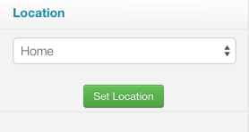

.. _get-started-tutorial:

Tutorial
========

This tutorial will guide you through writing your first SmartApp.

At the end of this tutorial, you will know:

- How to create a SmartApp using the web-based IDE.
- The key components of a SmartApp.
- How to gather input from a user to configure the SmartApp.
- How to subscribe to changes in a device's state.
- How to control devices.
- How to use the simulator to test your SmartApp.
- How to publish your SmartApp and install it on your mobile phone.

Overview
--------

The SmartApp we will create will be fairly simple, but will teach you some core concepts of SmartThings, and get you familiar with the development process.

The purpose of the SmartApp is to turn a switch on when a door opens.

Prerequisites
-------------

Before completing this tutorial, you should have read the :ref:`get-started-overview`, and registered for an account as discussed in the :ref:`up-and-running` page.

Devices
```````

The SmartApp will utilize an open-closed sensor, and a smart switch. If you don't have these devices, or even a hub, you can still complete this tutorial. We will call out any special steps required if you don't have the hardware.

Programming Experience
``````````````````````

Some programming experience is assumed in this tutorial. You don't have to be an expert in Groovy, or even know what it is. But we do assume you've programmed before.

Create a SmartApp
-----------------

In the developer tools, navigate to the *My SmartApps* page.

<details and screen captures for creating a SmartApp>

Editor
------

Once you've created your SmartApp, you'll be taken to the editor and simulator. Before we look at the code, it's worth becoming familiar with some of the basic features.

Above the code window, there are four buttons:

.. image:: ../img/get-started/editor-buttons.png

Save
    This button does exactly as you'd think - it saves your SmartApp.

Publish
    This allows you to publish your SmartApp for yourself to install on your mobile phone, as well as to submit it to the SmartThings team for publication into the SmartThings catalog.

IDE Settings
    Here you can make changes to personalize the editor to your liking. You can choose from a variety of themes to control the look and feel, specify your preferred keymapping, and set the font size.

App Settings
    This takes you back to the form that you created this SmartApp from, where you can view the values entered when you created the SmartApp, as well as edit certain properties about the SmartApp.

On the upper-right side of the IDE, you'll see a drop-down titled *Browse SmartApp Templates*. If you click this, you'll see a variety of SmartApps that you can browse to learn from, or use as the starting point of a new SmartApp.

Simulator
---------

On the right side of the IDE is the simulator. This is where you can install your SmartApp to test it, either using physical devices, or simulated devices. We will walk you through installing the SmartApp using this later in the tutorial.



.. note::

    If your simulator does not look like the one above, but instead displays a message about needing a location, don't worry. We'll cover creating a location if you don't have one later in this tutorial.

SmartApp Basics
---------------

There are a few important things to point out about SmartApps:

- SmartApps are not continuously running. They are executed in response to various events or schedules.
- SmartApps do not have any user interface, except for the preferences page that allows the user to configure the SmartApp (more on this in a bit).

In your editor, you can see that there is some code already written for you. This defines the basic structure and skeleton for your SmartApp. We will discuss each key component as we build our SmartApp.

Definition
----------

Every SmartApp must have a ``definition`` method call. This provides metadata about the SmartApp itself. The ``definition`` method simply expects a map of parameters. If you look at the code in the editor, you'll see that these values are already set from the values you entered when creating your SmartApp:

.. code-block:: groovy

    definition(
        name: "My First SmartApp",
        namespace: "mygithubusername",
        author: "Peter Gregory",
        description: "This is my first SmartApp. Woot!",
        category: "My Apps",
        iconUrl: "https://s3.amazonaws.com/smartapp-icons/Convenience/Cat-Convenience.png",
        iconX2Url: "https://s3.amazonaws.com/smartapp-icons/Convenience/Cat-Convenience@2x.png",
        iconX3Url: "https://s3.amazonaws.com/smartapp-icons/Convenience/Cat-Convenience@2x.png")

We don't need to change anything here.

Preferences
-----------

<discuss what preferences are, how they are used by the mobile clients. Include that they are also a security measure, only allowing a SmartApp to control devices specifically authorized by the user>

<walk through adding preferences for this SmartApp. Discuss capabilities and their significance/importance>

<tease greater possibilities with preferences (different input types, multiple pages, dynamic pages), with links to preferences docs>

Callbacks
---------

<Discuss the callback methods the platform will call at various points in the lifecycle (installed(), updated(), uninstalled()).>

Events
------

<discuss events in the ST platform, their importance, and the typical way to subscribe to events, and how the callback works>

Controlling Devices
-------------------

<discuss how to actuate devices>

Using the Simulator
-------------------

<how to use the IDE simulator to install the SmartApp in the IDE and use simulated devices to test>

<include simulating a location for anyone who does not have a hub>

Publishing and Installing
-------------------------

<how to publish the SmartApp for yourself, install it on your mobile phone, and configure it>

<something about a device type handler>?
----------------------------------------

<not sure, maybe consider adding something about the device type handler that physically turns the switch on/off?>

Next Steps
----------

<tease and links to more information about SmartApps>
