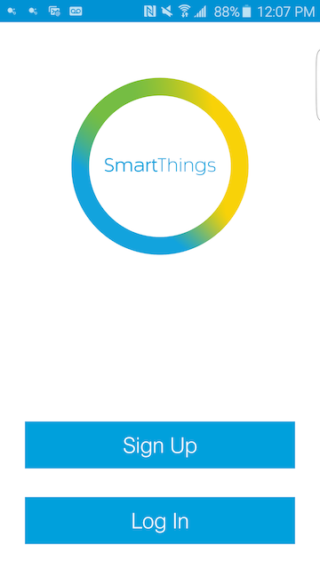
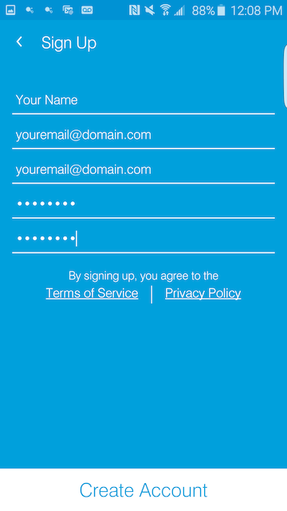
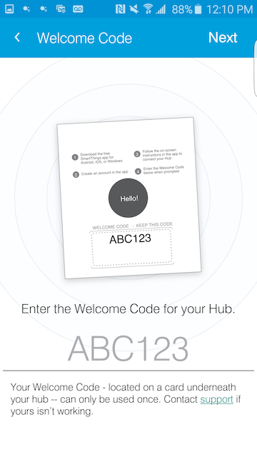

.. _quick-start:

Up and Running
==============

SmartThings offers a rich toolset to develop, test, and publish custom code.

Don't have a SmartThings Hub or any devices yet? Carry on! You can still create an account and even develop without any hardware, by using our online IDE and simulator.

Of course, you'll want to have the hardware sooner than later, but you can start developing with SmartThings with nothing more than the free SmartThings mobile app, a web browser, and an Internet connection.

Register
--------

1. Download the free SmartThings app for `iOS <https://geo.itunes.apple.com/us/app/smartthings-mobile/id590800740?mt=8>`__, `Android <https://play.google.com/store/apps/details?id=com.smartthings.android>`__, or `Windows <https://www.microsoft.com/en-us/store/apps/smartthings-mobile/9wzdncrdszmq>`__.
2. Register for an account using the mobile app:





.. image:: ../img/getting-started/register-select-region.png
    :width: 30%

3. If you have a Hub to activate, proceed to enter your activation code. If you don't have a Hub, you can exit the app at this point:



4. Log into the `IDE <https://graph.api.smartthings.com/>`__ using the email and password you used to create your account.

----

Explore
-------

The :ref:`tools_ide` guide discusses the developer tools in more detail, but for now, let's look at a few key features to get you comfortable.

Account Management
``````````````````

You can use the tools available to view and manage your Locations, Hubs, and Devices, as well as view a live log of your SmartThings.

IDE and Simulator
`````````````````

.. image:: ../img/getting-started/building-img.png

At the top of the page, you'll notice links for *My SmartApps* and *My Device Types*. This is where any custom code will be listed. Clicking on any SmartApp or Device Type will bring you to the code editor, where you can view, edit, test, and publish your custom code.

As a new SmartThings developer, you won't have any SmartApps or Device Types yet. We will guide you through creating one later in the :ref:`first-smartapp-tutorial`.

----

Next Steps
----------

Now that you know what the SmartThings developer platform offers, you can dive in to the fun stuff.

If you're new to Groovy, we recommend that you read through the :ref:`groovy-basics` tutorial. You'll learn about Groovy, and how SmartThings uses it for development. The :ref:`groovy-with-smartthings` tutorial discusses some key differences between regular Groovy and Groovy with SmartThings.

Once you've completed that (or maybe you're the adventurous sort and just want to dive right in to some SmartApp code), check out the :ref:`first-smartapp-tutorial` tutorial.
