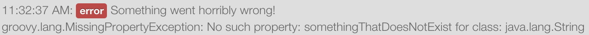

Logging
=======

Let's take a minute to talk about logging in SmartApps and Device Handlers.
There is an instance of a logger (``log``) injected into each SmartApp/Device Handler and available
for you use. Currently, we do not support a debugger environment for stepping through
code. Logging however works to this end in enabling you to log
messages to the console in the IDE. When you save your code, and start
the simulation, a console panel will appear at the bottom of the IDE. This
is where the log messages from your SmartApp/Device Handler will appear.

.. note::
    The 'Clear' button will clear all of the messages currently in the console.

.. figure:: ../../img/ide/console.png

Logging Levels
--------------

The log instance currently supports these log levels, in decreasing order of severity:

===== ===================== ====================================================================
Level Usage                 Description
===== ===================== ====================================================================
ERROR ``log.error(string)`` | Runtime errors or unexpected conditions.
WARN  ``log.warn(string)``  | Runtime situations that are that are unexpected, but not wrong.
                            | Can also be used to log use of deprecated APIs.
INFO  ``log.info(string)``  | Interesting runtime events. For example, turning a switch on or off.
DEBUG ``log.debug(string)`` | Detailed information about the flow of the SmartApp.
TRACE ``log.trace(string)`` | Most detailed information.
===== ===================== ====================================================================

Logging Examples
----------------

Consider the following simple SmartApp which sets up some switch devices
and has an event handler method that will log how many switches are currently
turned on.

.. code-block:: groovy

    preferences {
        section {
            input "switches", "capability.switch", multiple: true
        }
    }

    def installed() {
	    log.debug "Installed with settings: ${settings}"
	    initialize()
    }

    def updated() {
	    log.debug "Updated with settings: ${settings}"
	    unsubscribe()
	    initialize()
    }

    def initialize() {
        subscribe(switches, "switch", someEventHandler)
    }

    def someEventHandler(evt) {
        // returns a list of the values for all switches
        def currSwitches = switches.currentSwitch

        def onSwitches = currSwitches.findAll { switchVal ->
            switchVal == "on" ? true : false
        }

        log.debug "${onSwitches.size()} out of ${switches.size()} switches are on"
    }

Let's start the above SmartApp execution in the IDE. The first thing that
we can see are messages like this:

.. figure:: ../../img/ide/log_example1.png

It is easy to see that the *debug* message came from the ``updated()`` method

.. code-block:: groovy

    def updated() {
	    log.debug "Updated with settings: ${settings}"

But where did the other *trace* messages come from? These messages are coming
from the SmartApp framework. The SmartApp framework automatically will provide
certain information like this during the execution of a SmartApp. Try turning
one of the switches on in the IDE. You will see some more of these trace messages
coming from the SmartApp framework.
You will also see the *debug* message in the ``someEventHandler()`` method.

.. code-block:: groovy

    log.debug "${onSwitches.size()} out of ${switches.size()} switches are on"

You should expect to see something like this in the console.

.. note::
    The newest messages appear at the top of the console output. Not the bottom.

.. figure:: ../../img/ide/log_example2.png

Lets see an example of how each one of the log levels look when output
to the console. In the ``someEventHandler()`` method, I've added the following
log messages for this example.

.. code-block:: groovy

    log.error "${onSwitches.size()} out of ${switches.size()} switches are on"
    log.warn "${onSwitches.size()} out of ${switches.size()} switches are on"
    log.info "${onSwitches.size()} out of ${switches.size()} switches are on"
    log.debug "${onSwitches.size()} out of ${switches.size()} switches are on"
    log.trace "${onSwitches.size()} out of ${switches.size()} switches are on"

The output is nice and color coordinated so we can visually see the severity of
the various levels.

.. figure:: ../../img/ide/log_example3.png

Finally, an example of how the logger can be used in a try/catch block instead
of getting the exception.

.. code-block:: groovy

    try {
    	def x = "some string"
        x.somethingThatDoesNotExist
    } catch (all) {
    	log.error "Something went horribly wrong!\n${all}"
    }

