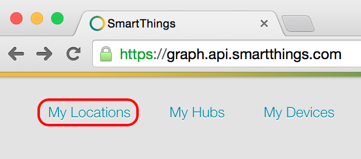

.. _publishing:

Publishing Code
===============

You can publish your SmartApp or Device Handler either just for yourself, or for public distribution.
Publishing for distribution requires you to submit your SmartApp or Device Handler for review and approval by SmartThings.

.. _publishing-for-yourself:

For Yourself
------------

When you publish for yourself, your SmartApp or Device Handler is available *only to your account* on your SmartThings mobile app.

.. _ensure-proper-location:

Ensure Proper Location
^^^^^^^^^^^^^^^^^^^^^^

To publish your SmartApp or Device Handler properly, you must be at the proper Location *before* you begin writing your code.

To ensure you are at the correct Location, follow these steps:

- Start by logging into IDE at at https://graph.api.smartthings.com.

- Next, navigate to *My Locations* page.

- On this page is a listing of all the Locations you created. Normally you will see just one Location where you installed your Hub.

- Click on the Location name appearing in the far left column (i.e., the *Name* column). You may need to log in again with your SmartThings userid and password.

.. note::

    Note that even though the IDE is located at https://graph.api.smartthings.com, it may not always be the correct URL for your SmartApp or Device Handler deployment.
    By explicitly selecting the Location name you will ensure that your SmartApp or Device Handler will be published properly.

Publish
^^^^^^^

Next, to publish for yourself, follow these steps:

- Make sure that you are in the proper Location (see above).
- From your SmartApp or Device Handler view, click on *Publish* button and click the *For Me* option.

This will publish your SmartApp or Device Handler for only your account.
Open your SmartThing mobile app, navigate to *Marketplace* and choose *SmartApps* section.
Tap on the *My Apps* category at the bottom and you will see your SmartApp.

.. _publishing-for-distribution:

For Public Distribution
-----------------------

To publish your SmartApp or Device Handler for public distribution, you will need to submit it for review and approval by SmartThings.
Follow these steps:

- On IDE, click on *My Publication Requests* in the top navigation bar. This will take you to your *Publication Requests* page.
- From this page click on *+New Request*. This will take you to *Submit a SmartApp or device type for publication* page.
- Follow the instructions on this page to submit your SmartApp or Device Handler for review by SmartThings.

Review Process
--------------

SmartThings team will review your SmartApp or Device Handler for approval.

.. note::

	To enhance the chances of your code getting your SmartApp or Device Handler approved, review and ensure your code follows the :doc:`../code-review-guidelines`.

----

Your SmartApp will be reviewed for the following criteria:

- Does this SmartApp duplicate an existing SmartApp? If so, does it improve the current SmartApp?
- Does it have a good title, description, and configuration preferences? Will the user understand how it works?
- Does the SmartApp work as expected?

----

Your *Device Handler* could be rejected by SmartThings review team for any of the following reasons:

- The Device Handler adds minor addition or change that may be changed with a core product or UX change in a future update.
- SmartThings is already developing a first-party integration and will not accept a Device Handler for this device.
- The Device Handler should actually be a SmartApp instead, because it is actuating or changing a device.
- No discovery mechanism is provided. For LAN-Connected devices, a `Service Manager SmartApp <http://docs.smartthings.com/en/latest/cloud-and-lan-connected-device-types-developers-guide/understanding-the-service-manage-device-handler-design-pattern.html>`_ should serve to discover and create the device.
- Multiple community submissions exist and SmartThings is rolling up several improvements together, so this specific one is being rejected.

----

Once your SmartApp or Device Handler has been approved, it will be published for worldwide public distribution in SmartThings mobile app.
