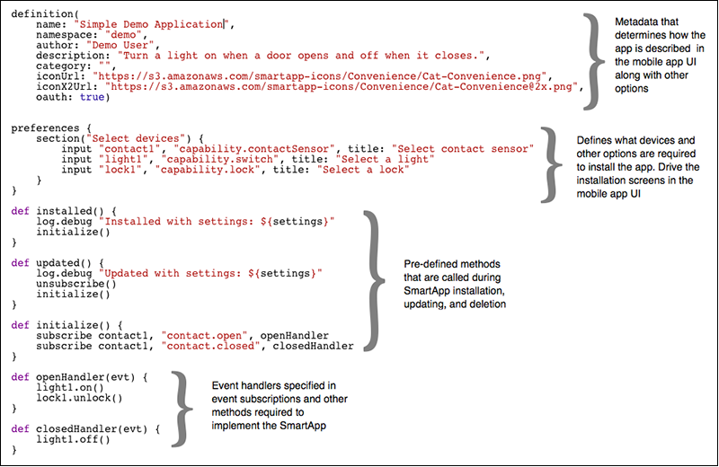

.. _anatomy-and-lifecycle-of-a-smartapp:

Anatomy & Life-Cycle of a SmartApp
==================================

SmartApps are applications that allow users to tap into the capabilities of
their devices to automate their lives. Most SmartApps are installed by the user via the
SmartThings mobile client application, though some come pre-installed. Generally
speaking, there are three different kinds of SmartApps: *Event-Handlers*,
*Solution Modules*, and *Service Managers*.

Types of SmartApps
------------------

**Event-Handler SmartApps**

Event Handler SmartApps are the most common apps developed by our
community. They allow you to subscribe to events from devices and call a
handler method upon their firing. This method can then do a variety of
things, most commonly invoking a command on another device. We're
confident that if you are familiar with back end development of web
sites, then you will be more than capable of developing SmartApps.

A very simple example of a SmartApp would involve you walking through a
door and having the lights turn on automatically.

**Solution Module SmartApps**

These apps exist within the dashboard of the SmartThings app interface,
and are containers for other SmartApps. The idea behind Solution Module
SmartApps is to combine SmartApps that, in the real world, intuitively
go together. One example of this would be the "Home & Family" section of
the dashboard which allows you to see the comings and goings of your
family.

Solution Module SmartApps have traditionally been built by our internal
team, but we will be opening them up for external development in the
near future.

**Service Manager SmartApps**

Service Manager SmartApps are used to connect to LAN or cloud devices,
such as the Sonos or WeMo. They are the connecting glue between the
unique protocols of your external devices and a device type handler
you'd create for those devices. They discover devices and then continue
to maintain the connection for those devices.

The Service Manager SmartApp must be installed when a user utilizes a
device using LAN or the cloud, so for example, there is a Sonos Service
Manager SmartApp that is installed when pairing with a Sonos.

SmartApp Structure
------------------

SmartApps take the form of a single `Groovy <http://groovy.codehaus.org/>`__ script.
A typical SmartApp script is composed of four
sections: *Definition*, *Preferences*, *Predefined Callbacks*, and *Event Handlers*. There is also
a *Mappings* section that is required for cloud-connected SmartApps that will be described later.

**Definition**

The *defintion* section of the SmartApp specifies the name of the app along with other information that identifies and
describes it.

**Preferences**

The *preferences* section is responsible for defining the screens that appear in the mobile app when a SmartApp is
installed or updated. These screens allow the user to specify which devices the SmartApp interacts with along with
other configuration options that affect its behavior.

**Pre-defined Callbacks**

The following methods, if present, are automatically called at various times during the lifecycle of a SmartApp:

1. **installed()** - Called when a SmartApp is first installed
2. **updated()** - Called when the preferences of an installed smart app are updated
3. **uninstalled()** - Called when a SmartApp is uninstalled.
4. **childUninstalled()** - Called for the parent app when a child app is uninstalled

The installed and updated methods are commonly found in all apps. Since the selected devices may have changed when an
app is updated, both of these methods typically set up the same event subscriptions, so it is common practice to put
those calls in an `initialize()` method and call it from both the installed and updated methods.

The uninstalled method is typically not needed since the system automatically removes subscriptions and schedules
when a SmartApp is uninstalled. However, they can be necessary in apps that integrate with other systems and need
to perform cleanup on those systems.

**Event Handlers**

The remainder of the SmartApp contains the event handler methods specified in the event subscriptions and any other
methods necessary for implementing the SmartApp. Event handler methods must have a single argument, which contains the
Event object.

SmartApp Execution
------------------

SmartApps aren't always running. Their various methods are executed when external events occur.
SmartApps execute when any of the following types of events occur:

1. **Pre-defined callback** - Any of the predefined lifecycle events described above occur.
2. **Device state change** - An attribute changes on a device, which
   creates an event, which triggers a subscription, which calls a
   handler method within your SmartApp.
3. **Location state change** - A location attribute such as *mode* changes. *Sunrise* and *sunset*
   are other examples of location events
4. **User action on the app** - The user taps a SmartApp icon or shortcut in the mobile app UI
5. **Scheduled event** - Using a method like runIn(), you call
   a method within your SmartApp at a particular time .
6. **Web services call** Using our `web services
   API <../smartapp-web-services-developers-guide/overview.html>`__, you
   create an endpoint accessible over the web that calls a method within
   your SmartApp.

Device Preferences
------------------

The most common type of input in the preferences section specifies what kind of devices a SmartApp works with. For
example, to specify that an app requires one contact sensor:

::

    input "contact1", "capability.contactSensor"

This will generate an input element in the mobile UI that prompts for the selection
of a single contact sensor (`capability.contactSensor`). `contact1` is the name of a variable that provides access to the device in the SmartApp.

Device inputs can also prompt for more than one device, so to ask for the selection of one
or more switches:

::

    input "switch1", "capability.switch", multiple: true

You can find more information about SmartApp preferences `here <preferences-and-settings.html>`__

Event Subscriptions
-------------------

Subscriptions allow a SmartApp to listen for events from devices, the location, and the SmartApp tile in the mobile UI.
Device subscriptions are the most common and take the form:

    **subscribe (** device **,** "attribute[.value]" **,** handlerMethod **)**

For example, to subscribe to all events from a contact sensor you would write:
::

    subscribe(contact1, "contact", contactHandler)

The contactHandler method would then be called whenever the sensor opened or closed. You can also subscribe to specific
event values, so to call a handler only when the contact sensor opens write:

::

    subscribe(contact1, "contact.open", contactOpenHandler)

The *subscribe* method call accepts either a device or a list of devices, so you don't need to explicitly iterate over
each device in a list when you specify `multiple: true` in an input preference.

You can learn more about subscribing to device events in the :ref:`events_and_subscriptions` section.

SmartApp Sandboxing
-------------------

SmartApps are developed in a sandboxed environment. The sandbox is a way
to limit developers to a specific subset of the Groovy language for
performance and security. We have :ref:`documented <groovy-for-smartthings>` the main ways this should affect you.

Execution Location
------------------

With the original SmartThings Hub, all SmartApps execute in the SmartThings cloud. With the new Samsung SmartThings Hub, certain SmartApps may run locally on hub or in the SmartThings cloud. Execution location varies depending on a variety of factors, and is managed by the SmartThings internal team.

As a SmartThings developer, you should write your SmartApps to satisfy their specific use cases, regardless of where the app executes. There is currently no way to specify or force a certain execution location.

Rate Limiting
-------------

SmartApps that execute in the cloud are monitored for excessive resource utilization. Rate limiting ensures that no single SmartApp can consume too many shared cloud resources.

All rate limiting is based on an execution limit within a particular time window for an installed SmartApp or Device Handler. When the execution limit has been reached within the time window, no further executions will occur until the next time window. There will be an entry in the logs that will show the SmartApp or Device Type has been rate limited.

*SmartApps are limited to executing 250 times in 60 seconds.*

The common cause for exceeding this limit is excessive subscriptions. This may be an infinite loop of events (for example, subscribing to an "on" and "off" event, and the "on" command actually triggers the "off" event and vice versa - leading to a never-ending chain of event handlers being called). It's also possible that a SmartApp that subscribes to a very large number of particularly "chatty" devices may run into this limit.

Additional rate limiting restrictions apply to SmartApps or Device Handlers that expose endpoints via the ``mappings`` definitions. You can learn about those in the `SmartApp Web Services Guide <../smartapp-web-services-developers-guide/overview.html>`__.
