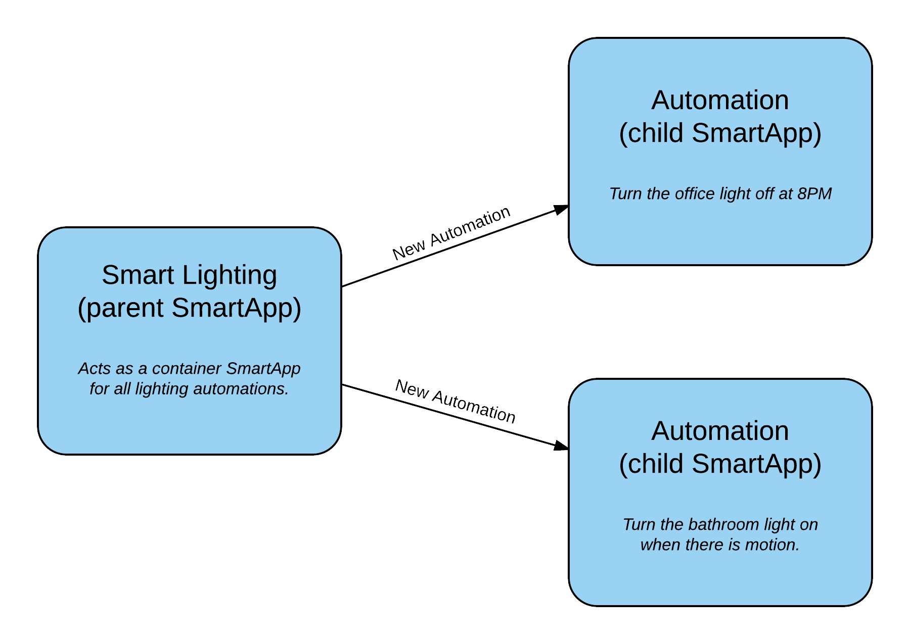

Parent-Child SmartApps
======================

SmartApps can have child SmartApps. This is often useful whe you want to provide multiple automations that act independently on separate devices. This will consolidate multiple separate automations under one parent.

Smart Lighting is an example of a parent-child SmartApp. When you install Smart Lighting, you are installing one parent SmartApp (Smart Lighting), and each unique lighting automation you create is actually a new instance of a child SmartApp. This child SmartApp is what actually controls each lighting automation.

The diagram below illustrates this relationship:

The relationship between a parent SmartApp and its children is a one-to-many relationship. A SmartApp may have many children, and those children can also have children. A child SmartApp can have only one parent.

The Parent SmartApp
-------------------

To define that a SmartApp is a parent to other SmartApps, use the ``app`` input element inside the ``preferences``. This establishes the relationship between parent and child.

.. code-block:: groovy

    preferences {
        page("mainPage", title: "Child Apps", install: true, uninstall: true) {
            section {
                app(name: "childApps", appName: "Child App", namespace: "mynamespace", title: "New Child App", multiple: true)
            }
        }
    }

The key options to note are the ``appName``, which must be the name of the child SmartApp, and the ``namespace``, which is the namespace of the child SmartApp.

The Child SmartApp
------------------

In the SmartApp you wish to serve as the child, specify the ``parent`` option in the child SmartApp's ``definition``, in the form of ``"namespace":"Parent App Name"``:

.. code-block:: groovy

    definition(
        ...
        parent: "yourNameSpace:Parent App Name",
        ...
    )

Communicating Between Parent and Children
-----------------------------------------

Parents and children may need to talk to each other. In the parent SmartApp, you can get the child SmartApp using the ``getChildApps()`` method:

.. code-block:: groovy

    def children = getChildApps()
    log.debug "$children.size() child apps installed"
    children.each { child ->
        log.debug "Child app id: $child.id"
    }

You can then call methods directly on the child SmartApp:

.. code-block:: groovy

    // assumes the child SmartApp has method foo() defined
    child.foo()

You can also use the ``findChildAppByName()`` method to find a specific child SmartApp by it's name:

.. code-block:: groovy

    def theChild = findChildAppByName("My Child App")

Children can communicate with their parent by using the ``parent`` property in the Child SmartApp:

.. code-block:: groovy

    // assumes the parent SmartApp has a method bar() defined:
    parent.bar()

Preventing More Than One Parent Instance
----------------------------------------

If you want to prevent users from installing more than one Parent SmartApp in their location, you can specify ``singleInstane: true`` in the definition:

.. code-block:: groovy

    definition(
        ...
        singleInstance: true
        ...
    )

With ``singleInstance: true``, when a user tries to install a parent SmartApp that has already been installed, they will be taken to the existing installation. From there, they can configure existing child SmartApps or add new ones. This avoids having multiple instances of parent SmartApp, when only one is necessary.

Example
-------

Below is a simple example illustrating how a parent SmartApp ("Simple Lighting") can be created to allow multiple child SmartApps ("Simple Automations").

Here is the parent SmartApp:

.. code-block:: groovy

    definition(
        name: "Simple Lighting",
        namespace: "mynamespace/parent",
        author: "Your Name",
        description: "An example of parent/child SmartApps (this is the parent).",
        category: "My Apps",
        iconUrl: "https://s3.amazonaws.com/smartapp-icons/Convenience/Cat-Convenience.png",
        iconX2Url: "https://s3.amazonaws.com/smartapp-icons/Convenience/Cat-Convenience@2x.png",
        iconX3Url: "https://s3.amazonaws.com/smartapp-icons/Convenience/Cat-Convenience@2x.png")

    preferences {
    	// The parent app preferences are pretty simple: just use the app input for the child app.
        page(name: "mainPage", title: "Simple Automations", install: true, uninstall: true,submitOnChange: true) {
            section {
                app(name: "simpleAutomation", appName: "Simple Automation", namespace: "mynamespace/automations", title: "Create New Automation", multiple: true)
    		}
    	}
    }

    def installed() {
    	log.debug "Installed with settings: ${settings}"
    	initialize()
    }

    def updated() {
    	log.debug "Updated with settings: ${settings}"
    	unsubscribe()
    	initialize()
    }

    def initialize() {
    	// nothing needed here, since the child apps will handle preferences/subscriptions
        // this just logs some messages for demo/information purposes
        log.debug "there are ${childApps.size()} child smartapps"
        childApps.each {child ->
            log.debug "child app: ${child.label}"
        }
    }

Here's the child SmartApp:

.. code-block:: groovy

    definition(
        name: "Simple Automation",
        namespace: "mynamespace/automations",
        author: "Your Name",
        description: "A simple app to control basic lighting automations. This is a child app.",
        category: "My Apps",

        // the parent option allows you to specify the parent app in the form <namespace>/<app name>
        parent: "mynamespace/parent:Simple Lighting",
        iconUrl: "https://s3.amazonaws.com/smartapp-icons/Convenience/Cat-Convenience.png",
        iconX2Url: "https://s3.amazonaws.com/smartapp-icons/Convenience/Cat-Convenience@2x.png",
        iconX3Url: "https://s3.amazonaws.com/smartapp-icons/Convenience/Cat-Convenience@2x.png")

    preferences {
    	page name: "mainPage", title: "Automate Lights & Switches", install: false, uninstall: true, nextPage: "namePage"
    	page name: "namePage", title: "Automate Lights & Switches", install: true, uninstall: true
    }

    def installed() {
        log.debug "Installed with settings: ${settings}"
        initialize()
    }

    def updated() {
        log.debug "Updated with settings: ${settings}"
        unschedule()
        initialize()
    }

    def initialize() {
    	// if the user did not override the label, set the label to the default
    	if (!overrideLabel) {
            app.updateLabel(defaultLabel())
    	}
    	// schedule the turn on and turn off handlers
    	schedule(turnOnTime, turnOnHandler)
        schedule(turnOffTime, turnOffHandler)
    }

    // main page to select lights, the action, and turn on/off times
    def mainPage() {
        dynamicPage(name: "mainPage") {
            section {
                lightInputs()
                actionInputs()
            }
            timeInputs()
    	}
    }

    // page for allowing the user to give the automation a custom name
    def namePage() {
        if (!overrideLabel) {
            // if the user selects to not change the label, give a default label
            def l = defaultLabel()
            log.debug "will set default label of $l"
            app.updateLabel(l)
    	}
        dynamicPage(name: "namePage") {
            if (overrideLabel) {
                section("Automation name") {
                    label title: "Enter custom name", defaultValue: app.label, required: false
                }
            } else {
                section("Automation name") {
                    paragraph app.label
                }
            }
            section {
                input "overrideLabel", "bool", title: "Edit automation name", defaultValue: "false", required: "false", submitOnChange: true
            }
        }
    }

    // inputs to select the lights
    def lightInputs() {
        input "lights", "capability.switch", title: "Which lights do you want to control?", multiple: true, submitOnChange: true
    }

    // inputs to control what to do with the lights (turn on, turn on and set color, turn on
    // and set level)
    def actionInputs() {
        if (lights) {
            input "action", "enum", title: "What do you want to do?", options: actionOptions(), required: true, submitOnChange: true
            if (action == "color") {
                input "color", "enum", title: "Color", required: true, multiple:false, options: [
                    ["Soft White":"Soft White - Default"],
                    ["White":"White - Concentrate"],
                    ["Daylight":"Daylight - Energize"],
                    ["Warm White":"Warm White - Relax"],
                    "Red","Green","Blue","Yellow","Orange","Purple","Pink"]

            }
            if (action == "level" || action == "color") {
                input "level", "enum", title: "Dimmer Level", options: [[10:"10%"],[20:"20%"],[30:"30%"],[40:"40%"],[50:"50%"],[60:"60%"],[70:"70%"],[80:"80%"],[90:"90%"],[100:"100%"]], defaultValue: "80"
            }
        }
    }

    // utility method to get a map of available actions for the selected switches
    def actionMap() {
        def map = [on: "Turn On", off: "Turn Off"]
        if (lights.find{it.hasCommand('setLevel')} != null) {
            map.level = "Turn On & Set Level"
        }
        if (lights.find{it.hasCommand('setColor')} != null) {
            map.color = "Turn On & Set Color"
        }
        map
    }

    // utility method to collect the action map entries into maps for the input
    def actionOptions() {
        actionMap().collect{[(it.key): it.value]}
    }

    // inputs for selecting on and off time
    def timeInputs() {
        if (settings.action) {
            section {
                input "turnOnTime", "time", title: "Time to turn lights on", required: true
                input "turnOffTime", "time", title: "Time to turn lights off", required: true
            }
        }
    }

    // a method that will set the default label of the automation.
    // It uses the lights selected and action to create the automation label
    def defaultLabel() {
        def lightsLabel = settings.lights.size() == 1 ? lights[0].displayName : lights[0].displayName + ", etc..."

        if (action == "color") {
            "Turn on and set color of $lightsLabel"
        } else if (action == "level") {
            "Turn on and set level of $lightsLabel"
        } else {
            "Turn $action $lightsLabel"
        }
    }

    // the handler method that turns the lights on and sets level and color if specified
    def turnOnHandler() {
        // switch on the selected action
        switch(action) {
            case "level":
                lights.each {
                    // check to ensure the switch does have the setLevel command
                    if (it.hasCommand('setLevel')) {
                        log.debug("Not So Smart Lighting: $it.displayName setLevel($level)")
                        it.setLevel(level as Integer)
                    }
                    it.on()
                }
                break
            case "on":
                log.debug "on()"
                lights.on()
                break
            case "color":
                setColor()
                break
            }
    }

    // set the color and level as specified, if the user selected to set color.
    def setColor() {

    	def hueColor = 0
    	def saturation = 100

    	switch(color) {
    		case "White":
                hueColor = 52
                saturation = 19
                break;
            case "Daylight":
                hueColor = 53
                saturation = 91
                break;
            case "Soft White":
                hueColor = 23
                saturation = 56
                break;
            case "Warm White":
                hueColor = 20
                saturation = 80
                break;
            case "Blue":
                hueColor = 70
                break;
            case "Green":
                hueColor = 39
                break;
            case "Yellow":
                hueColor = 25
                break;
            case "Orange":
                hueColor = 10
                break;
            case "Purple":
                hueColor = 75
                break;
            case "Pink":
                hueColor = 83
                break;
            case "Red":
                hueColor = 100
                break;
    	}

    	def value = [switch: "on", hue: hueColor, saturation: saturation, level: level as Integer ?: 100]
    	log.debug "color = $value"

    	lights.each {
            if (it.hasCommand('setColor')) {
                log.debug "$it.displayName, setColor($value)"
                it.setColor(value)
            } else if (it.hasCommand('setLevel')) {
                log.debug "$it.displayName, setLevel($value)"
                it.setLevel(level as Integer ?: 100)
            } else {
                log.debug "$it.displayName, on()"
                it.on()
            }
    	}
    }

    // simple turn off lights handler
    def turnOffHandler() {
    	lights.off()
    }

To try it out, create the parent and child SmartApp with the code as shown above, and publish the parent SmartApp for yourself (you don't need to publish the child SmartApp, since it will be discovered by the parent and you don't want to install it individually from the marketplace). Then, go to the marketplace and install "Simple Lighting" in "My Apps". You can then add multiple automations, with each automation being an instance of the child SmartApp ("Simple Automation").

Tips & Best Practices
---------------------

- Think carefully about creating more than one level of parent-to-child relationships, as it may negatively impact usability and create unneeded complications.
- Sharing ``state`` or ``atomicState`` between parent and child SmartApps is not currently supported.

Summary
-------

Parent-child relationships can be useful when you want to provide multiple automations that act independently on separate devices. A parent SmartApp may have many children; a child SmartApp has only one parent.

To create a parent-child relationship, the SmartApp that is to be the parent should use the ``app`` input type to specify what app can be a child. The child SmartApp should specify the ``parent`` option in its definition to specify what SmartApp should serve as the parent.

A parent SmartApp can get its children by using the ``getChildApps()``, or ``findChildAppByName()`` if you know the name of the app you are looking for. Children can get a reference to their parent through the ``parent`` property.
