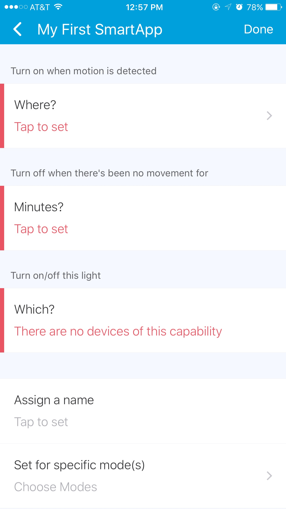
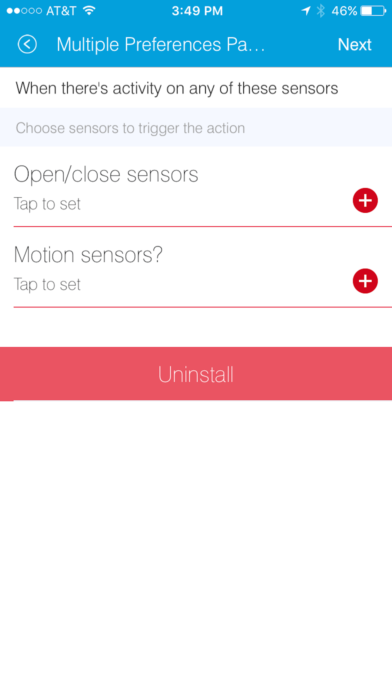
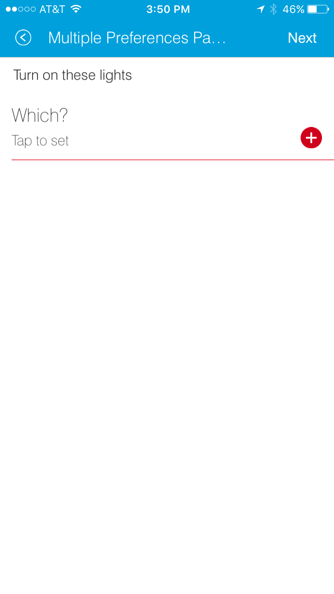
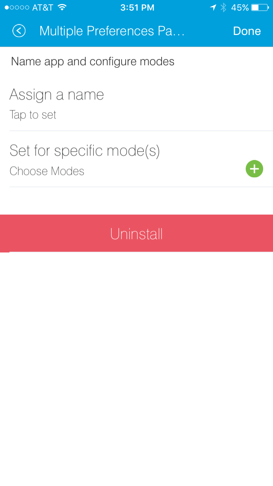
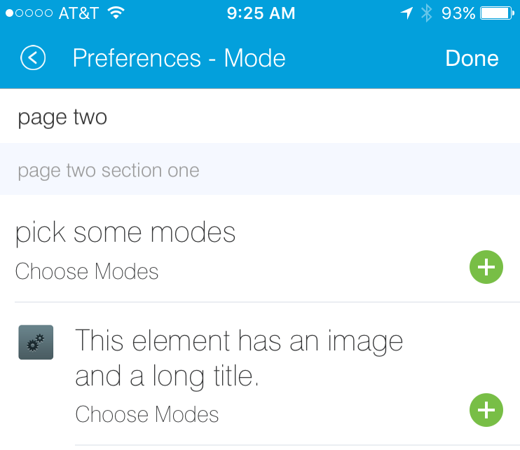
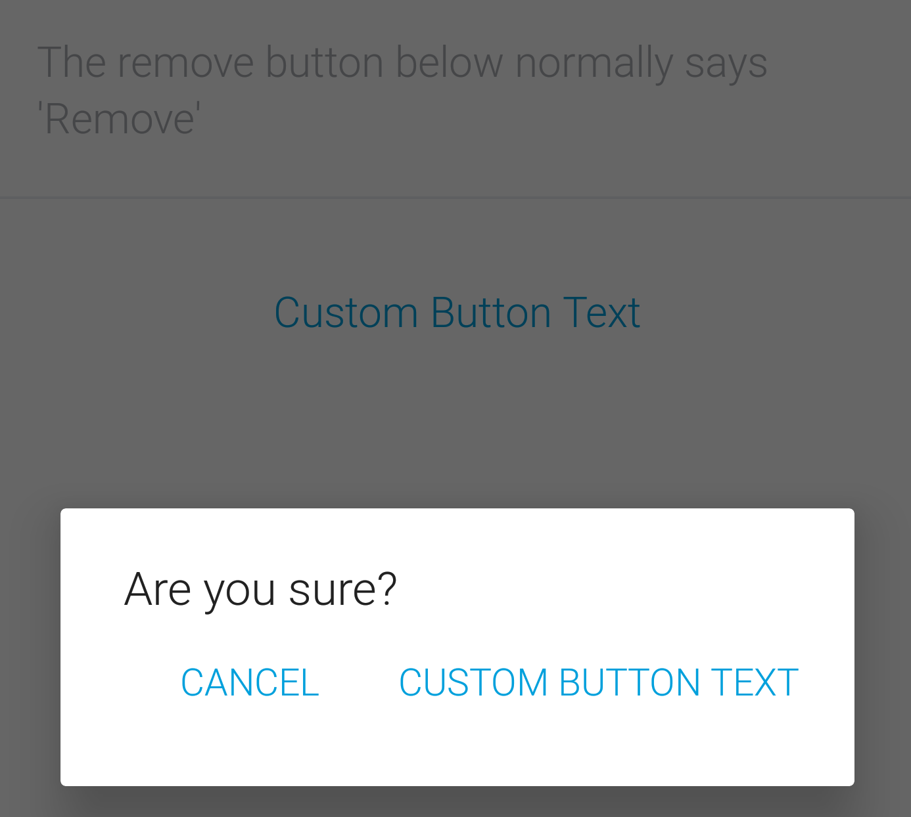
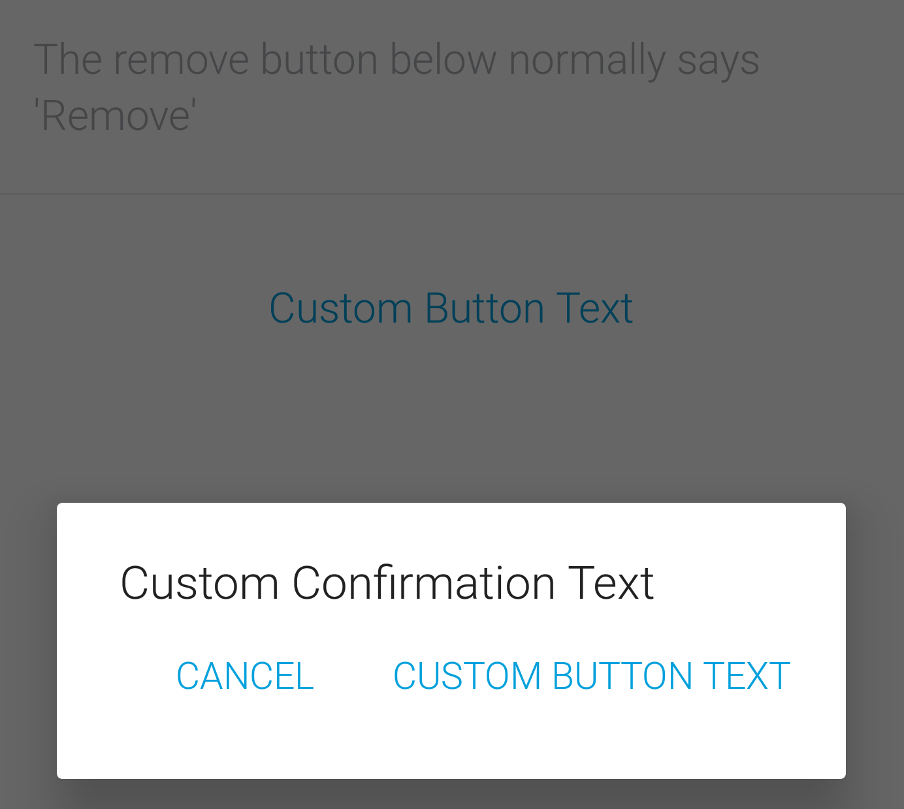
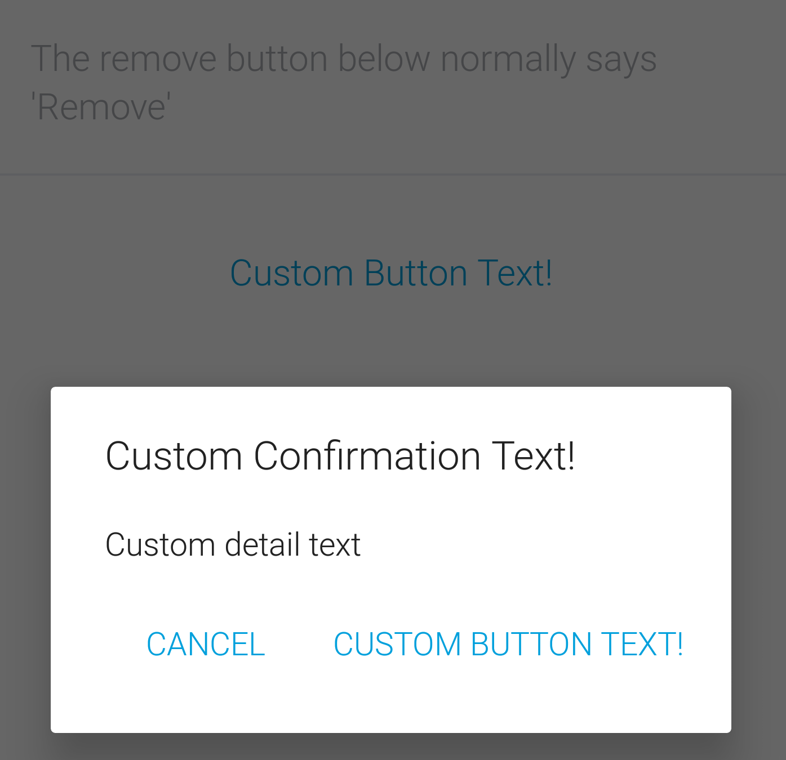

.. _prefs_and_settings:

Preferences and Settings
========================

The preferences section of a SmartApp specifies what kinds of devices and other information is needed in order for the application to run.
During the installation of the SmartApp the user is prompted, in the mobile UI, to provide such needed information.
The user can present all these inputs on a single page, or break them up into multiple pages.

We strongly recommend you to try out the `web IDE <http://ide.smartthings.com>`__ and become familiar with it.

----

Preferences Overview
--------------------

Preferences are made up of one or more pages.
Later we will see that pages themselves contain one or more sections, which in turn contain
one or more elements.
The general form of creating preferences looks like:

.. code-block:: groovy

    preferences {
        page() {
            section() {
                paragraph "some text"
                input "motionSensors", "capability.motionSensor",
                    title: "Motions sensors?", multiple: true
            }
            section() {
                ...
            }
        }
        page() {
            ...
        }
    }

All inputs from the user are stored in a read-only map called ``settings``, and they are available simply by referring to the input name (the first argument to ``input()``).

Assuming the following inputs:

.. code-block:: groovy

    preferences {
        section() {
            input "someSwitch", "capability.switch"
            input "someText", "text",
            input "someTime", "time"
        }
    }

The values can be accessed like this:

.. code-block:: groovy

    // direct access
    log.debug "someSwitch is $someSwitch"
    log.debug "someText is $someText"
    log.debug "someTime is $someTime"

    // via settings
    log.debug "settings.someSwitch is $settings.someSwitch"
    log.debug "settings.someText is $settings.someText"
    log.debug "settings.someTime is $settings.someTime"

----

Page Definition
---------------

Pages can be defined two different ways: either by *page(String pageName, String pageTitle) {}* or by *page(options) {}*.

**page(String pageName, String pageTitle) {}**

The code sample below illustrates the first way:

.. code-block:: groovy

    preferences {
        // page with name and title
        page("page name", "page title") {
            // sections go here
        }
    }

**page(options) {}**

This form takes a comma-separated list of name-value arguments.

.. note::

    This is a common Groovy pattern that allows for named arguments to be passed to a method.
    More info can be found `here <http://docs.groovy-lang.org/latest/html/documentation/#_named_arguments>`__.

.. code-block:: groovy

    preferences {
        page(name: "pageName", title: "page title",
             nextPage: "nameOfSomeOtherPage", uninstall: true) {
            // sections go here
        }
    }

The valid options are:

*name* (required)
    String - Identifier for this page.
*title*
    String - The display title of this page
*nextPage*
    String - Used on multi-page preferences only. Should be the name of the page to navigate to next.
*install*
    Boolean - Set to ``true`` to allow the user to install this app from this page. Defaults to ``false``. Not necessary for single-page preferences.
*uninstall*
    Boolean - Set to ``true`` to allow the user to uninstall from this page. Defaults to false. Not necessary for single-page preferences.

We will see more in-depth examples of pages in the following sections.

----

Section Definition
------------------

Pages can have one or more sections.
Think of sections as way to group the inputs you want to gather from the user.

Sections can be created in three different ways:

*section{}*

.. code-block:: groovy

    preferences {
        // section with no title
        section {
            // elements go here
        }
    }

*section(String sectionTitle){}*

.. code-block:: groovy

    preferences {
        // section with title
        section("section title") {
            // elements go here
        }
    }

*section(options, String sectionTitle) {}*

.. code-block:: groovy

    preferences {
        // section will not display in IDE
        section(mobileOnly: true, "section title")
    }

The valid options are:

*hideable*
    Boolean - Pass ``true`` to allow the section to be collapsed. Defaults to ``false``.
*hidden*
    Boolean - Pass ``true`` to specify the section is collapsed by default. Used in conjunction with ``hideable``. Defaults to ``false``.
*mobileOnly*
    Boolean - Pass ``true`` to suppress this section from the IDE simulator. Defaults to ``false``.

----

Single Preferences Page
-----------------------

A single page preferences declaration is composed of one or more *section* elements, which in turn contain one or more *elements*.
Note that there is no *page* defined in the example below.
When creating a single-page preferences app, there's no need to define the page explicitly - it's implied.
Here's an example:

.. code-block:: groovy

      preferences {
            section("Turn on when motion is detected") {
                  input "themotion", "capability.motionSensor", required: true, multiple: true, title: "Where?"
                  }
            section("Turn off when there's been no movement for") {
                      input "minutes", "number", required: true, title: "Minutes?"
                  }
            section("Turn on/off this light") {
                      input "theswitch", "capability.switch", required: true
                  }

      }

Which would be rendered in the mobile app UI as:

Note that in the above example, we did not specify the *name* or *mode* input in the ``preferences`` section of the code, yet they appeared in the UI of our mobile app at the bottom ("Assign a name" and "Set for specific mode(s)").
When defining single-page preferences, name and mode are automatically added.
Also note that inputs that are marked as ``required: true`` are displayed prominently in red color by the mobile app, so that the user knows they are required.
The mobile application will prevent the user from going to the next page or installing the SmartApp without entering required inputs.

----

Multiple Preferences Pages
--------------------------

Preferences can also be broken up into multiple pages.
Each page must contain one or more *section* elements.
Each page specifies a *name* property that is referenced by the *nextPage* property.
The *nextPage* property is used to define the flow of the pages.

.. note::

    Unlike single page preferences, the name and mode control fields are not automatically added, and must be specified on the desired page or pages.

Here's an example that defines three pages:

.. code-block:: groovy

    preferences {
        page(name: "pageOne", title: "When there's activity on any of these sensors", nextPage: "pageTwo", uninstall: true) {
            section("Choose sensors to trigger the action") {

                input "contactSensors", "capability.contactSensor",
                    title: "Open/close sensors", multiple: true

                input "motionSensors", "capability.motionSensor",
                    title: "Motion sensors?", multiple: true
            }
        }
        page(name: "pageTwo", title: "Turn on these lights", nextPage: "pageThree") {
            section {
                input "switches", "capability.switch", multiple: true
            }
        }
        page(name: "pageThree", title: "Name app and configure modes", install: true, uninstall: true) {
            section([mobileOnly:true]) {
                label title: "Assign a name", required: false
                mode title: "Set for specific mode(s)", required: false
            }
        }
    }

The resulting pages in the mobile app would show the name and mode control fields only on the third page, and the uninstall button on the first and third pages:

==========================  ==========================  ==========================
Page 1                      Page 2                      Page 3
==========================  ==========================  ==========================
|multiple-pages-page1.png|  |multiple-pages-page2.png|  |multiple-pages-page3.png|
==========================  ==========================  ==========================

----

Preference Elements and Inputs
------------------------------

Preference pages (single or multiple) are composed of one or more *sections.*
Each *section*, in turn, contains one or more of the
following elements:

paragraph
^^^^^^^^^

Text that is displayed on the page for messaging and instructional purposes.

Example:

.. code-block:: groovy

    preferences {
        section("paragraph") {
            paragraph "This is how you can make a paragraph element"
            paragraph image: "https://s3.amazonaws.com/smartapp-icons/Convenience/Cat-Convenience.png",
                      title: "paragraph title",
                      required: true,
                      "This is a long description that rambles on and on and on..."
        }
    }

The above ``preferences`` definition would render the mobile app UI as:

.. image:: ../img/smartapps/prefs-paragraph.png
    :width: 250 px
    :height: 447 px

Valid options are:

*title*
    String - The title of the paragraph
*image*
    String - URL of image to use, if desired
*required*
    Boolean - ``true`` or ``false`` to specify this input is required. Defaults to ``false``.

icon
^^^^

Allows the user to select an icon to be used when displaying the app in the mobile UI.

Example:

.. code-block:: groovy

    preferences {
        section("paragraph") {
            icon(title: "required is true",
                 required: true)
        }
    }

The above ``preferences`` definition would render the mobile app UI as:

.. image:: ../img/smartapps/prefs-icon.png
    :width: 250 px
    :height: 447 px

Tapping the *icon* UI element would then allow the user to choose an icon:

.. image:: ../img/smartapps/prefs-icon-chooser.png
    :width: 250 px
    :height: 447 px

Valid options are:

*title*
    String - The title of the icon
*required*
    Boolean - ``true`` or ``false`` to specify this input is required. Defaults to ``false``.

href
^^^^

A control that selects an external HTML page or another preference page.

Example of using *href* to visit a URL:

.. code-block:: groovy

    preferences {
        section("external") {
            href(name: "hrefNotRequired",
                 title: "SmartThings",
                 required: false,
                 style: "external",
                 url: "http://smartthings.com/",
                 description: "tap to view SmartThings website in mobile browser")
        }
        section("embedded") {
            href(name: "hrefWithImage", title: "This element has an image and a long title.",
                 description: "tap to view SmartThings website inside SmartThings app",
                 required: false,
                 image: "https://s3.amazonaws.com/smartapp-icons/Convenience/Cat-Convenience.png",
                 url: "http://smartthings.com/")
        }
    }

The above ``preferences`` would render the mobile app UI as:

.. image:: ../img/smartapps/prefs-href-external-embedded.png
    :width: 250 px
    :height: 600 px

Example of using *href* to link to another preference page (dynamic pages are discussed later in this section):

.. code-block:: groovy

    preferences {
        page(name: "hrefPage")
        page(name: "deadEnd")
    }

    def hrefPage() {
        dynamicPage(name: "hrefPage", title: "href example page", uninstall: true) {
            section("page") {
                href(name: "href",
                     title: "dead end page",
                     required: false,
                     page: "deadEnd")
            }
        }
    }

    def deadEnd() {
        dynamicPage(name: "deadEnd", title: "dead end page") {
            section("dead end") {
                paragraph "this is a simple paragraph element."
            }
        }
    }

You can use the params option to pass data to dynamic pages:

.. code-block:: groovy

    preferences {
        page(name: "firstPage")
        page(name: "secondPage")
    }

    def firstPage() {
        def hrefParams = [
            foo: "bar",
            someKey: "someVal"
        ]

        dynamicPage(name: "firstPage", uninstall: true) {
            section {
                href(name: "toSecondPage",
                     page: "secondPage",
                     params: hrefParams,
                     description: "includes params: ${hrefParams}")
            }
        }
    }

    // page def must include a parameter for the params map!
    def secondPage(params) {
        log.debug "params: ${params}"
        dynamicPage(name: "secondPage", uninstall: true, install: true) {
            section {
                paragraph "params.foo = ${params?.foo}"
            }
        }
    }

Valid options are:

*title*
    String - the title of the element
*required*
    Boolean - ``true`` or ``false`` to specify this input is required. Defaults to ``false``.
*description*
    String - the secondary text of the element
*external* (**deprecated - use style instead**)
    Boolean - ``true`` to open URL in mobile browser application, ``false`` to open URL within the SmartThings app. Defaults to ``false``
*style*
    String - Controls how the link will be handled. Specify "external" to launch the link in the mobile device's browser. Specify "embedded" to launch the link within the SmartThings mobile application. Specify "page" to indicate this is a preferences page.

    If ``style`` is not specified, but ``page`` is, then ``style:"page"`` is assumed. If ``style`` is not specified, but ``url`` is, then ``style:"embedded"`` is assumed.

    Currently, Android does not support the "external" style option.
*url*
    String - The URL of the page to visit. You can use query parameters to pass additional information to the URL (For example, \http://someurl.com?param1=value1&param2=value1\)
*params*
    Map - Use this to pass parameters to other preference pages. If doing this, make sure your page definition method accepts a single parameter (that will be this params map). See the page-params-by-href example at the end of this document for more information.
*page*
    String - Used to link to another preferences page. Not compatible with the external option.
*image*
    String - URL of an image to use, if desired.

.. _mode_pref:

mode
^^^^

Allows the user to select which modes the app executes in. Automatically generated by single-page preferences.

Example:

.. code-block:: groovy

    preferences {
        page(name: "pageOne", title: "page one", nextPage: "pageTwo", uninstall: true) {
            section("section one") {
                paragraph "just some text"
            }
        }
        page(name: "pageTwo", title: "page two") {
            section("page two section one") {
                mode(name: "modeMultiple",
                     title: "pick some modes",
                     required: false)
                mode(name: "modeWithImage",
                     title: "This element has an image and a long title.",
                     required: false,
                     multiple: false,
                     image: "https://s3.amazonaws.com/smartapp-icons/Convenience/Cat-Convenience.png")
            }
        }
    }

The second page of the above example would render in the mobile UI as:

Valid options are:

*title*
    String - the title of the mode field
*required*
    Boolean - ``true`` or ``false`` to specify this input is required. Defaults to ``false``.
*multiple*
    Boolean - ``true`` or ``false`` to specify this input allows selection of multiple values. Defaults to ``true``.
*image*
    String - URL of an image to use, if desired.

.. note::
    There are a couple of different ways to use modes that are worth pointing out. The first way is to use modes as a type of enum input like this:

    .. code-block:: groovy

        input "modes", "mode", title: "only when mode is", multiple: true, required: false

    This method will automatically list the defined modes as the options. Please note when using modes in this way that the modes are just data
    and can be accessed in the SmartApp as such.
    This does not effect SmartApp execution. In this scenario, it is up to the SmartApp itself to react to the mode changes.

    The second example actually controls whether the app is executed based on the modes selected:

    .. code-block:: groovy

        mode(title: "set for specific mode(s)")

    Both of these methods of using modes are valid. The impact on SmartApp execution is different in each scenario and
    it is up to the SmartApp developer to properly label whichever form is used and code the app accordingly.

label
^^^^^

Allows the user to name the app installation. Automatically generated by single-page preferences.

Example:

.. code-block:: groovy

    preferences {
        section("labels") {
            label(name: "label",
                  title: "required:false",
                  required: false,
                  multiple: false)
            label(name: "labelRequired",
                  title: "required:true",
                  required: true,
                  multiple: false)
            label(name: "labelWithImage",
                  title: "This element has an image and a title.",
                  description: "image and a title",
                  required: false,
                  image: "https://s3.amazonaws.com/smartapp-icons/Convenience/Cat-Convenience.png")
        }
    }

The above preferences definition would render in the mobile UI as:

.. image:: ../img/smartapps/prefs-label.png
    :width: 250 px
    :height: 447 px

.. note::

    Images do not currently render in ``label`` inputs on Android.

Valid options are:

*title*
    String - the title of the label field
*description*
    String - the text in the input field
*required*
    Boolean - ``true`` or ``false`` to specify this input is required. Defaults to ``false``. Defaults to ``true``.
*image*
    String - URL to an image to use, if desired

app
^^^

Provides user-initiated installation of child apps.

input
^^^^^

Allows the user to select devices or enter values to be used during execution of the SmartApp.

Inputs are the most commonly used preference elements.
They can be used to prompt the user to select devices that provide a certain capability, or devices of a specific type, or constants of various kinds.

Input element method calls take two forms.

The "shorthand" form passes in the name and type unnamed as the required first two parameters, and any other arguments as named options:

.. code-block:: groovy

    preferences {
        section("section title") {
            // name is "temperature1", type is "number"
            input "temperature1", "number", title: "Temperature"
        }
    }

The second form explicitly specifies the name of each argument:

.. code-block:: groovy

    preferences {
        section("section title") {
            input(name: "color", type: "enum", title: "Color", options: ["Red","Green","Blue","Yellow"])
        }
    }

Valid input options are:

*capitalization*
    (Note - this feature is currently only supported on iOS devices) String - if the input is a text field, this controls the behavior of the auto-capitalization on the mobile device. ``"none"`` specifies to not enable auto-capitalization for any word. ``"sentences"`` will capitlize the first letter of each sentence. ``"all"`` will use all caps. ``"words"`` will capitalize every word. The default is ``"words"``.
*defaultValue*
    Object - if specified, a default value for this input.
*name*
    String - name of variable that will be created in this SmartApp to reference this input
*title*
    String - title text of this element.
*description*
    String - default value of the input element
*multiple*
    Boolean - ``true`` or ``false`` to specify this input allows selection of multiple devices of the input type (if you have more than one). Defaults to ``true``.
    For example, in the motion sensor example above, setting this to ``true`` will allow you to select more than one motion sensor, provided you have more than one.
*range*
    A range for numeric (number and decimal) that restricts the valid entries to values within the range. For exampe, ``range: "2..7"`` will only allow inputs between 2 and 7 (inclusive). ``range: "-5..8"`` allows inputs between -5 and 8. A value of "*" will allow any numeric value on that side of the range. Use ``range: "*..*"`` to allow the user to enter any value, negative or positive. Note that without specifying a range that allows negative numbers, the mobile clients will only show a keypad to allow positive numeric entries.
*required*
    Boolean - ``true`` to require the selection of a device for this input or ``false`` to not require selection.
*submitOnChange*
    Boolean - ``true`` to force a page refresh after input selection or ``false`` to not refresh the page. This is useful
    when creating a dynamic input page.
*options*
    List - used in conjunction with the enum input type to specify the values the user can choose from. Example: ``options: ["choice 1", "choice 2", "choice 3"]``
*type*
    String - one of the names from the following table:

    ===========================  ===========================================================================================
    **Name**                     **Comment**
    ===========================  ===========================================================================================
    capability.capabilityName    Prompts for all the devices that match the specified capability.

                                 See the *Preferences Reference* column of the :ref:`capabilities_taxonomy`
                                 table for possible values.
    device.deviceTypeName        Prompts for all devices of the specified type. See :ref:`device_specific_inputs` for more information.
    bool                         A ``true`` or ``false`` value (value returned as a boolean).
    boolean                      A ``"true"`` or ``"false"`` value (value returned as a string). It's recommended that you use the "bool" input instead, since the simulator and mobile support for this type may not be consistent, and using "bool" will return you a boolean (instead of a string). The "boolean" input type may be removed in the near future.
    decimal                      A floating point number, i.e. one that can contain a decimal point
    email                        An email address
    enum                         One of a set of possible values. Use the *options* element to define the possible values.
    hub                          Prompts for the selection of a hub
    icon                         Prompts for the selection of an icon image
    number                       An integer number, i.e. one without decimal point
    password                     A password string. The value is obscured in the UI and encrypted before storage
    phone                        A phone number
    time                         A time of day. The value will be stored as a string in the Java `SimpleDateFormat <http://docs.oracle.com/javase/7/docs/api/java/text/SimpleDateFormat.html>`__ (e.g., "2015-01-09T15:50:32.000-0600")
    text                         A text value
    ===========================  ===========================================================================================

.. _device_specific_inputs:

Using device-specific inputs
^^^^^^^^^^^^^^^^^^^^^^^^^^^^

If a specific device is required for a SmartApp, the device itself can be used instead of the capability, with the ``"device.<deviceName>"`` input type.
For example, if your SmartApp specifically requires a device named "My Fancy Device", you can prompt the user for that device this way:

.. code-block:: groovy

    input "myDevice", "device.myFancyDevice"

The format of the device name is determined by the following algorithm:

#. Remove ``"device."`` prefix (``"device.myFancyDevice"`` -> ``"myFancyDevice"``)
#. Capitalize the result (``"myFancyDevice"`` -> ``"MyFancyDevice"``)
#. Split the result by camel case (``"MyFancyDevice"`` -> ``["My", "Fancy", "Device"]``)
#. Join result with a space (``["My", "Fancy", "Device"]`` -> ``"My Fancy Device"``)
#. Replace occurrences of any of these strings in the result with the following, as shown:

============================  =============
Original                      Replaced With
============================  =============
``"Smart Sense"``             ``"SmartSense"``
``"Smart Power Outlet V 1"``  ``"SmartPower Outlet V1"``
``"Smart Power Outlet"``      ``"SmartPower Outlet"``
``"Open Closed Sensor"``      ``"Open/Closed Sensor"``
``"On Off"``                  ``"On/Off"``
``"Door Window"``             ``"Door/Window"``
``"Motion Temp Sensor"``      ``"Motion/Temp Sensor"``
``"Z Wave"``                  ``"Z-Wave"``
``"Zwave"``                   ``"Z-Wave"``
``"Smart Phone"``             ``"Mobile Presence"``
``"Mobile   Presence"``       ``"Mobile Presence"``
============================  =============

Here are a few examples:

============================= ========================
Device Preference Input       Device Name Searched For
============================= ========================
``"device.myFancyDevice"``    ``"My Fancy Device"``
``"device.ecobeeThermostat"`` ``"Ecobee Thermostat"``
``"device.myOnOffDevice"``    ``"My On/Off Device"``
============================= ========================

When using ``device.<name>`` inputs, the platform first looks up which Device Handler it is, then finds any devices of that type for that location.
The algorithm searches for a Device Handler in the following order:

#. A Device Handler published by SmartThings that matches the name.
#. A Device Handler published by the current user that matches the name.

If there are multiple Device Handlers with the same name, the first Device Handler found will be returned.
Only the name of the Device Handler is searched for; namespace is not considered.

There are some caveats to be aware of due to the way the algorithm works:

- The name of the device should have every word capitalized.
- Use of numbers can cause unexpected results.
- Use of spaces in the device input can cause unexpected results.

Here are some examples that illustrate this:

======================== ========================
Device Preference Input  Device Name Searched For
======================== ========================
``"device.myDevice v1"`` ``"My Device   v 1"``
``"device.myDeviceV1"``  ``"My Device V 1"``
``"device.myDevicev1"``  ``"My Devicev 1"``
``"device.mydevice"``    ``"Mydevice"``
======================== ========================

----

.. _prefs_hide_when_empty:

Hide When Empty
---------------

Inputs, sections, and pages support the ``hideWhenEmpty`` attribute.
This attribute will hide the element that it is associated with when the element is empty.
For example, if you have an input that prompts the user for an audio device, but that user does not have any audio devices, the ``hideWhenEmpty`` attribute will hide the input from the user.
Let's take a look at a few examples.

Add the ``hideWhenEmpty`` attribute to SmartApp inputs to completely hide UI control if there are no devices available.
In this example, the SmartApp will not display the valve input if there were no valves in this user's location, but would display the switch input even if there were no switches.

.. code-block:: groovy

    preferences {
        section {
            input "switches", "capability.switch", title: "Select a switch"
            input "valves", "capability.valve", title: "Select a valve", hideWhenEmpty: true, required: false
        }
    }

Adding the ``hideWhenEmpty`` attribute to a `section` or a `page` will cascade the attribute down to all of the child `input` elements.
This means that adding the ``hideWhenEmpty`` attribute to any parent element is in effect the same as adding the ``hideWhenEmpty`` attribute to all of the child `input` elements.
Let's look at a few examples.

The following example will hide the entire section if there are no valves and no switches.
If the user did have a switch or a valve, then the section would be displayed with only the input element that is available.

.. code-block:: groovy

    preferences {
        section(hideWhenEmpty: true) {
            input "switches", "capability.switch", title: "Select a switch"
            input "valves", "capability.valve", title: "Select a valve", required: false
        }
    }

The last example illustrates how this attribute applies to an entire page element.
In this case, any section will be hidden if all of its input elements are absent.
For example, if the switch device is available but the valve device is not available, then the section with switches and valves will still display.
However, if both switch and valve devices are entirely absent, then the section with switches and valves will not display.

.. code-block:: groovy

    preferences {
        page(name: "mainPage", title: "Select some things", hideWhenEmpty: true) {
            section {
                input "switches", "capability.switch", title: "Select a switch"
                input "valves", "capability.valve", title: "Select a valve", required: false
            }
            section {
                input "audio", "capability.musicPlayer", title: "Select a music player"
            }
        }
    }

It is worth noting that in the last example, the audio input does not have the usual ``required: false`` attribute.
This is because the input will not be displayed if there are no audio devices associated to this location.
However, the SmartApp would have to be able to handle a ``null`` value for that input.
Also, it is worth remembering that if the user does have an audio device in this location, the default value of ``required: true`` will be applicable.

Working with other input types
^^^^^^^^^^^^^^^^^^^^^^^^^^^^^^

We've seen how the ``hideWhenEmpty`` attribute works with device inputs, but what about other types of inputs like Number, text, or Boolean inputs?

These types of inputs will always appear because they can never have empty selections.
It is possible to hide these kinds of input elements if they relate to another input element.
Let's look at an example where we have two inputs, an audio device input, and a volume input.
The volume input can never be empty, so we can't hide it. But it is related to the audio input which can be empty and hidden.
In this case, we can hide the entire section containing the two inputs by telling the volume input to hide if the audio input is empty.
We do this by referencing the name of the related input.

.. code-block:: groovy

    preferences {
        page(name: "mainPage", title: "Select some things", hideWhenEmpty: true) {
            section {
                input "audio", "capability.musicPlayer", title: "Select a music player"
                input "volume", "number", title: "Set it to this volume level", hideWhenEmpty: "audio"
            }
        }
    }

----

.. _custom_remove_button:

Custom Remove Button
--------------------

By default, a "Remove" button is added to the bottom of a preferences page that specifies ``uninstall: true``.
This button can be customized by using the ``remove()`` method:

.. code-block:: groovy

    page(name: "firstPage") {
        section {
            paragraph "The remove button below normally says 'Remove'"
        }
        remove("Custom Button Text")
    }

The specified text is used as the label of the button on the page, as well as the label of the confirmation button on the resulting confirmation dialog:

We can also specify custom confirmation text:

.. code-block:: groovy

    page(name: "firstPage") {
        section {
            paragraph "The remove button below normally says 'Remove'"
        }
        remove("Custom Button Text", "Custom Confirmation Text")
    }

This renders in the mobile UI as:

Finally, we can specify custom detail text to show on the confirmation dialog:

.. code-block:: groovy

    page(name: "firstPage") {
        section {
            paragraph "The remove button below normally says 'Remove'"
        }
        remove("Custom Button Text!", "Custom Confirmation Text!", "Custom detail text")
    }

This renders in the mobile UI as:

The use of ``remove()`` must follow these rules:

- It must be defined after all other sections.
- It must not be nested inside a section.
- It can only be used inside a page.
- It must only be used once per page.

If these rules are not followed, exceptions are thrown and error messages are displayed when pressing "Save".

``remove()`` also sets the page ``uninstall`` to ``true``.

----

Dynamic Preferences
-------------------

One of the most powerful features of multi-page preferences is the ability to dynamically generate the content of a page based on previous selections or external inputs, such as the data elements returned from a web services call.
The following example shows how to create a two-page preferences SmartApp where the content of the second page depends on the selections made on the first page.

.. code-block:: groovy

     preferences {
        page(name: "page1", title: "Select sensor and actuator types", nextPage: "page2", uninstall: true) {
            section {
                input("sensorType", "enum", options: [
                    "contactSensor":"Open/Closed Sensor",
                    "motionSensor":"Motion Sensor",
                    "switch": "Switch",
                    "moistureSensor": "Moisture Sensor"])

                input("actuatorType", "enum", options: [
                    "switch": "Light or Switch",
                    "lock": "Lock"]
                )
            }
        }

        page(name: "page2", title: "Select devices and action", install: true, uninstall: true)

    }

    def page2() {
        dynamicPage(name: "page2") {
            section {
                input(name: "sensor", type: "capability.$sensorType", title: "If the $sensorType device")
                input(name: "sensorAction", type: "enum", title: "is", options: attributeValues(sensorType))
            }
            section {
                input(name: "actuator", type: "capability.$actuatorType", title: "Set the $actuatorType")
                input(name: "actuatorAction", type: "enum", title: "to", options: actions(actuatorType))
             }

        }
    }

    private attributeValues(attributeName) {
        switch(attributeName) {
            case "switch":
                return ["on","off"]
            case "contactSensor":
                return ["open","closed"]
            case "motionSensor":
                return ["active","inactive"]
            case "moistureSensor":
                return ["wet","dry"]
            default:
                return ["UNDEFINED"]
        }
    }

    private actions(attributeName) {
        switch(attributeName) {
            case "switch":
                return ["on","off"]
            case "lock":
                return ["lock","unlock"]
            default:
                return ["UNDEFINED"]
        }
    }

The previous example shows how you can achieve dynamic behavior between pages.
Next, with the ``submitOnChange`` input attribute you can also have dynamic behavior in a single page.

.. code-block:: groovy

    preferences {
        page(name: "examplePage")
    }

    def examplePage() {
        dynamicPage(name: "examplePage", title: "", install: true, uninstall: true) {

            section {
                input(name: "dimmers", type: "capability.switchLevel", title: "Dimmers",
                      description: null, multiple: true, required: false, submitOnChange: true)
            }

            if (dimmers) {
                // Do something here like update a message on the screen,
                // or introduce more inputs. submitOnChange will refresh
                // the page and allow the user to see the changes immediately.
                // For example, you could prompt for the level of the dimmers
                // if dimmers have been selected:

                section {
                    input(name: "dimmerLevel", type: "number", title: "Level to dim lights to...", required: true)
                }
            }
        }
    }

.. note::

    When a ``submitOnChange`` input is changed, the whole page will be saved and then a refresh is triggered with the saved page state.
    This means that all of the methods will execute each time you change a submitOnChange input.

.. _dynamic-page-options:

dynamicPage() options
^^^^^^^^^^^^^^^^^^^^^

Any valid option for ``page()`` will work for ``dynamicPage()`` also. 
In addition, the ``refreshInterval`` input option is specific to ``dynamicPage()`` method:

.. code-block:: groovy

    preferences {
        page(name: "page0")
        page(name: "page1")
        page(name: "page3")
    }
    
    ...

    def page1() {
        dynamicPage(name: "page1", title: "Page 1", nextPage: "page2", refreshInterval: 5, uninstall: "true")
    }

*refreshInterval*
    Integer - refreshes the specific page of the SmartApp on the mobile device for the integer number of seconds. 
    In the above example, it refreshes the *page1* every 5 seconds. 

----

.. _app_settings:

Private Settings
----------------

Some SmartApps may need to reference sensitive data, such as API keys or secrets.
These should not be placed directly in the source code, since anyone with access to the source will then be able to view this sensitive information.

Instead, you should specify ``appSettings`` in the SmartApp's ``definition``:

.. code-block:: groovy

    definition(
        name: "your app name",
        namespace: "your-namespace",
        // ...
    ) {
        appSetting "setting1"
        appSetting "setting2"
    }

The string passed to ``appSetting`` will be the name of the setting.
The actual values are set on the Edit SmartApp page, accessed by pressing the *App Settings* button.
Scroll down the page, expand the *Settings* group, and set the values as needed.

The values are stored in a map in ``app.appSettings``.
You can access the values like this:

.. code-block:: groovy

    definition(
        //...
    ) {
        appSetting "apiSecret"
    }

    // get the value of apiSecret
    def mySecret = appSettings.apiSecret

.. note::

    All values in ``appSettings`` are stored as strings.
    Any desired type conversion will need to be performed manually.

Any SmartApp that requires the use of API keys or other information that is sensitive in nature should use ``appSettings`` to store this information.

----

Examples
--------

The Github page `page-params-by-href.groovy <https://github.com/SmartThingsCommunity/Code/blob/master/smartapps/preferences/page-params-by-href.groovy>`__ shows how to pass parameters to dynamic pages using the href element.

Almost every SmartApp makes use of preferences to some degree. You can browse them in the IDE under the "Browse SmartApp Templates" menu.
