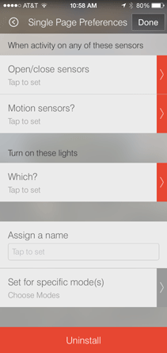
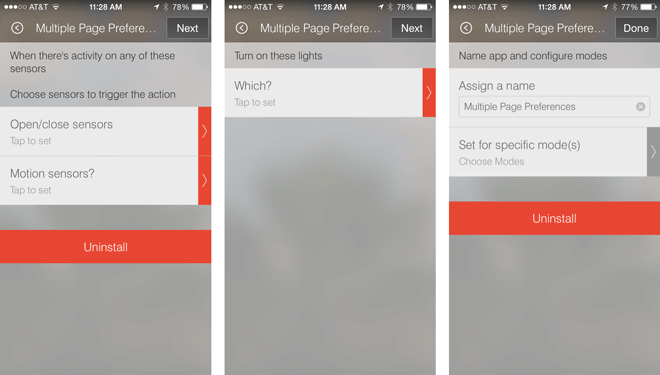
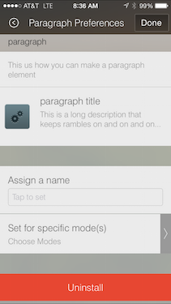
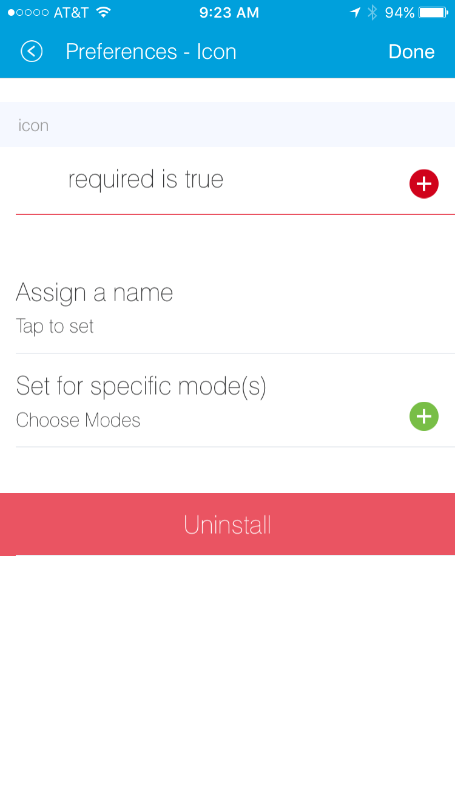
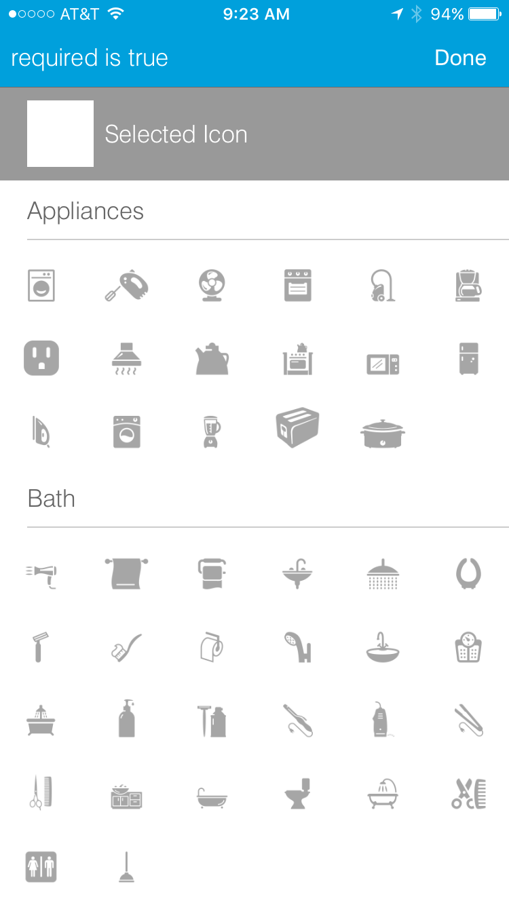
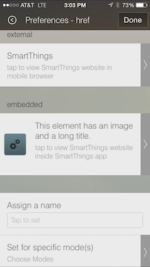
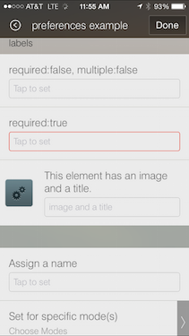

Preferences & Settings
======================

The preferences section of a SmartApp specifies what
kinds of devices and other information is needed in order for the
application to run. Inputs for each of these are presented to the user
during installation of the SmartApp from the mobile UI.  You can present all of these
inputs on a single page, or break them up into multiple pages. 

As usual, the best way to become comfortable with something is through trying it yourself.
So, fire up the `web IDE <http://ide.smartthings.com>`__ and try things out!

Preferences Overview
--------------------

Preferences are made up of one or more pages, which contain one or more sections, which in turn contain
one more elements. The general form of creating preferences looks like:

::

    preferences {
        page() {
            section() {
                paragraph "some text"
                input "motionSensors", "capability.motionSensor",
                    title: "Motions sensors?", multiple: true
            }
            section() {
                ...
            }
        }
        page() {
            ...
        }
    }

Page Definition
---------------

Pages can be defined a couple different ways:

*page(String pageName, String pageTitle) {}*

::

    preferences {
        // page with name and title
        page("page name", "page title") {
            // sections go here
        }
    }

*page(options) {}*

This form takes a comma-separated list of name-value arguments. 

.. note::

    this is a common Groovy pattern that allows for named arguments to be passed to a method. More info can be found `here <http://groovy.codehaus.org/Extended+Guide+to+Method+Signatures>`__.

::

    preferences {
        page(name: "pageName", title: "page title", 
             nextPage: "nameOfSomeOtherPage", uninstall: true) {
            // sections go here
        }
    }

The valid options are:

*name* (required)
    String - Identifier for this page.
*title*
    String - The display title of this page
*nextPage*
    String - Used on multi-page preferences only. Should be the name of the page to navigate to next.
*install*
    Boolean - Set to ``true`` to allow the user to install this app from this page. Defaults to ``false``. Not necessary for single-page preferences.
*uninstall*
    Boolean - Set to ``true`` to allow the user to uninstall from this page. Defualts to false. Not necessary for single-page preferences.

We will see more in-depth examples of pages in the following sections.

Section Definition
------------------

Pages can have one or more sections. Think of sections as way to group the input you want to gather from the user.

Sections can be created in a few different ways:

*section{}*

::

    preferences {
        // section with no title
        section {
            // elements go here
        }
    }

*section(String sectionTitle){}*

::

    preferences {
        // section with title
        section("section title") {
            // elements go here
        }
    }

*section(options, String sectionTitle) {}*

::

    preferences {
        // section will not display in IDE
        section(mobileOnly: true, "section title")
    }

The valid options are:

*hideable*
    Boolean - Pass ``true`` to allow the section to be collapsed. Defaults to ``false``.
*hidden*
    Boolean - Pass ``true`` to specify the section is collapsed by default. Used in conjunction with ``hidden``. Defaults to ``false``. 
*mobileOnly*
    Boolean - Pass ``true`` to suppress this section from the IDE simulator. Defaults to ``false``.

Single Preferences Page
-----------------------

A single page preferences declaration is composed of one or more *section* elements, which in turn contain one or more
*elements*. Note that there is no *page* defined in the example below. When creating a single-page preferences app, there's no need to define the page explicitly - it's implied. Here's an example:

::

    preferences {
        section("When activity on any of these sensors") {

            input "contactSensors", "capability.contactSensor",
                title: "Open/close sensors", multiple: true

            input "motionSensors", "capability.motionSensor",
                title: "Motion sensors?", multiple: true
        }
        section("Turn on these lights") {
            input "switches", "capability.switch", multiple: true
        }
    }

Which would be rendered in the mobile app UI as:

Note that in the above example, we did not specify the name or mode input, yet they appeared on our preferences page.
When defining single-page preferences, name and mode are automatically added.

Multiple Preferences Pages
--------------------------

Preferences can also be broken up into multiple pages. Each page must contain one or more *section*
elements. Each page specifies a *name* property that is referenced by the *nextPage* property. The *nextPage*
property is used to define the flow of the pages. Unlike single page preferences, the app name and mode control
fields are not automatically added, and must be specified on the desired page or pages.

Here's an example that defines three pages:

::

    preferences {
        page(name: "pageOne", title: "When there's activity on any of these sensors", nextPage: "pageTwo", uninstall: true) {
            section("Choose sensors to trigger the action") {

                input "contactSensors", "capability.contactSensor",
                    title: "Open/close sensors", multiple: true

                input "motionSensors", "capability.motionSensor",
                    title: "Motion sensors?", multiple: true
            }
        }
        page(name: "pageTwo", title: "Turn on these lights", nextPage: "pageThree") {
            section {
                input "switches", "capability.switch", multiple: true
            }
        }
        page(name: "pageThree", title: "Name app and configure modes", install: true, uninstall: true) {
            section([mobileOnly:true]) {
                label title: "Assign a name", required: false
                mode title: "Set for specific mode(s)", required: false
            }
        }
    }

The resulting pages in the mobile app would show the name and mode control fields only on the third page, and the
uninstall button on the first and third pages:

Preference Elements & Inputs
----------------------------

Preference pages (single or multiple) are composed of one or more sections, each of which contains one or more of the
following elements:

**paragraph**

Text that's displayed on the page for messaging and instructional purposes.

Example::

    preferences {
        section("paragraph") {
            paragraph "This us how you can make a paragraph element"
            paragraph image: "https://s3.amazonaws.com/smartapp-icons/Convenience/Cat-Convenience.png", 
                      title: "paragraph title", 
                      required: true, 
                      "This is a long description that rambles on and on and on..."
        }
    }

The above preferences definition would render as:

Valid options:

*title*
    String - The title of the paragraph
*image*
    String - URL of image to use, if desired
*required* 
    Boolean - ``true`` or ``false`` to specify this input is required. Defaults to ``false``. 

**icon**

Allows the user to select an icon to be used when displaying the app in the mobile UI

Example::

    preferences {
        section("paragraph") {
            icon(title: "required:true", 
                 required: true)
        }
    }

The above preferences definition would render as:

Tapping the element would then allow the user to choose an icon:

Valid options:

*title*
    String - The title of the icon
*required*
    Boolean - ``true`` or ``false`` to specify this input is required. Defaults to ``false``. 

**href**

A control that selects another preference page or external HTML page.

Example of using href to visit a URL::

    preferences {
        section("external") {
            href(name: "hrefNotRequired", 
                 title: "SmartThings", 
                 required: false, 
                 style: "external", 
                 url: "http://smartthings.com/", 
                 description: "tap to view SmartThings website in mobile browser")
        }
        section("embedded") {
            href(name: "hrefWithImage", title: "This element has an image and a long title.", 
                 description: "tap to view SmartThings website inside SmartThings app", 
                 required: false, 
                 image: "https://s3.amazonaws.com/smartapp-icons/Convenience/Cat-Convenience.png", 
                 url: "http://smartthings.com/")
        }
    }

The above preferences would render as:

Example of using href to link to another preference page (dynamic pages are discussed later in this section)::

    preferences {
        page(name: "hrefPage")
        page(name: "deadEnd")
    }

    def hrefPage() {
        dynamicPage(name: "hrefPage", title: "href example page", uninstall: true) {
            section("page") {
                href(name: "href", 
                     title: "dead end page", 
                     required: false,
                     page: "deadEnd")
            }
        }
    }

    def deadEnd() {
        dynamicPage(name: "deadEnd", title: "dead end page") {
            section("dead end") {
                paragraph "this is a simple paragraph element."
            }
        }
    }

Valid options:

*title*
    String - the title of the element
*required*
    Boolean - ``true`` or ``false`` to specify this input is required. Defaults to ``false``. 
*description*
    String - the secondary text of the element
*external*
    Boolean - ``true`` to open URL in mobile browser application, ``false`` to open URL within the SmartThings app.
*url*
    String - The URL of the page to visit. You can use query parameters to pass additional information to the URL (For example, \http://someurl.com?param1=value1&param2=value1\)
*page*
    String - Used to link to another preferences page. Not compatible with the external option.
*image*
    String - URL of an image to use, if desired.  

**mode**

Allows the user to select which modes the app executes in. Automatically generated by single-page preferences.

Example::

    preferences {
        page(name: "pageOne", title: "page one", nextPage: "pageTwo", uninstall: true) {
            section("section one") {
                paragraph "just some text"
            }
        }
        page(name: "pageTwo", title: "page two") {
            section("page two section one") {
                mode(name: "modeMultiple", 
                     title: "pick some modes", 
                     required: false)
                mode(name: "modeWithImage", 
                     title: "This element has an image and a long title.", 
                     required: false, 
                     multiple: false, 
                     image: "https://s3.amazonaws.com/smartapp-icons/Convenience/Cat-Convenience.png")
            }
        }
    }

The second page of the above example would render as:

Valid options:

*title*
    String - the title of the mode field
*required*
    Boolean - ``true`` or ``false`` to specify this input is required. Defaults to ``false``. 
*multiple*
    Boolean - ``true`` or ``false`` to specify this input allows selection of multiple values. Defaults to ``true``.
*image*
    String - URL of an image to use, if desired.

**label**

Allows the user to name the app installation. Automatically generated by single-page preferences.

Example::

    preferences {
        section("labels") {
            label(name: "label", 
                  title: "required:false, 
                  multiple:false", 
                  required: false, 
                  multiple: false)
            label(name: "labelRequired",
                  title: "required:true", 
                  required: true, 
                  multiple: false)
            label(name: "labelWithImage", 
                  title: "This element has an image and a title.", 
                  description: "image and a title", 
                  required: false, 
                  image: "https://s3.amazonaws.com/smartapp-icons/Convenience/Cat-Convenience.png")
        }
    }

The above preferences definition would render as:

Valid options:

*title*
    String - the title of the label field
*description*
    String - the default text in the input field
*required*
    Boolean - ``true`` or ``false`` to specify this input is required. Defaults to ``false``. Defaults to ``true``.
*image*
    String - URL to an image to use, if desired

**app**

Provides user-initiated installation of child apps. Typically used in `dashboard solution SmartApps <dashboard-solution-smartapps.html>`__

**input**

Allows the user to select devices or enter values to be used during execution of the smart app.

Inputs are the most commonly used preference elements. They can be used to prompt the user to select devices that
provide a certain capability, devices of a specific type, or constants of various kinds. Input element method calls
take two forms. The "shorthand" form passes in the name and type unnamed as the required first two parameters, and any
other arguments as named options:

::

    preferences {
        section("section title") {
            // name is "temperature1", type is "number"
            input "temperature1", "number", title: "Temperature"
        }
    }

The second form explicitly specifies the name of each argument:

::

    preferences {
        section("section title") {
            input(name: "color", type: "enum", title: "Color", options: ["Red","Green","Blue","Yellow"])
        }
    }

Valid input options:

*name*
    String - name of variable that will be created in this SmartApp to reference this input
*title*
    String - title text of this element.
*description*
    String - default value of the input element
*multiple*
    Boolean - ``true`` to allow multiple values or ``false`` to allow only one value. Not valid for all input types.
*options*
    List - used in conjunction with the enum input type to specify the values the user can choose from. Example: ``options: ["choice 1", "choice 2", "choice 3"]``
*type*
    String - one of the names from the following table:

    ===========================  ===========================================================================================
    **Name**                     **Comment**
    ---------------------------  -------------------------------------------------------------------------------------------
    cacapability.capabilityName  Prompts for all the devices that match the specified capability.

                                 See the *Preferences Reference* column of the `capabilities <https://graph.api.smartthings.com/ide/doc/capabilities>`__
                                 table for possible values.
    device.deviceTypeName        Prompts for all devices of the specified type.
    boolean                      A ``true`` or ``false`` value
    date                         A calendar date value
    decimal                      A floating point number, i.e. one that can contain a decimal point
    email                        An email address
    enum                         One of a set of possible values. Use the *options* element to define the possible values.
    hub                          Prompts for the selection of a hub
    icon                         Prompts for the selection of an icon image
    number                       An integer number, i.e. one without decimal point
    password                     A password string. The value is obscured in the UI and encrypted before storage
    phone                        A phone number
    time                         A time of day
    text                         A text value
    ===========================  ===========================================================================================

Dynamic Preferences
-------------------

One of the most powerful features of multi-page preferences is the ability to dynamically generate the content of a page
based on previous selections or external inputs, such as the data elements returned from a web services call. The
following example shows how to create a two-page preferences SmartApp where the content of the second page depends
on the selections made on the first page.

::

     preferences {
        page(name: "page1", title: "Select sensor and actuator types", nextPage: "page2", uninstall: true) {
            section {
                input("sensorType", "enum", options: [
                    "contactSensor":"Open/Closed Sensor",
                    "motionSensor":"Motion Sensor",
                    "switch": "Switch",
                    "moistureSensor": "Moisture Sensor"])

                input("actuatorType", "enum", options: [
                    "switch": "Light or Switch",
                    "lock": "Lock"]
                )
            }
        }

        page(name: "page2", title: "Select devices and action", install: true, uninstall: true)

    }

    def page2() {
        dynamicPage(name: "page2") {
            section {
                input(name: "sensor", type: "capability.$sensorType", title: "If the $sensorType device")
                input(name: "action", type: "enum", title: "is", options: attributeValues(sensorType))
            }
            section {
                input(name: "actuator", type: "capability.$actuatorType", title: "Set the $actuatorType")
                input(name: "action", type: "enum", title: "to", options: actions(actuatorType))
             }

        }
    }

    private attributeValues(attributeName) {
        switch(attributeName) {
            case "switch":
                return ["on","off"]
            case "contactSensor":
                return ["open","closed"]
            case "motionSensor":
                return ["active","inactive"]
            case "moistureSensor":
                return ["wet","dry"]
            default:
                return ["UNDEFINED"]
        }
    }

    private actions(attributeName) {
        switch(attributeName) {
            case "switch":
                return ["on","off"]
            case "lock":
                return ["lock","unlock"]
            default:
                return ["UNDEFINED"]
        }
    }

