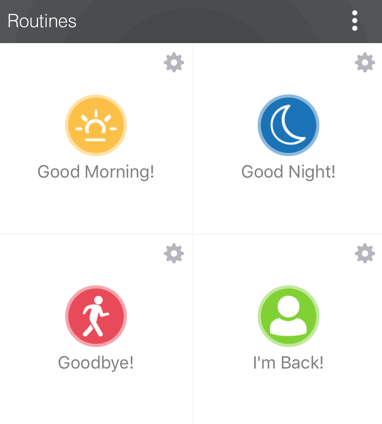

.. _smartapp-routines:

========
Routines
========

*Routines* (or *Hello Home Actions* in older mobile apps) allow certain things to happen when the routine is invoked.

----

Overview
--------

Routines allow for certain things to happen whenever it executes. SmartThings comes with a few routines already installed:

- Good Morning! - You or the house is waking up
- Good Night! - You or the house is going to sleep
- Goodbye! - You're leaving the house
- I'm Back! - You've returned to the house

Each routine can be configured to do certain things. For example, when "I'm Back!" executes, you can set the mode to "Home", unlock doors, adjust the thermostat, etc.

Routines exist for each location in a SmartThings account.

----

Get Available Routines
----------------------

You can get the routines for the location the SmartApp is installed into by accessing the ``helloHome`` object on the ``location``:

.. code-block:: groovy

    def actions = location.helloHome?.getPhrases()*.label

.. tip::

    If the above code example, with the ``?`` and ``*`` operator looks foreign to you, read on.

    The ``?`` operator allows us to safely avoid a ``NullPointerException`` should ``helloHome`` be null. It's one of Groovy's niceties that allows us to avoid wrapping calls in ``if(someThing != null)`` blocks. Read more about it `here <http://docs.groovy-lang.org/latest/html/documentation/#_safe_navigation_operator>`__.

    The ``*`` operator is called the *spread operator*, and it invokes the specified action (get the label, in the example above) on all items in a collection, and collects the result into a list. Read more about it `here <http://docs.groovy-lang.org/latest/html/documentation/#_spread_operator>`__.

----

Execute Routines
----------------

To execute a Routine, you can call the ``execute()`` method on ``helloHome``:

.. code-block:: groovy

    location.helloHome?.execute("Good Night!")

----

Allowing Users to Select Routines
---------------------------------

A SmartApp may want to allow a user to execute certain Routines in a SmartApp.
Since the routines for each location will vary, we need to get the available routines, and use them as options for an ``enum`` input type.

This needs to be done in a dynamic preferences page, since we need to execute some code to populate the available actions:

.. code-block:: groovy

    preferences {
    	page(name: "selectActions")
    }

    def selectActions() {
        dynamicPage(name: "selectActions", title: "Select Hello Home Action to Execute", install: true, uninstall: true) {

            // get the available actions
    		def actions = location.helloHome?.getPhrases()*.label
    		if (actions) {
                // sort them alphabetically
            	actions.sort()
    			section("Hello Home Actions") {
    				log.trace actions
                    // use the actions as the options for an enum input
                    input "action", "enum", title: "Select an action to execute", options: actions
    			}
    		}
        }
    }

You can read more about the ``enum`` input type and dynamic pages :ref:`here <prefs_and_settings>`.

You can then access the selected phrase like so:

.. code-block:: groovy

    def selectedAction = settings.action

----

Routine Events
--------------

When a routine is executed, a ``"routineExecuted"`` event is created for that location.
Here's how you can subscribe to a routine being executed in a SmartApp:

.. code-block:: groovy

    def initialize() {
        // subscribe to the "routineExecuted" event on the location
        subscribe(location, "routineExecuted", routineChanged)
    }

    def routineChanged(evt) {
        log.debug "routineChanged: $evt"

        // name will be "routineExecuted"
        log.debug "evt name: ${evt.name}"

        // value will be the ID of the SmartApp that created this event
        log.debug "evt value: ${evt.value}"

        // displayName will be the name of the routine
        // e.g., "I'm Back!" or "Goodbye!"
        log.debug "evt displayName: ${evt.displayName}"

        // descriptionText will be the name of the routine, followed by the action
        // e.g., "I'm Back! was executed" or "Goodbye! was executed"
        log.debug "evt descriptionText: ${evt.descriptionText}"
    }

----

Example
-------

This example simply shows executing a selected routine when a switch turns on, and another action when a switch turns off:

.. code-block:: groovy

    preferences {
    	page(name: "configure")
    }

    def configure() {
        dynamicPage(name: "configure", title: "Configure Switch and Phrase", install: true, uninstall: true) {
    		section("Select your switch") {
    			input "theswitch", "capability.switch",required: true
    		}

    		def actions = location.helloHome?.getPhrases()*.label
    		if (actions) {
            	actions.sort()
    			section("Hello Home Actions") {
    				log.trace actions
                    input "onAction", "enum", title: "Action to execute when turned on", options: actions, required: true
                    input "offAction", "enum", title: "Action to execute when turned off", options: actions, required: true
    			}
    		}
        }
    }

    def installed() {
    	log.debug "Installed with settings: ${settings}"
    	initialize()
    }

    def updated() {
    	log.debug "Updated with settings: ${settings}"
    	unsubscribe()
    	initialize()
    }

    def initialize() {
    	subscribe(theswitch, "switch", handler)
        subscribe(location, "routineExecuted", routineChanged)
        log.debug "selected on action $onAction"
        log.debug "selected off action $offAction"
    }

    def handler(evt) {
    	if (evt.value == "on") {
        	log.debug "switch turned on, will execute action ${settings.onAction}"
        	location.helloHome?.execute(settings.onAction)
        } else {
    	    log.debug "switch turned off, will execute action ${settings.offAction}"
        	location.helloHome?.execute(settings.offAction)
        }
    }

    def routineChanged(evt) {
        log.debug "routineChanged: $evt"
        log.debug "evt name: ${evt.name}"
        log.debug "evt value: ${evt.value}"
        log.debug "evt displayName: ${evt.displayName}"
        log.debug "evt descriptionText: ${evt.descriptionText}"
    }

----

Further Reading
---------------

- :ref:`Preferences and Settings Guide <prefs_and_settings>`
