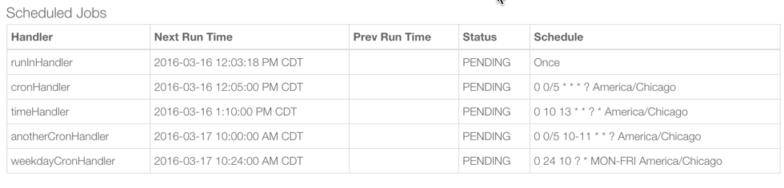
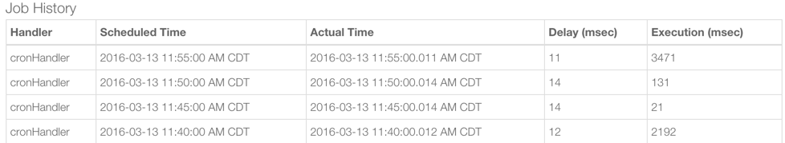

.. _smartapp-scheduling:

Scheduling
==========

SmartApps and Device Handlers often need to schedule certain actions to take place at a given point in time.
For example, an app may want to turn off the lights five minutes after someone leaves.
Or, an app may want to turn the lights on every day at a certain time.

----

Overview
--------

Broadly speaking, there are a few different ways we might want to schedule something to happen:

- Do something after a certain time amount from now.
- Do something once at certain time in the future.
- Do something on a recurring schedule.

We'll look at each scenario in detail, and what methods SmartThings makes available to address these requirements.

.. note::
    When using the scheduler APIs, the schedule will be created using the time zone for the installed SmartApp's location.

----

``runIn()`` - Schedule From Now
-------------------------------

A SmartApp may want to take some action in a certain amount of time after some event has occurred.
Consider a few examples:

- When a door closes, turn a light off after two minutes.
- When everyone leaves, adjust the thermostat after ten minutes.
- If a door opens and is not shut after five minutes, send a notification.

All these scenarios follow a common pattern: when a certain event happens, take some action after a given amount of time.
This can be accomplished this by using the :ref:`smartapp_run_in` method.

``runIn()`` takes the number of seconds from now to execute, the method to execute, and a map of options (not required).

.. code-block:: groovy
    :emphasize-lines: 3

    def someEventHandler(evt) {
        // execute handler in five minutes from now
        runIn(60*5, handler)
    }

    def handler() {
        theswitch.off()
    }

By default, if a method is scheduled to run in the future, and then another call to runIn with the same method is made, the last one overwrites the previously scheduled method.
This is usually preferable.

Consider the situation if we have a switch scheduled to turn off after five minutes of a door closing:

- First, the door closes at 2:50 and we schedule the switch to turn off after five minutes (2:55).
- Then, two minutes later (2:52), the door opens and closes again - another call to ``runIn()`` will be made to schedule the switch to turn off in five minutes from now (2:57).

By default, there will now be *one* scheduled execution, at 2:57.
And in this scenario, that is preferable.

But if don't want the most recent scheduled handler to execute, we can specify ``[overwrite: false]``:

.. code-block:: groovy
    :emphasize-lines: 2

    def someEventHandler(evt) {
        runIn(300, handler, [overwrite: false])
    }

    def handler() {
        // need to handle multiple calls since overwrite:false specified
    }

We would now have two schedules to turn off the switch - one at 2:55, and one at 2:57.
So, if you do specify ``[overwrite: false]``, be sure to write your handler so that it can handle multiple calls.

.. note::

    It is important to note that you should not rely on ``runIn()`` being called in *exactly* the specified number of seconds.
    SmartThings will *attempt* to execute the method within a minute of the time specified, but cannot guarantee it.
    See the :ref:`limitations_best_practices` topic below for more information.

----

``runOnce()`` - Run Once in the Future
--------------------------------------

Some SmartApps may need to schedule certain actions to happen *once* at a specific time and date. :ref:`smartapp_run_once` handles this case.

You can pass a Date object or a Java ISO-8601 formatted string [1]_.

.. code-block:: groovy
    :emphasize-lines: 7,10

    preferences {
        input "executeTime", "time", title: "enter a time to execute every day"
    }

    def initialized() {
        // execute once at the time specified by the user
        runOnce(executeTime, handler)

        // execute tomorrow at the current time
        runOnce(new Date() + 1, handler)
    }

    def handler() {
        log.debug "handler executed at ${new Date()}"
    }

Like ``runIn()``, you can also specify the overwrite behavior of ``runOnce()``:

.. code-block:: groovy

    runOnce(new Date() + 1, handlerMethod, [overwrite: false])

----

``schedule()`` - Run on a Recurring Schedule
--------------------------------------------

Often, there is a need to schedule a job to run on a specific schedule.
For example, maybe you want to turn the lights off at 11 PM every night.
Or, you might need to execute a certain action every X minutes.

SmartThings provides the :ref:`smartapp_schedule` method to allow you to create recurring schedules.

The various ``schedule()`` methods follow a similar form - they take an argument representing the desired schedule, and the method to be called on this schedule.

.. note::

    If you call ``schedule()`` with a method that is already scheduled, it will result in the schedule for that method being updated with the new schedule.

Schedule Once Per Day
^^^^^^^^^^^^^^^^^^^^^

Use the ``schedule()`` method to execute a handler method every day at a certain time:

.. code-block:: groovy
    :emphasize-lines: 6

    preferences {
        input "theTime", "time", title: "Time to execute every day"
    }

    def initialize() {
        schedule(theTime, handler)
    }

    // called every day at the time specified by the user
    def handler() {
        log.debug "handler called at ${new Date()}"
    }

You can also use ``schedule()`` with a Date object.
Only the time portion of the Date will be used to derive the schedule.

.. code-block:: groovy

    // execute every day at the current time
    schedule(new Date(), handler)

Finally, you can pass a Long representing the desired time in milliseconds (using `Unix time <http://en.wikipedia.org/wiki/Unix_time>`__) to ``schedule()``:

.. code-block:: groovy
    :emphasize-lines: 3

    def someEventHandler(evt) {
        // call handlerMethod every day, at two minutes from the current time
        schedule(now() + 120000, handlerMethod)
    }

    def handlerMethod() {
        ...
    }

Schedule Using Cron
^^^^^^^^^^^^^^^^^^^

Scheduling jobs to execute at a particular time is useful, but what if we want to execute a job at some other interval?
What if, for example, we want a method to execute at fifteen minutes past the hour, every hour?

SmartThings allows you to pass a cron expression to the schedule method to accomplish this.
A cron expression is based on the cron UNIX tool, and is a way to specify a recurring schedule.

.. code-block:: groovy
    :emphasize-lines: 3

    def initialize() {
        // execute handlerMethod every hour on the half hour.
        schedule("0 30 * * * ?", handlerMethod)
    }

    def handlerMethod() {
        ...
    }

Cron syntax is very powerful, but also fairly complex.

We recommend reading through the `Quartz Cron Trigger Tutorial`_ for some basic information and examples using the cron expression format.

We also recommend you test your cron expression before using it in a SmartApp or Device Handler.
It's easy to create a cron expression that doesn't do what you intended, and often this results in too many scheduled executions, resulting in a wide range of problems.
The cron expression test tool we use is http://www.cronmaker.com/.

.. note::

    High volume cron schedules are encouraged to specify a random seconds field.
    This helps to avoid a large number of scheduled executions being queued up at the same time.

    It may not be acceptable for every use case, but if it is, use a random second.

Here are some common examples for recurring schedules using cron:

============================================= ===========
Expression Description                        Description
============================================= ===========
``schedule("12 30 * * * ?", handler)``         Execute ``handler()`` every hour on the half hour (using a randomly chosen seconds field)
``schedule("23 0/7 * * * ?", handler)``        Execute ``handler()`` every 7 minutes beginning at 0 minutes after the hour (using a randomly chosen seconds field)
``schedule("0 0/5 10-11 * * ?", handler)``    Execute ``handler()`` every 5 minutes beginning at 0 minutes after the hour, between the hours of 10 and 11 AM, at 0 seconds past the minute
``schedule("48 25 10 ? * MON-FRI", handler)``  Execute ``handler()`` at 10:25 AM Monday through Friday (using a randomly chosen seconds field)
============================================= ===========

.. warning::

    ``*`` means "every", not "any".
    Don't confuse the two.

    ``* */5 * * * ?`` means every 5th minute, run 60 times within that minute.
    That's almost surely not what you want, and SmartThings will not execute your schedule that frequently (see below).

    If you were trying to execute every X minutes, it would look like this: ``0 0/X * * * ?`` where X is the minute value.

Cron jobs are only be allowed to run at a minimum of 1 minute intervals.
If your cron expression runs more often than once per minute it, will be limited to a 1 minute interval.

For more information, see this `community post`_.

Schedule Every X Minutes or Hours
^^^^^^^^^^^^^^^^^^^^^^^^^^^^^^^^^

For common recurring schedules, SmartThings provides some convenience APIs that we can use.
These methods use cron under the hood, but save you the pain of authoring the expression themselves.

These methods work by creating a random start time in the X minutes or hours, and then every X minutes or hours after that.
For example, ``runEvery5Minutes(handlerMethod)`` will execute ``handlerMethod()`` at a random time in the next five minutes, and then run every five minutes from then.

These methods have the advantage of randomizing the start time for schedules, which can reduce the load on the SmartThings cloud.
As such, they should be preferred over cron expressions when available.

The currently available methods are:

- :ref:`smartapp_run_every_5_minutes`
- :ref:`smartapp_run_every_10_minutes`
- :ref:`smartapp_run_every_15_minutes`
- :ref:`smartapp_run_every_30_minutes`
- :ref:`smartapp_run_every_1_hours`
- :ref:`smartapp_run_every_3_hours`

Using them is similar to other scheduling methods:

.. code-block:: groovy
    :emphasize-lines: 2

    def initialize() {
        runEvery5Minutes(handlerMethod)
    }

    def handlerMethod() {
        log.debug "handlerMethod called at ${new Date()}"
    }

----

.. _scheduling_passing_data:

Passing Data to the Handler Method
----------------------------------

Sometimes it is useful to pass data to the handler method.
This is possible by passing in a map as the last argument to the various schedule methods with ``data`` as the key and another map as the value.

.. code-block:: groovy
    :emphasize-lines: 2

    def someEventHandler(evt) {
        runIn(60, handler, [data: [flag: true]])
    }

    def handler(data) {
        if (data.flag) {
            theswitch.off()
        }
    }

By passing data directly to the handler method, you can avoid having to store data in the SmartApp or Device Handler state.
The following scheduling methods support passing data to their handler methods:

- ``runIn()``
- ``runOnce()``
- ``schedule()``
- All ``runEveryXMinutes()`` methods
- All ``runEveryXHours()`` methods

.. note::

    To also specify the overwrite flag, pass it as an additional property in the map: ``[overwrite: false, data: [foo: 'bar']]``.

Similar to state, :ref:`only data that can be serialized to JSON <state_what_can_be_stored>` can be passed to the handler.

The amount of data is limited to 2500 characters after being serialized.
If this limit is exceeded, a ``physicalgraph.exception.DataCharacterLimitExceededException`` exception will be thrown, and the schedule will not be created.

----

Removing Scheduled Executions
-----------------------------

You can remove scheduled executions using the :ref:`smartapp_unschedule` method:

.. code-block:: groovy
    :emphasize-lines: 8

    def initialize() {
        // schedule execution every 5 minutes
        runEvery5Minutes(handler)
    }

    def someEventHandler(evt) {
        // remove the scheduled execution
        unschedule(scheduledHandler)
    }

    def handler() {
        log.debug "in handler, current time is ${new Date()}"
    }

This will remove schedules created with any of the scheduling methods (``runIn()``, ``runOnce()``, and ``schedule()``).

You can also call ``unschedule()`` with no arguments to remove all schedules:

.. code-block:: groovy

    // remove all scheduled executions for this SmartApp install
    unschedule()

.. note::

    Due to the way that the scheduling service is currently implemented, ``unschedule()`` is a fairly expensive operation, and may take many seconds to execute.

    We plan to address this in the future, but until then, you should be aware of the potential performance impacts.

----

Viewing Schedules in the IDE
----------------------------

You can view schedules for any installed SmartApp in the IDE.

.. note::
    Schedules can only be viewed for SmartApps installed via the mobile client.

    Schedules for Device Handlers and SmartApps installed into the IDE simulator can not be viewed.

1. In the IDE, navigate to `Locations`.
2. Select the Location the SmartApp is installed into.
3. Click the `List SmartApps` link:

4. Click the name of the SmartApp you wish to view the schedules for.

You will then see various information about the installed SmartApp, including the scheduled executions:

You can view all the scheduled jobs, including the next scheduled run time, the status, and the schedule.

You can also view the SmartApp job history, which shows the previous executions and the scheduled vs. actual execution time, the delay between the scheduled time and actual time, and the total execution time for the handler method:

----

.. _limitations_best_practices:

Scheduling Limitations, Best Practices, and Things Good to Know
---------------------------------------------------------------

When using any of the scheduling APIs, it's important to understand some limitations and best practices.

.. _scheduling_chained_run_in:

Avoid Chained ``runIn()`` Calls
^^^^^^^^^^^^^^^^^^^^^^^^^^^^^^^

Use ``runIn()`` to schedule one-time executions, not recurring schedules.

For example, do **not** do this:

.. code-block:: groovy
    :caption: do-not-do-this.groovy

    def initialize() {
        runIn(60, handler)
    }

    def handler() {
        // do something here

        // schedule to run again in one minute - this is an antipattern!
        runIn(60, handler)
    }

The above example uses a chained ``runIn()`` pattern to create a recurring schedule to execute every minute.

This pattern is prone to failure, because any single scheduled execution failure that results in ``handler()`` not being called, means it will not be able to reschedule itself.
One failure causes the whole chain to collapse.

If you need a recurring schedule, use cron.

.. note::

    Using a chained ``runIn()`` pattern can be acceptable for certain short-running tasks, such as gradually dimming a bulb.
    But for anything long-running, use cron.

Execution Time May Not Be in Exact Seconds
^^^^^^^^^^^^^^^^^^^^^^^^^^^^^^^^^^^^^^^^^^

SmartThings will try to execute your scheduled job at the specified time, but cannot guarantee it will execute at that exact moment.
As a general rule of thumb, you should expect that your job will be called within the minute of scheduled execution.
For example, if you schedule a job at 5:30:20 (20 seconds past 5:30) to execute in five minutes, we expect it to be executed at some point in the 5:35 minute.

Do Not Aggressively Schedule
^^^^^^^^^^^^^^^^^^^^^^^^^^^^

Every scheduled execution incurs a cost to launch the SmartApp, and counts against the :ref:`rate_limits`.
While there are some limitations in place to prevent excessive scheduling, it's important to note that excessive polling or scheduling is discouraged.
It is one of the items we look for when reviewing community-developed SmartApps or device-type handlers.

``unschedule()`` is Expensive
^^^^^^^^^^^^^^^^^^^^^^^^^^^^^

As discussed above, ``unschedule()`` is currently a potentially expensive operation.

We plan to address this in the near future. Until we do, be aware of the potential performance impacts of calling ``unschedule()``.

Note that when the SmartApp is uninstalled, all scheduled executions are removed - there is no need to call ``unschedule()`` in the ``uninstalled()`` method.

Number of Scheduled Executions Limit
^^^^^^^^^^^^^^^^^^^^^^^^^^^^^^^^^^^^

The :ref:`smartapp_can_schedule` method returns false if four or more scheduled executions are created.

This currently does not actually impact the ability to create additional schedules, but such a limit may be imposed in the near future.
A community post will be made in advance of any such change.

----

Examples
--------

Here are some examples in the ``SmartThingsPublic`` repository that make use of schedules:

- Once-A-Day_ uses ``schedule()`` turn switches on and off every day at a specified time.
- Turn-It-On_ uses ``runIn()`` to turn a switch off after five minutes.
- Left-It-Open_ uses ``runIn()`` to see if a door has been left open for a specified number of minutes.

----

.. [1] You may notice that some of the scheduling APIs accept a string to represent the the date/time to be executed.
    This is a result of when you define a preference input of the "time" type, it uses a String representation of the value entered.
    When using this value later to set up a schedule, the APIs need to be able to handle this type of argument.
    When simply using the input from preferences, you don't need to know the details of the specific date format being used.
    But, if you wish to use the APIs with string inputs directly, you will need to understand their expected format.
    SmartThings uses the Java standard format of "yyyy-MM-dd'T'HH:mm:ss.SSSZ". More technical readers may recognize this format as ISO-8601 (Java does not fully conform to this format, but it is very similar).
    Full discussion of this format is beyond the scope of this documentation, but a few examples may help:
    "January 09, 2015 3:50:32 GMT-6 (Central Standard Time)" converts to "2015-01-09T15:50:32.000-0600", and "February 09, 2015 3:50:32:254 GMT-6 (Central Standard Time)" converts to "2015-02-09T15:50:32.254-0600"
    For more information about date formatting, you can review the `SimpleDateFormat JavaDoc`_.

.. _Once-a-Day: https://github.com/SmartThingsCommunity/SmartThingsPublic/blob/master/smartapps/smartthings/once-a-day.src/once-a-day.groovy
.. _Turn-It-On: https://github.com/SmartThingsCommunity/SmartThingsPublic/blob/master/smartapps/smartthings/turn-it-on-for-5-minutes.src/turn-it-on-for-5-minutes.groovy
.. _Left-It-Open: https://github.com/SmartThingsCommunity/SmartThingsPublic/blob/master/smartapps/smartthings/left-it-open.src/left-it-open.groovy
.. _community post: https://community.smartthings.com/t/announcement-changes-coming-to-cron-jobs/41656
.. _Quartz Cron Trigger Tutorial: http://www.quartz-scheduler.org/documentation/quartz-2.x/tutorials/crontrigger.html
.. _SimpleDateFormat JavaDoc: http://docs.oracle.com/javase/6/docs/api/java/text/SimpleDateFormat.html
