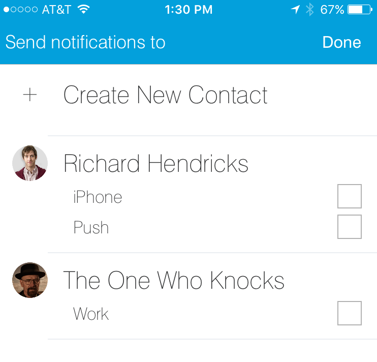

.. _smartapp-sending-notifications:

=====================
Sending Notifications
=====================

SmartApps can send notifications, either as a push notification in the mobile app, or as SMS messages to designated recipients. This allows SmartApps to notify people when important events happen in their home.

In this guide, you will learn:

- How to send notifications to contacts in a user's Contact Book
- How to send push notifications to the mobile app
- How to send SMS notifications
- How to display messages in the Notifications feed of the mobile app

Send Notifications with Contact Book
------------------------------------

.. note::

    The Contact Book feature is not currently enabled for users.
    However, using the Contact Book APIs (with the fall-back to non-contact book features), will future-proof your SmartApp for when contact book is enabled.

    See the :ref:`disabled_contact_book` section for more information.

If a user has added contacts to their Contact Book, SmartApps can prompt a user to select contacts to send notifications to.
This allows a user's contacts to be managed independently through the Contact Book, and SmartApps can tap into that feature.
This has the advantage that a user does not have to enter in phone numbers for every SmartApp.

Sending notifications by using the Contact Book feature is the preferred way for sending notifications in a SmartApp.

Selecting Contacts to Notify
~~~~~~~~~~~~~~~~~~~~~~~~~~~~

To allow a user to select from a list of their contacts, use the ``"contact"`` input type:

.. code-block:: groovy

    preferences {
        section("Send Notifications?") {
            input("recipients", "contact", title: "Send notifications to")
        }
    }

When the user configures this SmartApp, they can then select which contacts they want to notify, and how they should be notified (SMS or push):

In the example above, the users selected will be stored in a variable named ``recipients``. This is just a simple list that we can pass into the ``sendNotificationToContacts()`` method.

.. note::

    When creating contacts, the user can enter an email address. Emails are *not* currently sent by SmartThings, though they are used to identify SmartThings users, and enable them to receive push notifications.

Send Notifications to Contacts
~~~~~~~~~~~~~~~~~~~~~~~~~~~~~~

Use the ``sendNotificationToContacts()`` method to send a notification to the users (and the specified mode of contact) selected.

``sendNotificationToContacts()`` accepts three parameters - the message to send, the contacts selected, and an optional map of additional parameters. The valid option for the additional parameters is ``[event: false]``, which will suppress the message from appearing in the Notifications feed.

Assuming the ``"contact"`` input named ``"recipients"`` above, you would use:

.. code-block:: groovy

    sendNotificationToContacts("something you care about!", recipients)

If you don't want the message to appear in the Notifications feed, specify ``event: false``:

.. code-block:: groovy

    sendNotificationToContacts("something you care about!", recipients, [event: false])

.. _disabled_contact_book:

Handling Disabled Contact Book
~~~~~~~~~~~~~~~~~~~~~~~~~~~~~~

A user may not have created any contacts, and SmartApps should be written to handle this.

The ``"contact"`` input element takes an optional closure, where you can define additional input elements that will be displayed if the user has no contacts. If the user has contacts, these input elements won't be seen when installing or configuring the SmartApp.

Modifying our preferences definition from above, to handle the case of a user having no contacts, would look like:

.. code-block:: groovy

    preferences {
        section("Send Notifications?") {
            input("recipients", "contact", title: "Send notifications to") {
                input "phone", "phone", title: "Warn with text message (optional)",
                    description: "Phone Number", required: false
            }
        }
    }

If the user configuring this SmartApp does have contacts defined, they will only see the input to select from those contacts.
If they don't have any contacts defined, they will see the input to enter a phone number.

When attempting to send notifications, we should also check to see if the user has enabled the Contact Book and selected contacts. You can check the ``contactBookEnabled`` property on ``location`` to find out if Contact Book has been enabled. It's a good idea to also check if any contacts have been selected.

.. code-block:: groovy

    // check that contact book is enabled and recipients selected
    if (location.contactBookEnabled && recipients) {
        sendNotificationToContacts("your message here", recipients)
    } else if (phone) { // check that the user did select a phone number
        sendSms(phone, "your message here")
    }

Complete Example
~~~~~~~~~~~~~~~~

The example SmartApp below sends a notification to selected contacts when a door opens.
If the user has no contacts, they can enter in a number to receive an SMS notification.

.. code-block:: groovy

    definition(
        name: "Contact Book Example",
        namespace: "smartthings",
        author: "SmartThings",
        description: "Example using Contact Book",
        category: "My Apps",
        iconUrl: "https://s3.amazonaws.com/smartapp-icons/Convenience/Cat-Convenience.png",
        iconX2Url: "https://s3.amazonaws.com/smartapp-icons/Convenience/Cat-Convenience@2x.png",
        iconX3Url: "https://s3.amazonaws.com/smartapp-icons/Convenience/Cat-Convenience@2x.png")

    preferences {
        section("Which Door?") {
            input "door", "capability.contactSensor", required: true,
                  title: "Which Door?"
        }

        section("Send Notifications?") {
            input("recipients", "contact", title: "Send notifications to") {
                input "phone", "phone", title: "Warn with text message (optional)",
                    description: "Phone Number", required: false
            }
        }
    }

    def installed() {
        initialize()
    }

    def updated() {
        initialize()
    }

    def initialize() {
        subscribe(door, "contact.open", doorOpenHandler)
    }

    def doorOpenHandler(evt) {
        log.debug "recipients configured: $recipients"

        def message = "The ${door.displayName} is open!"
        if (location.contactBookEnabled && recipients) {
            log.debug "contact book enabled!"
            sendNotificationToContacts(message, recipients)
        } else {
            log.debug "contact book not enabled"
            if (phone) {
                sendSms(phone, message)
            }
        }
    }

----

.. note::

    The rest of this guide discusses alternative ways to send notifications (push, SMS, Notifications Feed). SmartApps should use Contact Book, and use the methods described below as a precaution in case the user does not have Contact Book enabled.

----

Send Push Notifications
-----------------------

To send a push notification through the SmartThings mobile app, you can use the ``sendPush()`` or ``sendPushMessage()`` methods.
Both methods simply take the message to display.
``sendPush()`` will display the message in the Notifications feed; ``sendPushMessage()`` will not.

A simple example below shows (optionally) sending a push message when a door opens:

.. code-block:: groovy

    preferences {
        section("Which door?") {
            input "door", "capability.contactSensor", required: true,
                  title: "Which door?"
        }
        section("Send Push Notification?") {
            input "sendPush", "bool", required: false,
                  title: "Send Push Notification when Opened?"
        }
    }

    def installed() {
        initialize()
    }

    def updated() {
        initialize()
    }

    def initialize() {
        subscribe(door, "contact.open", doorOpenHandler)
    }

    def doorOpenHandler(evt) {
        if (sendPush) {
            sendPush("The ${door.displayName} is open!")
        }
    }

Push notifications will be sent to all users with the SmartThings mobile app installed, for the account the SmartApp is installed into.

----

Send SMS Notifications
----------------------

In addition to sending push notifications through the SmartThings mobile app, you can also send SMS messages to specified numbers using the ``sendSms()`` and ``sendSmsMessage()`` methods.

Both methods take a phone number (as a string) and a message to send.
The message can be no longer than 140 characters. ``sendSms()`` will display the message in the Notifications feed; ``sendSmsMessage()`` will not.

Extending the example above, let's add the ability for a user to (optionally) send an SMS message to a specified number:

.. code-block:: groovy

    preferences {
        section("Which door?") {
            input "door", "capability.contactSensor", required: true,
                  title: "Which door?"
        }
        section("Send Push Notification?") {
            input "sendPush", "bool", required: false,
                  title: "Send Push Notification when Opened?"
        }
        section("Send a text message to this number (optional)") {
            input "phone", "phone", required: false
        }
    }

    def installed() {
        initialize()
    }

    def updated() {
        initialize()
    }

    def initialize() {
        subscribe(door, "contact.open", doorOpenHandler)
    }

    def doorOpenHandler(evt) {
        def message = "The ${door.displayName} is open!"
        if (sendPush) {
            sendPush(message)
        }
        if (phone) {
            sendSms(phone, message)
        }
    }

SMS notifications will be sent from the number 844647 ("THINGS").

----

Send Both Push and SMS Notifications
------------------------------------

The ``sendNotification()`` method allows you to send both push and/or SMS messages, in one convenient method call. It can also optionally display the message in the Notifications feed.

``sendNotification()`` takes a message parameter, and a map of options that control how the message should be sent, if the message should be displayed in the Notifications feed, and a phone number to send an SMS to (if specified):

.. code-block:: groovy

    // sends a push notification, and displays it in the Notifications feed
    sendNotification("test notification - no params")

    // same as above, but explicitly specifies the push method (default is push)
    sendNotification("test notification - push", [method: "push"])

    // sends an SMS notification, and displays it in the Notifications feed
    sendNotification("test notification - sms", [method: "phone", phone: "1234567890"])

    // Sends a push and SMS message, and displays it in the Notifications feed
    sendNotification("test notification - both", [method: "both", phone: "1234567890"])

    // Sends a push message, and does not display it in the Notifications feed
    sendNotification("test notification - no event", [event: false])

----

Only Display Message in the Notifications Feed
----------------------------------------------

Use the ``sendNotificationEvent()`` method to display a message in the Notifications feed, without sending a push notification or SMS message:

.. code-block:: groovy

    sendNotificationEvent("Your home talks!")

----

Examples
--------

Several examples exist in the SmartApp templates that send notifications. Here are a few you can look at to learn more:

- "Notify Me When" sends push or text messages in response to a variety of events.
- "Presence Change Push" and "Presence Change Text" send notifications when people arrive or depart.

----

Related API Documentation
-------------------------
- :ref:`smartapp_send_notification_to_contact`
- :ref:`location_contact_book_enabled`
- :ref:`smartapp_send_push`
- :ref:`smartapp_send_push_message`
- :ref:`smartapp_send_sms`
- :ref:`smartapp_send_sms_message`
- :ref:`smartapp_send_notification`
- :ref:`smartapp_send_notification_event`
