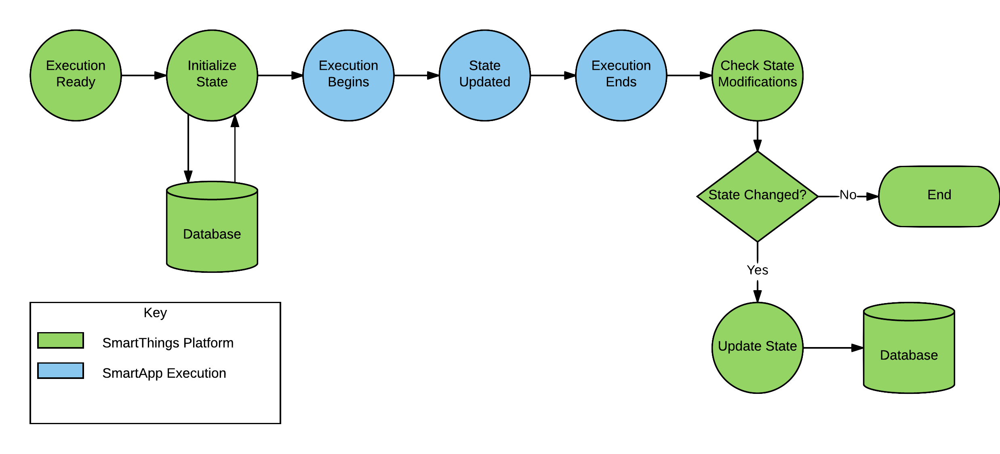

.. _storing-data:

State - Storing Data
====================

SmartApps and Device Handlers execute in response to various events or schedules; they are not continuously running.
Since each execution is executed independently, it has no information regarding previous executions.
This is often adequate for most SmartApps or Device Handlers, but sometimes, they need to remember information across executions.

For this reason, SmartApps and Device Handlers can store small amounts of data using a map-like API, and retrieve this data in later executions.

SmartApps can persist and retrieve data one of two ways - using the built-in ``state`` or ``atomicState`` objects (the details and difference between these implementations are discussed in detail in this document).
Device Handlers can use the built-in ``state`` object, just as SmartApps can, but do not have ``atomicState`` available.

.. warning::

    As discussed in the documentation below, ``state`` and ``atomicState`` should **never** be used in the same SmartApp.

    Doing so can cause inconsistencies or even loss of data.
    At some point, this may be enforced through a compile-time check to prevent making this mistake.

----

Quick Example
-------------

Consider this simple example that keeps track of how many time a switch is turned on:

.. code-block:: groovy

    preferences {
        section() {
            input "theswitch", "capability.switch"
        }
    }

    def installed() {
        initialize()
    }

    def updated() {
        unsubscribe()
        initialize()
    }

    def initialize() {
        // initialize counter
        state.switchCounter = 0

        subscribe(theswitch, "switch.on", incrementCounter)
    }

    def incrementCounter() {
        state.switchCounter = state.switchCounter + 1
        log.debug "switch has been turned on $state.switchCounter times"
    }

As you can see, using State is straightforward - we can add and retrieve data just as we would with a map (actually, State *is* an implementation of ``java.util.Map``, as discussed more below).

While working with State appears straightforward (and for simple use cases, it is), an understanding of the workings of State is necessary to avoid debugging headaches, inconsistent data results, and even potential data loss in certain scenarios.
With this information, you can make the best use of State (and Atomic State) and save yourself and your customers a good deal of trouble that *could* be encountered.

----

.. _state_atomicState_overview:

State and Atomic State Overview
-------------------------------

There are two objects injected into every SmartApp to persist and retrieve data across executions: ``state`` and ``atomicState`` (Device Handlers only have ``state`` available, but an understanding of how ``state`` works is still important for Device Handler developers).

Here are the key features and differences between State and Atomic State.
The details of both are discussed in this document, along with guidelines for understanding which to use in different situations.

State:

- State is an implementation of ``java.util.Map``, making it simpler and more feature-rich to work with.
- Modifications (addition, removal, updating) to State within an execution are only persisted to external storage *after execution completes*. This makes State the more performant choice.

Atomic State:

- Atomic State is not an implementation of ``java.util.Map``, so working with it is not as feature-rich as State.
- Modifications (additional, removal, updating) to Atomic State within an execution are persisted to external storage *more or less immediately*. This incurs a performance penalty when compared to State.

Persistence Model
-----------------

Both State and Atomic State use a database table to store values.
The same table is used by both State and Atomic State.

The values are stored as JSON strings.
Given the following code:

.. code-block:: groovy

    def initialize() {
        state.someString = "some string"
        state.someNum = 42
        state.collection = [k1: 1, k2: [n1: "nested"]]
    }

The data stored in the database table would look like this:

======================= ========== =====
Installed SmartApp ID   Name       Value
======================= ========== =====
<installed-smartapp-id> someString "some string"
<installed-smartapp-id> someNum    42
<installed-smartapp-id> collection {"k1":1,"k2":{"n1":"nested"}}
======================= ========== =====

----

.. _state_how_it_works:

How State Works
---------------

All SmartApps and Device Handlers have available to them a ``state`` object (it is a map) to persist data between executions.

The general flow for SmartApp state is as follows:

#. When a SmartApp or Device Handler is scheduled for execution, the ``state`` object is populated with the values from the database. The SmartThings platform also makes a copy of the contents of ``state`` prior to execution, for later comparison.
#. SmartApp or Device Handler execution begins, and can add, read, or modify the contents in the ``state`` object just as with any other map.
#. Execution ends. The SmartThings platform compares the ``state`` object at execution ends with the contents of ``state`` before execution began. If there are any changes (additions, removals, updates), those entries are written to the database.

This is summarized in the following diagram:

----

.. _state_potential_race_conditions:

State and Potential Race Conditions
-----------------------------------

Since ``state`` is initialized from persistent storage when a SmartApp executes, and is written to storage only when the application is done executing, there is the possibility that another execution *could* happen within that time window, and cause the values stored in ``state`` to appear inconsistent.

Consider the scenario of a SmartApp that keeps a counter of executions.
Each time the SmartApp executes, it increments the counter by 1.
Assume that the initial value of ``state.counter`` is ``0``.

1. An execution ("Execution 1") occurs, and increments ``state.counter`` by one:

.. code-block:: groovy

  state.counter = state.counter + 1 // counter == 1

2. Another execution ("Execution 2") occurs *before "Execution 1" has finished*. It reads ``state.counter`` and increments it by one.

.. code-block:: groovy

  state.counter = state.counter + 1 // counter == 1!!!

Because "Execution 1" hasn't finished executing by the time that "Execution 2" begins, the value of ``counter`` is still 0!

Additionally, because the contents of ``state`` are only persisted when execution is complete, it's also possible to inadvertently overwrite values (last finished execution "wins").

To avoid this type of scenario, SmartApps can use Atomic State, which is discussed next.
Atomic State writes to the data store when a value is *set*, and reads from the data store when a value is *read* - not just when the application execution initializes and completes.

Before using Atomic State, you should read about :ref:`how to choose between State and Atomic State <choosing_between_state_atomicState>`.

----

.. _how_atomicState_works:

How Atomic State Works
----------------------

In addition to ``state``, SmartApps also available to them the object ``atomicState``, which operates like ``state`` with two notable differences:

#. Atomic State does not implement ``java.util.Map``.
#. When items are added or modified to Atomic State, those values are persisted more or less immediately (unlike State, which only persists its data when execution finishes).
#. Reads from Atomic State are done ....

The following diagram illustrates how Atomic State is initialized and updated when a SmartApp executes:

.. image:: ../img/smartapps/atomic-state-execution-lifecycle.png

----

.. _choosing_between_state_atomicState:

Choosing between State and Atomic State
---------------------------------------

Given the choice between State and Atomic State, which should you use?

In short, prefer State until analysis and testing shows you otherwise.
The reasons for this are:

#. State is easier to work with, since it supports ``java.util.Map``.
#. State is more performant than Atomic State, since it does not read or write to external storage during SmartApp execution.

You may need to use Atomic State if code that updates a value in State may execute at the same time as another instance of the same SmartApp, updating the same State key, as discussed :ref:`here <state_potential_race_conditions>`.

.. important::

    The most important thing to note is to **never use both Atomic State and State in the same SmartApp. This can't be emphasized enough - doing so may result in data inconsistency, data corruption, or even data loss.**

----

.. _state_what_can_be_stored:

What Can Be Stored in State and Atomic State
--------------------------------------------

``state`` and ``atomicState`` values are stored as a JSON string by SmartThings.

Supported types
^^^^^^^^^^^^^^^

The following types are supported for storage in State and Atomic State:

- ``String``
- ``long``
- ``int``
- ``BigDecimal``
- ``true``
- ``false``
- ``null``
- ``ArrayList``
- ``Map``

Here is an example illustrating this:

.. code-block:: groovy

    def initialize() {
        state.string = "string"
        state.int = 42
        state.long = now()
        state.decimal = 4.2
        state.yes = true
        state.no = false
        state.empty = null
        state.list = [1, 2, 3, 4]
        state.map = [a: 1, b: 2, c: "three"]
        runIn(60, check)
    }

    def check() {
        def isString = state.string instanceof String // -> true
        def isInt = state.int instanceof Integer // -> true
        def isLong = state.long instanceof Long // -> true
        def isDecimal = state.decimal instanceof BigDecimal // -> true
        def isBoolean = state.yes instanceof Boolean // -> true
        def isAlsoBoolean = state.no instanceof Boolean // -> true
        def isNull = state.empty == null // -> true
        def isList = state.list instanceof List // -> true
        def isMap = state.map instanceof Map // -> true

        // items in map
        def isMapInt = state.map.b instanceof Integer // -> true
        def isMapString = state.map.c instanceof String // -> true

Other object types
^^^^^^^^^^^^^^^^^^

SmartThings objects (like :ref:`event_ref`, :ref:`device_ref`, etc.) cannot be stored in State or Atomic State.
If you attempt to store these objects, it will silently fail without any messages in Live Logging.

If you need to store such information on State, get the specific data you need from the object and assign it to state, like so:

.. code-block:: groovy

    def someEventHandler(evt) {
        state.someEvent = [name: evt.name, value: evt.value, id: evt.id]
    }

Dates also require some care when storing in state.
If you were to store a date directly, you would end up with a string representation of the date when retrieving it.

.. code-block:: groovy

    def initialize() {
        state.date = new Date()
        runIn(30, check)
    }

    def check() {
        def isDate = state.date instanceof Date // -> false
        def isString = state.date instanceof String // -> true
    }

If you need to store time information, consider using an epoch time stamp, conveniently available via the :ref:`smartapp_now` method:

.. code-block:: groovy

  def installed() {
    state.installedAt = now()
  }

  def someEventHandler(evt) {
    def millisSinceInstalled = now() - state.installedAt
    log.debug "this app was installed ${millisSinceInstalled / 1000} seconds ago"

    // you can also create a Date object back from epoch time:
    log.debug "this app was installed at ${new Date(state.installedAt)}"
  }

----

Working with the ``state`` Object
---------------------------------

``state`` is an implementation of ``java.util.Map``.
This means you can interact with the ``state`` object in a SmartApp or Device Handler just as you would with any other map.

Just remember that all modifications done to ``state`` within a SmartApp or Device Handler are only written to external storage after the execution completes.

.. important::

    Be sure to read the :ref:`Overview <state_atomicState_overview>` and :ref:`state_how_it_works` documentation before using ``state``.

Adding values
^^^^^^^^^^^^^

Add values to ``state`` just as you would with a map:

.. code-block:: groovy

    state.someKey = "some val"
    state['otherKey'] = 32

Retrieving values
^^^^^^^^^^^^^^^^^

Get values from ``state`` just as you would with a map, using either dot notation or index notation (we prefer dot notation for simplicity):

.. code-block:: groovy

    state.someKey = "some val"
    log.debug "value of state.someKey: $state.someKey"

    state.someOtherKey = 42
    log.debug "value of state['someOtherKey']: ${state['someOtherKey']}"

Updating values
^^^^^^^^^^^^^^^

To update the value for an existing key in ``state``, simply assign a new value to it:

.. code-block:: groovy

    state.someKey = "some val"
    log.debug "state.someKey: $state.someKey" // -> some val
    state.someKey = "updated"
    log.debug "state.someKey: $state.someKey" // -> updated

Removing values
^^^^^^^^^^^^^^^

Because ``state`` is a map, we can use the ``remove()`` method to remove the item:

.. code-block:: groovy

    state.someKey = "some val"
    log.debug "state: $state" // -> [someKey: "some val"]
    state.remove('someKey')
    log.debug "state: $state" // -> [:]

Iterating over ``state``
^^^^^^^^^^^^^^^^^^^^^^^^

We can iterate over the values in ``state`` just as we would with a map, using ``each()``:

.. code-block:: groovy

    state.keyOne = "val one"
    state.keyTwo = "val two"

    state.each {key, val ->
        log.debug "state key: $key, value: $val"
    }

We can also find entries using any of Groovy's collections methods like ``find()``, ``findAll()``, ``collect()``, etc:

.. code-block:: groovy

    state.key_one = "val one"
    state.key_two = "val two"
    state.someOther = 42

    def found = state.findAll {k, v ->
        k.startsWith('key_')
    }

    log.debug "found: $found" // -> [key_one: "val one", key_two: "val two"]

Working with collections
^^^^^^^^^^^^^^^^^^^^^^^^

Working with collections in ``state`` is straightforward:

.. code-block:: groovy

    state.collection = [k1: "one", k2: "two", k3: [n1: 2, n2: 3]]
    state.collection.k1 = "UPDATED"
    state.collection.k3.n1 = "ALSO UPDATED"

    // [k1: "UPDATED", k2: "two", k3: [n1: 2, n2: "ALSO UPDATED"]
    log.debug "state: $state"

----

Working with the ``atomicState`` Object
---------------------------------------

For simple use cases, working with Atomic State is just like working with State - you can assign and retrieve values just as with State.
The key difference is that Atomic State does *not* implement ``java.util.Map``, so using map operations like ``remove()``, ``forEach()``, ``find()``, etc., will not work with Atomic State.

.. important::

    Be sure to read the :ref:`Overview <state_atomicState_overview>`, :ref:`how_atomicState_works`, and :ref:`choosing_between_state_atomicState` documentation before using ``atomicState``.

Adding values
^^^^^^^^^^^^^

We can add values to Atomic State just as we do with State:

.. code-block:: groovy

    atomicState.someKey = "some val"
    log.debug "value of atomicState.someKey: $atomicState.someKey"

    atomicState.someOtherKey = 42
    log.debug "value of atomicState['someOtherKey']: ${atomicState['someOtherKey']}"

Updating values
^^^^^^^^^^^^^^^

To update the value for an existing key in Atomic State, simply assign a new value to it.

.. note::

    Updating collections in ``atomicState`` is a special case, and is discussed :ref:`here <atomic_state_collections>`.

.. code-block:: groovy

    atomicState.someKey = "some val"
    log.debug "atomicState.someKey: $atomicState.someKey" // -> some val
    atomicState.someKey = "updated"
    log.debug "atomicState.someKey: $atomicState.someKey" // -> updated

Removing values
^^^^^^^^^^^^^^^

Removing items from Atomic State is not possible, since it does not implement ``java.util.Map``.
Instead, you can set the value to ``null``:

.. code-block:: groovy

    atomicState.someExistingKey = null

Note that this does not remove the key from Atomic State; it simply sets the value to ``null``.

Iterating over all values
^^^^^^^^^^^^^^^^^^^^^^^^^

Iterating over all items in Atomic State is not possible, because it does not implement ``java.util.Map``.

.. _atomic_state_collections:

Working with collections
^^^^^^^^^^^^^^^^^^^^^^^^

Updating collections stored in Atomic State is different than working with collections in State.

Instead, you will need to assign the collection to a local variable, make changes as needed, then assign it back to ``atomicState``.
Here's an example:

.. code-block:: groovy

    def initialize() {
        atomicState.myMap = [key1: "val1"]
        log.debug "atomicState: $atomicState"

        // assign collection to local variable and update
        def temp = atomicState.myMap
        // update existing entry
        temp.key1 = "UPDATED"
        // add new entry
        temp.key2 = "val2"

        // assign collection back to atomicState
        atomicState.myMap = temp
        log.debug "atomicState: $atomicState"
    }

----

.. _state_size_limit:

Storage Size Limits
-------------------

The contents of State and Atomic State are limited to 100,000 characters when serialized to JSON.

This should be more than sufficient for typical use cases.
If you find yourself running into this limitation, you should evaluate your use case - remember, State and Atomic State are intended to persist small amounts of data across executions. It is not intended to be an unbounded or large database.

To get the character size of ``state`` or ``atomicState``, you can do:

.. code-block:: groovy

    def stateCharSize = state.toString().length()

When the character limit has been exceeded, a ``physicalgraph.exception.StateCharacterLimitExceededException`` will be thrown.

.. important::

    Remember that when using ``state``, the contents are written to the external data store when the app is finished executing - not immediately on write/read from the object.

    This means that if the character limit is exceeded for ``state``, you won't be able to handle a ``StateCharacterLimitExceededException`` in your code - it will only be visible in the logs.

    If using ``atomicState``, which reads and writes to the external data store when the object is updated or accessed, you will be able to handle a ``StateCharacterLimitExceededException`` in your code.

    Additional helper methods to get the remaining available size and the character limit will be added in a future release.

----

State in Parent-Child Relationships
-----------------------------------

If you are attempting to access the State or Atomic State of a parent or child relationship, you may encounter a ``NullPointerException``.
As a workaround, you can create a method to get State or Atomic State values like this:

.. code-block:: groovy

    def getStateValue(key) {
        return state[key]
    }

You could create a similar method to update State or Atomic State across parent-child relationships, but be careful.
Because there could be multiple children for a parent SmartApp, for example, updating the parent's State or Atomic State from the children may introduce additional complexity and opportunity for race conditions and inconsistent values.

----

Summary
-------

- State and Atomic State allow developers to persist data across executions.
- State and Atomic State are both available to SmartApps; only State is available to Device Handlers.
- State and Atomic State use the same underlying database table.
- State values are persisted after the current execution ends. Atomic State values are persisted immediately.
- State implements ``java.util.Map``, Atomic State does not.
- State and Atomic State allow for the storage of strings, numbers, booleans, null values, lists, and maps.
- Never mix State and Atomic State in the same SmartApp.
- Prefer State unless analysis and testing shows Atomic State is necessary.
- State and Atomic State are limited to 100,000 characters of data (when serialized to JSON) per installed SmartApp or Device Handler.
