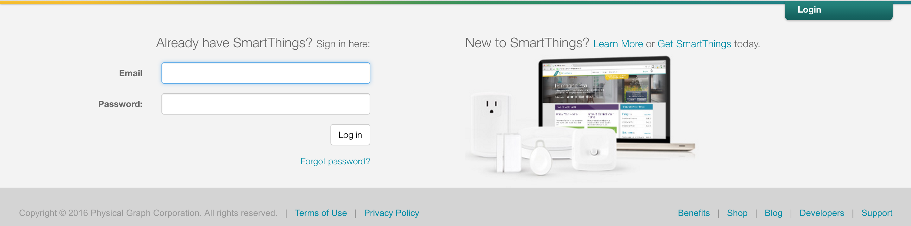
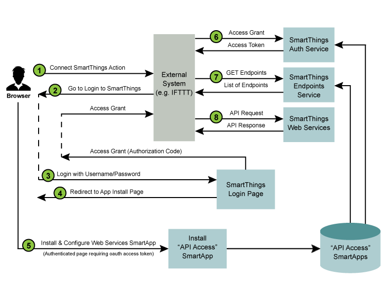

.. _web_services_smartapps_overview:

Web Services SmartApps Overview
===============================

*Integrating with SmartThings using SmartApps Web Services*

In this guide, you will learn:

- The overall design of how WebServices SmartApps work.
- Security measures taken to ensure access is only granted to trusted clients, and specific devices as chosen by the user.
- The end user flow for external applications integrating with Web Services SmartApps.

.. contents::

Introduction
------------

Our goal is to become *the* open platform for the consumer Internet of Things.
But, that doesn't mean that we can ignore security, even for a minute.

In designing a way to allow external systems API access, we wanted to give developers the flexibility they need, while ensuring that the customer understands why their account is being accessed through an external API, and has specifically authorized that access.

As such, we've designed an architecture and a user experience around external API access that meets the following goals:

-  It uses industry best practices such as OAuth2 to authenticate and authorize basic external API access.
-  It requires the end­ user (customer) to specifically authorize the access to specific devices.
-  It delivers a user experience that is easy to understand.
-  It delivers a developer experience that is easy to understand and implement.

Concepts
--------

There are a couple of important concepts that need to be understood with respect to how SmartApps APIs work.

- All SmartApps APIs are authenticated using OAuth2.
- When we talk about SmartApps APIs, we are referring to APIs that are exposed by SmartApps themselves.
- SmartApps execute in a special security context, where they only have access to devices specifically authorized by the user at installation time. This is no different for SmartApps APIs.

How it Works
------------

Our overall approach to API access requires the end­ user to authenticate and authorize the API access in two steps:

#. The installation of a SmartThings Web Services “SmartApp” into the user’s SmartThings Account/Location, along with specific device preferences that specify the devices to which the external system is being granted access.
  
#. The typical OAuth login flow grants the external system the OAuth access token. 

It is important to understand that it is the SmartApp itself that exposes the API endpoints that are then used by the external system to integration with SmartThings.

This approach is designed to ensure that an external system must have explicit access granted to the devices, before it can control those devices, and that the OAuth access token isn't enough to grant access to the user's entire smart home.

OAuth-Integrated App Installation Flow
~~~~~~~~~~~~~~~~~~~~~~~~~~~~~~~~~~~~~~

|Alt OAuth-Integrated App
Installation| 

The diagram above outlines the following standard steps in
the API Connection and Usage process:

#. A user of the external system takes some action that initiates a "Connect to SmartThings" flow. An example of this is an `IFTT <http://www.ifttt.com>`__ user adding the SmartThings "channel".

#. The external service will typically redirect to the SmartThings login page. The HTTP request to this page includes the required OAuth client id (more details below), allowing our login page to recognize this as a login request using OAuth.

#. The login page is displayed, and if the login is successful, a subsequent page is displayed that allows the non-authenticated user to install and configure the Web Services SmartApp that is associated with the client id. When this step is complete, an authorization code is returned to the browser.

#. Typically, the authorization code is then given to the external system, and it is used (along with the OAuth client id and client secret), to request an access token. The authorization code takes the place of the user credentials in this case, and is only valid for a single use. Once the external system has the OAuth access token, API requests can be made using this token.

#. The first API call that the external system should make is to the endpoints service. This service exists on a standard URL, and will return the specific URL that the external system should use (for this specific OAuth access token) to make all API requests.

#. Finally, the external system can use the specified endpoint URL and the provided OAuth2 access token to make API calls to the SmartApp providing the web services.

The End-User Journey
--------------------

Before discussing the specific steps to building a Web Services SmartApp, you should understand the end user experience.

Initiate Connection from External System
~~~~~~~~~~~~~~~~~~~~~~~~~~~~~~~~~~~~~~~~

The first step is to initiate the connection with the SmartThings cloud from the external web application. This is different for each web application, but is just a URL.

Authentication & Authorization
~~~~~~~~~~~~~~~~~~~~~~~~~~~~~~

The typical OAuth journey is the OAuth2 authorization code flow, initiated from the website of the external system, whereby the user is redirected to the SmartThings website. This is where they enter their SmartThings credentials, as shown below:

Once authenticated with SmartThings, they will be prompted to specifically authorize access by the application.

Application Configuration
~~~~~~~~~~~~~~~~~~~~~~~~~

The user is prompted to configure the Web Services SmartApp that will be automatically installed. The user does not have to select the specific SmartApp, because it can be automatically identified by the OAuth client id.

The first step in the application configuration process is to identify the Location in which the SmartApp will be installed.

.. figure:: ../img/smartapps/web-services/location.png

The second step is to configure exactly which devices will be accessible
through any external web services that are exposed by the SmartApp.

An example of the IFTTT SmartApp device selection options is shown
below:

.. figure:: ../img/smartapps/web-services/preferences.png

Finally, the user clicks on “Authorize” to complete both the
authorization of the application and the installation of the SmartApp
and the connection between the external system and the SmartThings Cloud
is now complete.

Once the user authorizes access, the external system is provided with the OAuth authorization code, which is in turn used to request and receive an OAuth access token. Once the external system has the token, it can access the web services provided by the SmartApp.

Rate Limiting
-------------

.. note::

   Rate limiting for inbound API calls is currently not enforced (we are in "Learning" mode at the moment). The limitations documented below, as well as the headers and status code, will go into effect when we enforce the limit. At that time, this note will be removed.

SmartApps or Device Handler's that expose web services are limited in the number of inbound requests they may receive in a time window. This is to ensure that no one SmartApp or Device Handler consumes too many resources in the SmartThings cloud. There are various headers available on every request that provide information about the current rate limit limits for a given installed SmartApp or Device Handler. These are discussed further below.

SmartApps or Device Handlers that expose web APIs are limited to receiving 250 requests in 60 seconds.

Rate Limit Headers
~~~~~~~~~~~~~~~~~~

The SmartThings platform will set three HTTP headers on the response for every inbound API call, so that a client may understand the current rate limiting status:

*X-RateLimit-Limit: 250*
   The rate limit - in this example, the limit is 250 requests.

*X-RateLimit-Current: 1*
   The current count of requests for the given time window. In this example, there has been one request within the current rate limit time window.

*X-RateLimit-TTL: 58*
   The time remaining in the current rate limit window. In this example, there is 58 seconds remaining before the current rate limit window resets.

Rate Limit HTTP Status Code
~~~~~~~~~~~~~~~~~~~~~~~~~~~

In addition to the three HTTP headers above, when the rate limit has been exceeded, the HTTP status code of 429 will be sent on the response.
