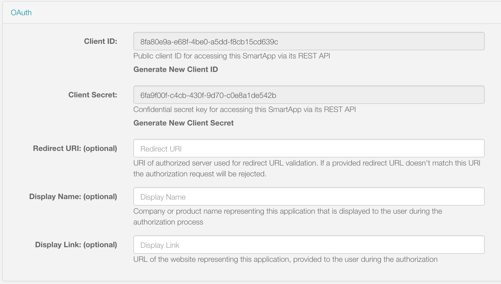

.. _webservices_smartapp:

The SmartApp
============

A Web Services SmartApp exposes endpoints that third parties can make REST calls to.
It can then do anything a normal SmartApp can do - get device status, actuate devices, etc. - and send a response back to the calling client.

----

.. _webservices_smartapp_enable_oauth:

Enable OAuth
------------

For a SmartApp to expose endpoints that can receive REST calls from a third party, OAuth must be enabled.

OAuth can be enabled for a SmartApp via the *App Settings* page.
In the *OAuth* section, check the box to enable OAuth.
A client ID and secret will be generated for this SmartApp.
These will be used as part of the OAuth flow to obtain an access token for this SmartApp.

There is an option to specify a Redirect URI.
This URI will be used to validate the ``redirect_uri`` passed in with the request for the authorization code.
The value of this field can be a single value, or a comma-delimited list of values.
For example:

``http://myserverhostname.com``

or

``http://myserverhostname1.com,http://myserverhostname2.com,http://myserverhostname3.com``

During validation, the ``redirect_uri`` passed in with the authorization code request will be checked against the URIs defined in this field.
The port does matter during validation.
If there is no match, validation will fail with the following error:

.. code-block:: html

    OAuth2 Error

    error="invalid_grant", error_description="Invalid redirect: http://myserverhostname.com/oauth/callback does not match one of the registered values: [http://myserverhostname1.com/oauth/callback]"

You can also set the Client Display Name and Client Display Link.
These will be used on the SmartThings Authorization page to inform the user who is requesting access to their devices.

----

.. _web_services_preferences:

Preferences
-----------

Part of the :ref:`Authorization Flow <webservices_authorization>` that installs the SmartApp requires the user to authorize specific devices that the third party can interact with.
The types of devices that may be authorized for Web Services SmartApps are controlled through the SmartApp's preferences.

The intent of the Authorization page is to simply allow the user to authorize specific devices.
This can be accomplished in one of two ways:

- Specify a simple, single page that allows the user to select from a set of devices, or
- Specify a specific preferences page to be used by the Authorization web page.

An example of a simple, single page that will allow the user to select from a set of devices:

.. code-block:: groovy

    preferences {
        section("Control these switches...") {
            input "switches", "capability.switch"
        }
        section("Control these motion sensors...") {
            input "motion", "capability.motionSensor"
        }
    }

Here is an example that specifies a specific page to be used during authorization, using the ``oauthPage`` option to ``preferences``:

.. warning::

    Currently, using required inputs does not work inside of page declarations when using ``oauthPage``. This is a known issue and is currently being worked on. We recommend using non-required inputs, by explicitly setting ``required: false``, when using ``oauthPage`` pages.

.. code-block:: groovy

    preferences(oauthPage: "deviceAuthorization") {
        // deviceAuthorization page is simply the devices to authorize
        page(name: "deviceAuthorization", title: "", nextPage: "instructionPage",
             install: false, uninstall: true) {
            section("Select Devices to Authorize") {
                input "switches", "capability.switch", title: "Switches:", required: false
                input "motions", "capability.motionSensor", title: "Motion Sensors:", required: false
            }

        }

        page(name: "instructionPage", title: "Device Discovery", install: true) {
            section() {
                paragraph "Some other information"
            }
        }
    }

If you require additional, non-device preferences inputs, you can use dynamic pages.
The ``oauthPage`` must be a static (non-dynamic) page, and be the first page displayed:

.. code-block:: groovy

    preferences(oauthPage: "deviceAuthorization") {
        // deviceAuthorization page is simply the devices to authorize
        page(name: "deviceAuthorization", title: "", nextPage: "otherPage",
             install: false, uninstall: true) {
            section("Select Devices to Authorize") {
                input "switches", "capability.switch", title: "Switches:", required: false
                input "motions", "capability.motionSensor", title: "Motion Sensors:", required: false
            }

        }

        page(name: "otherPage")
    }

    def otherPage() {
        dynamicPage(name: "otherPage", title: "Other Page", install: true) {
            section("Other Inputs") {
                input "sometext", "text"
                input "sometime", "time"
            }
        }
    }

----

.. _web_services_mapping_endpoints:

Mapping Endpoints
-----------------

To expose a callable endpoint in your SmartApp, use ``mappings``.
Specify the various endpoints using ``path``, and specify the supported HTTP methods (``GET``, ``PUT``, ``POST``, and ``DELETE``).
Each action specified is associated with the name of a method that will handle the request.

.. code-block:: groovy

    mappings {
        path("/foo") {
            action: [
                GET: "getFoo",
                PUT: "putFoo",
                POST: "postFoo",
                DELETE: "deleteFoo"
            ]
        }
        path("/bar") {
            action: [
                GET: "getBar"
            ]
        }
    }

    def getFoo() {}
    def putFoo() {}
    def postFoo() {}
    def deleteFoo() {}
    def getBar() {}

There is no limit to the number of endpoints a SmartApp exposes, but the path level is restricted to four levels deep (i.e., /level1/level2/level3/level4).

You can specify variable URL path parameters using the ``:`` prefix in the path:

.. code-block:: groovy

    mappings {
        path("/foo/:param1/:param2") {
            action: [GET: "getFoo"]
        }
    }

----

.. _webservices_smartapp_request_handling:

Request Handling
----------------

When a request is made to one of the SmartApp's endpoints, its associated request handler method will be called.

Every request handler method has available to it a ``request`` object that represents information about the request, and a ``params`` object that contains information about the request parameters.

.. important::

    All request or path parameters should be validated in your request handler.
    **Never** allow parameters to arbitrarily execute device commands or otherwise modify data.

Path variables
^^^^^^^^^^^^^^

Any path variables you defined in the ``path`` are available via the injected ``params`` object:

.. code-block:: groovy

    mappings {
        path("/switches/:command") {
            action: [PUT: "updateSwitches"]
        }
    }

    def updateSwitches() {
        def cmd = params.command
        log.debug "command: $cmd"
        switch(cmd) {
            case "on":
                // handle on command
                break
            case "off":
                // handle off command
                break
            default:
                httpError(501, "$command is not a valid command for all switches specified")
        }
    }

Query parameters
^^^^^^^^^^^^^^^^

URL query parameters sent on the request are available via the ``params`` object:

.. code-block:: groovy

    def someHandler() {
        // this endpoint can accept the "foo" query parameter
        def fooParam = params.foo
        log.debug "foo parameter: $foo"
    }

Request body parameters
^^^^^^^^^^^^^^^^^^^^^^^

SmartThings supports JSON or XML request body parameters.
They can be accessed via ``request.JSON`` and ``request.XML``:

.. code-block:: groovy

    // json on request: '{"foo": "bar"}'
    def someJSONHandler() {
        def fooJSON = request.JSON?.foo
        log.debug "foo json: $fooJSON"
    }

    // xml on request: '<foo>bar</foo>'
    def someXMLHandler() {
        def fooXML = request.XML?.foo
        log.debug "foo xml: $fooXML"
    }

.. tip::

    Use the ``?`` (safe navigation operator) to avoid a ``NullPointerException`` if the request JSON or XML is null (in case the request did not send JSON or XML).

The JSON available on the ``request`` will be the result of calling ``new JsonSlurper().parseText()``. You can learn more about working with JSON in Groovy `here <http://www.groovy-lang.org/json.html>`__.

Similarly, the XML on ``request`` is the result of calling ``new XmlSlurper().parseText()``. Learn more about working with XML in Groovy `here <http://www.groovy-lang.org/processing-xml.html>`__.

----

.. _smartapp_web_services_response:

Response Handling
-----------------

Defaults
^^^^^^^^

Each HTTP method (``GET``, ``PUT``, ``POST``, ``DELETE``) request handler returns a default response.
Some request handlers may return a map that will be serialized to JSON on the response, and some may specify their own response by using the ``render()`` method:

+----------------+----------------------------+----------------------------+-------------------------------+
| Request Method | Default HTTP Response Code | JSON Serialization Support | ``render()`` support          |
+================+============================+============================+===============================+
| ``GET``        | ``200 OK``                 | yes                        | yes                           |
+----------------+----------------------------+----------------------------+-------------------------------+
| ``POST``       | ``201 Created``            | yes                        | yes                           |
+----------------+----------------------------+----------------------------+-------------------------------+
| ``PUT``        | ``204 No Content``         | no                         | no                            |
+----------------+----------------------------+----------------------------+-------------------------------+
| ``DELETE``     | ``204 No Content``         | no                         | no                            |
+----------------+----------------------------+----------------------------+-------------------------------+

Automatic JSON serialization
^^^^^^^^^^^^^^^^^^^^^^^^^^^^

``GET`` and ``POST`` request handlers may return a map, which will be serialized to JSON and returned to the client with ``Content-Type: application/json``:

.. code-block:: groovy

    mappings {
        path("/test") {
            action: [
                GET: "responseTest",
                POST: "responseTest"
            ]
        }
    }

    def responseTest() {
        // a map is serialized to JSON and returned on the response
        return [data: "test"]
    }

The response of executing a ``GET`` or ``POST`` request on the ``/test`` endpoint results in the following:

.. code-block:: bash

    HTTP/1.1 200 OK
        Content-Type: application/json;charset=utf-8
        Date: Tue, 29 Mar 2016 13:53:14 GMT
        Server: Apache-Coyote/1.1
        Set-Cookie: JSESSIONID=XXXXXXXXXXXXXXXX-n1; Path=/; Secure; HttpOnly
        X-RateLimit-Current: 0
        X-RateLimit-Limit: 250
        X-RateLimit-TTL: 60
        transfer-encoding: chunked
        Connection: keep-alive

        {"data":"test"}

Using ``render()`` to control the response
^^^^^^^^^^^^^^^^^^^^^^^^^^^^^^^^^^^^^^^^^^

``GET`` and ``POST`` request handlers also support the ability to return a custom response using the :ref:`smartapp_render` method:

.. code-block:: groovy

    mappings {
        path("/test") {
            action: [
                GET: "responseTest",
                POST: "responseTest"
            ]
        }
    }

    def responseTest() {
        def html = """
        <!DOCTYPE html>
        <html>
            <head><title>Some Title</title></head>
            <body>
Testing
</body>
        </html>"""

        render contentType: "text/html", data: html, status: 200
    }

The response of executing a ``GET`` or ``POST`` request on the ``/test`` endpoint results in the following:

.. code-block:: bash

    HTTP/1.1 200 OK
        Content-Type: text/html;charset=utf-8
        Date: Tue, 29 Mar 2016 15:00:32 GMT
        Server: Apache-Coyote/1.1
        Set-Cookie: JSESSIONID=1A4382D4BDFCCB31CD6C4EF3C2E3D693-n5; Path=/; Secure; HttpOnly
        Vary: Accept-Encoding
        X-RateLimit-Current: 0
        X-RateLimit-Limit: 250
        X-RateLimit-TTL: 60
        transfer-encoding: chunked
        Connection: keep-alive

        <!DOCTYPE html>
        <html>
            <head><title>Some Title</title></head>
            <body>
Testing
</body>
        </html>

If not specified, the ``contentType`` will be "application/json", and the ``status`` will be ``200``.

----

Error Handling
--------------

Default errors
^^^^^^^^^^^^^^

The following errors may be returned by the SmartThings platform:

============================ =============================================================================================================== =====
HTTP Response Code           Error Message                                                                                                   Cause
============================ =============================================================================================================== =====
``401 (Unauthorized)``       {"error": "invalid_token", "error_description": "<TOKEN>"}                                                      Invalid token for the SmartApp installation.
``403 (Forbidden)``          {"error":true, "type":"AccessDenied", "message":"This request is not authorized by the specified access token"} No installed SmartApp can be found associated with the token.
``404 (Not Found)``          {"error":true,"type":"SmartAppException","message":"Not Found"}                                                 The endpoint path requested does not exist.
``405 (Method Not Allowed)`` {"error":true,"type":"SmartAppException","message":"Method Not Allowed"}                                        An endpoint path was called but no request handler is defined for the specified request method (e.g., issuing a ``POST`` request to an endpoint path that only handles ``GET`` requests)
``429 (Too Many Requests)``  {"error": true, "type": "RateLimit", "message": "Please try again later"}                                       The rate limit for this SmartApp installation has been exceeded. See the :ref:`web_services_rate_limiting` documentation for more information.
``500 (Server Error)``       {"error":true, "type":"<EXCEPTION-TYPE>", "message": "An unexpected error has occurred"}                        An unhandled exception occurred in the processing of the request. Check the SmartThings live logging to debug.
============================ =============================================================================================================== =====

Custom errors
^^^^^^^^^^^^^

If your endpoint needs to send an error response, use the :ref:`smartapp_http_error` method:

.. code-block:: groovy

    def someHandler() {
        def foo = request.JSON?.foo

        if (!foo) {
            httpError(400, "Foo parameter required")
        }
    }

A ``SmartAppException`` will be thrown, and a response will be sent to the client with the specified HTTP code.
The body of the response will be ``application/json``, and look like this:

.. code::

    {
        "error":true,
        "type":"SmartAppException",
        "message":"your error message"
    }

You should send appropriate error codes and messages for any errors.
