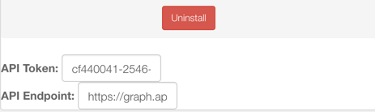

.. _smartapp_as_web_service_part_1:

Web Services Tutorial - SmartApp
================================

This is the first part of two that will teach you how to build a Web Services SmartApp and a web application to illustrate the authorization flow.

----

Overview
--------

In part 1 of this tutorial, you will learn:

- How to develop a Web Services SmartApp that exposes endpoints.
- How to call the Web Services SmartApp using simple API calls.

The source code for this tutorial is available `here <https://github.com/SmartThingsCommunity/Code/tree/master/smartapps/tutorials/web-services-smartapps>`__.

Part 1 of this tutorial will build a simple SmartApp that exposes endpoints to get information about and control switches.

----

Create a new SmartApp
---------------------

Create a new SmartApp in the IDE. Fill in the required fields, and make sure to click on *Enable OAuth in SmartApp* to receive an auto-generated client ID and secret.

Note the Client ID and secret - they'll be used later (should you forget, you can get them by viewing the "App Settings" in the IDE).

----

Define Preferences
------------------

SmartApps declare preferences metadata that is used at installation and configuration time, to allow the user to control what devices the SmartApp will have access to.

This is a configuration step, but also a security step, whereby the users must explicitly select what devices the SmartApp can control.

Web Services SmartApps are no different, and this is part of the power of this approach.
The end user controls exactly what devices the SmartApp will have access to, and therefore what devices the external systems that consume those web services will have access to.

The preferences definition should look like this:

.. code-block:: groovy

  preferences {
    section ("Allow external service to control these things...") {
      input "switches", "capability.switch", multiple: true, required: true
    }
  }

Also ensure that you have an ``installed()`` and ``updated()`` method defined (this should be created by default when creating a SmartApp).
They can remain empty, since we are not subscribing to any device events in this example.

You can learn more about Web Services SmartApp preferences :ref:`here <web_services_preferences>`.

----

Specify Endpoints
-----------------

The ``mappings`` declaration allows developers to expose HTTP endpoints, and map the various supported HTTP operations to an associated handler.

Our SmartApp will expose two endpoints:

- The ``/switches`` endpoint will support a GET request. A GET request to this endpoint will return state information for the configured switches.

- The ``/switches/:command`` endpoint will support a PUT request. A PUT request to this endpoint will execute the specified command (``"on"`` or ``"off"``) on the configured switches.

Here's the code for our mappings definition. This is defined at the top-level in our SmartApp (i.e., not in another method):

.. code-block:: groovy

    mappings {
      path("/switches") {
        action: [
          GET: "listSwitches"
        ]
      }
      path("/switches/:command") {
        action: [
          PUT: "updateSwitches"
        ]
      }
    }

Note the use of variable parameters in our PUT endpoint.
Use the ``:`` prefix to specify that the value will be variable. We'll see later how to get this value.

Go ahead and add empty methods for the various handlers. We'll fill these in in the next step:

.. code-block:: groovy

  def listSwitches() {}

  def updateSwitches() {}

See the :ref:`web_services_mapping_endpoints` documentation for more information.

----

GET Switch Information
----------------------

Now that we've defined our endpoints, we need to handle the requests in the handler methods we stubbed in above.

Let's start with the handler for GET requests to the ``/switches`` endpoint.
When a GET request to the ``/switches`` endpoint is called, we want to return the display name, and the current switch value (e.g., on or off) for the configured switch.

Our handler method returns a list of maps, which is then serialized by the SmartThings platform into JSON:

.. code-block:: groovy

  // returns a list like
  // [[name: "kitchen lamp", value: "off"], [name: "bathroom", value: "on"]]
  def listSwitches() {
      def resp = []
      switches.each {
        resp << [name: it.displayName, value: it.currentValue("switch")]
      }
      return resp
  }

See the :ref:`smartapp_web_services_response` documentation for more information on working with web request responses.

----

UPDATE the Switches
-------------------

We also need to handle a PUT request to the ``/switches/:command`` endpoint. ``/switches/on`` will turn the switches on, and ``/switches/off`` will turn the switches off.

If any of the configured switches does not support the specified command, we'll return a ``501`` HTTP error.

.. code-block:: groovy

    void updateSwitches() {
        // use the built-in request object to get the command parameter
        def command = params.command

        // all switches have the command
        // execute the command on all switches
        // (note we can do this on the array - the command will be invoked on every element
        switch(command) {
            case "on":
                switches.on()
                break
            case "off":
                switches.off()
                break
            default:
                httpError(400, "$command is not a valid command for all switches specified")
        }
    }

Our example uses the endpoint itself to get the command.
You can learn more about working with requests :ref:`here <webservices_smartapp_request_handling>`.

----

Self-publish the SmartApp
-------------------------

Publish the app for yourself, by clicking on the "Publish" button and selecting "For Me".

----

.. _run_api_smartapp_simulator:

Run the SmartApp in the Simulator
---------------------------------

Using the simulator, we can quickly test our Web Services SmartApp.

Click the *Install* button in the simulator, select a Location to install the SmartApp into, and select a switch.

Note that in the lower right of the simulator there is an API token and an API endpoint URL:

.. important::

    The base URL for of your SmartApp's API endpoint will vary depending on the location being installed into.

    **Be sure to copy the URL from the simulator to ensure you have the correct URL!**

We can use these to test making requests to our SmartApp.

----

Make API Calls to the SmartApp
------------------------------

Using whatever tool you prefer for making web requests (this example will use curl, but `Apigee <http://apigee.com>`__ is a good UI-based tool for making requests), we will call one of our SmartApp endpoints.

From the simulator, grab the API endpoint. It will look something like this::

  https://<BASE-URL>/api/smartapps/installations/158ef595-3695-49ab-acc1-80e93288c0c8

Your installation will have a different, unique URL.

.. important::

    The base URL for of your SmartApp's API endpoint will vary depending on the location being installed into.

    **Be sure to copy the URL from the simulator to ensure you have the correct URL!**

To get information about the switch, we will call the /switch endpoint using a GET request.
You'll need to substitute your unique endpoint and API key.

.. code-block:: bash

  curl -H "Authorization: Bearer <api token>" "<api endpoint>/switches"

This should return a JSON response like the following::

  [{"name":"Kitchen 2","value":"off"},{"name":"Living room window","value":"off"}]

To turn the switch on or off, call the /switches endpoint using a PUT request.
Again, you'll need to substitute your unique endpoing and API key:

.. code-block:: bash

  curl -H "Authorization: Bearer <api token>" -X PUT "<api endpoint>/switches/on"

Change the command value to ``"off"`` to turn the switch off.
Try turning the switch on and off, and then using curl to get the status, to see that it changed.

----

Uninstall the SmartApp
----------------------

Finally, uninstall the SmartApp using the *Uninstall* button in the IDE simulator.

----

Summary
-------

In this tutorial, you learned how to create a SmartApp that exposes endpoints to get information about, and control, a device.
You also learned how to install the SmartApp in the simulator, and then make API calls to the endpoint.

In the next part of this tutorial, we'll look at how a external application might interact with SmartThings using the OAuth2 flow (instead of simply using the simulator and its generated access token).
