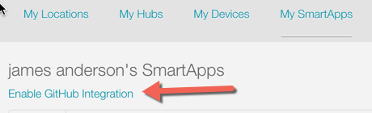
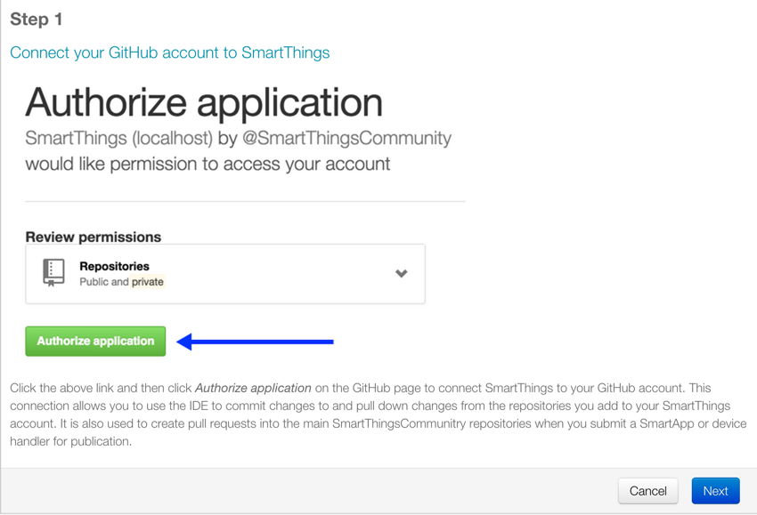
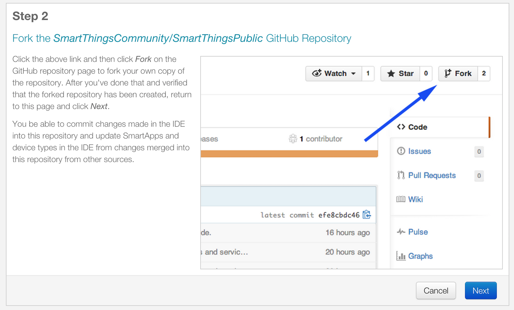
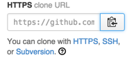
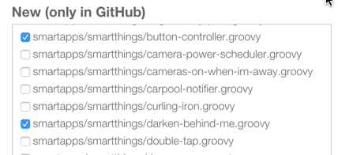

.. _github_integration:

GitHub Integration
==================

.. warning::

    Before proceeding to enable GitHub integration in the IDE, be aware that:

    1. GitHub IDE integration is not supported outside the US.
    2. GitHub IDE integration may negatively impact the performance of the IDE. 

As an open platform, we recognize that giving our community developers access to the repository housing our SmartApps and Device Handlers is extremely important.
While you can browse the code in the IDE, not having access to the repository itself is limiting.
The `SmartThingsCommunity/SmartThingsPublic <https://github.com/SmartThingsCommunity/SmartThingsPublic>`__ GitHub repository is now public, allowing you to browse the source code in a more traditional format.

We have also provided an integration with the GitHub repository into the IDE.
This will allow SmartThings developers to integrate their forked SmartThingsPublic repository with the IDE, including the ability to make commits to the forked repository using the IDE.

If you just want to browse the source in GitHub, you can do that using the tools you are most comfortable with.

If you want to take advantage of the GitHub integration with the IDE, read on for more information.

.. note::

    A working knowledge of Git and GitHub is assumed in this guide. If you are new to Git and GitHub, we recommend checking out the `GitHub Bootcamp <https://help.github.com/categories/bootcamp/>`__ to help you learn the basics. We will walk you through some specific Git steps, but a full discussion/explanation of Git is beyond the scope of this guide.

----

Overview
--------

The GitHub IDE integration allows you to integrate your forked SmartThingsPublic repository with the IDE.
This allows you to easily view and work with SmartApps or Device Handlers already in the repository, as well as update the versions in your IDE with upstream repository changes, and make commits to your forked repository right from the IDE.

When you setup GitHub integration in the IDE, you will create a fork of the SmartThingsPublic repository in GitHub.
This will then be the repository that the IDE will be connected to.
When you add files from the repository to the IDE, this is the repository it will look at to get the available files.
When you commit changes in the IDE, you are making commits in your remote forked repository.

You will need to manage the syncing of your forked repository with the original SmartThingsPublic repository, just as you would with any forked repository in GitHub.

.. important::

    Remember that the IDE is connected to your *remote forked repository in GitHub*. If you create a local clone of your repository, you will need to keep that in sync with the remote repository.

.. _github_setup:

Setup
-----

To connect your GitHub account with the SmartThingsPublic repository in the IDE, follow these steps.

Step 1 - Enable GitHub integration
^^^^^^^^^^^^^^^^^^^^^^^^^^^^^^^^^^

Click the *Enable GitHub Integration* link on the *My SmartApps* or *My Device Handlers* page.
This will launch a wizard that will guide you through the process.

Step 2 - Connect your GitHub account to SmartThings
^^^^^^^^^^^^^^^^^^^^^^^^^^^^^^^^^^^^^^^^^^^^^^^^^^^

On Step 1 of the wizard, follow the instructions to authorize SmartThings to integrate with your GitHub account.
Click the *Next* button after you have done this.

.. _setup_create_fork:

Step 3 - Create a fork
^^^^^^^^^^^^^^^^^^^^^^

Follow the instructions to fork the SmartThingsCommunity/SmartThingsPublic repository, and then click the *Next* button.

.. _setup_clone_fork:

Step 4 - Clone the forked repository
^^^^^^^^^^^^^^^^^^^^^^^^^^^^^^^^^^^^

.. tip::

    While not required to for submitting changes, this is useful so that you have a local copy of the source code (useful for grepping the source locally, using your favorite editor, etc.), and *is* required to update your fork from the main SmartThingsPublic repository.

Follow these steps to clone your forked repository to your local machine (it is assumed that you have installed and configured Git on your local machine):

On the main page of your forked repository in GitHub, copy the HTTPS clone URL link:

In a terminal or command prompt, type:

``git clone <clone URL copied as above>``

Press Enter. This will create a local clone of your forked repository.

.. _setup_sync_fork:

Step 5 - Configure Git to sync fork with SmartThings
^^^^^^^^^^^^^^^^^^^^^^^^^^^^^^^^^^^^^^^^^^^^^^^^^^^^

If you chose to create a local clone of your forked repository, you should configure it get upstream changes from the original SmartThings repository.

On GitHub, navigate to the SmartThingsCommunity/SmartThingsPublic repository.
On the right sidebar of the repository page, copy the clone URL:

.. important::

    This is the clone URL for the main SmartThingsPublic repository, not your fork!

In a terminal or command prompt, change directories to the location of your cloned fork, and type:

``git remote add upstream <remote URL as copied above>``

It should look like this:

``git remote add upstream https://github.com/SmartThingsCommunity/SmartThingsPublic.git``

Press Enter.

In a terminal or command prompt, type:

``git remote -v``

This will show all the configured remotes.
You should see an upstream remote configured for the SmartThingsPublic repository.

That’s it! You now have connected your GitHub account with the SmartThings IDE.
You will now be able to commit changes made in the IDE to this repository, and update SmartApps and Device Handlers in the IDE from changes merged into this repository from other sources.

.. _github_repo_structure:

Repository Structure
--------------------

The repository is organized by type (SmartApps or Device Handlers) and namespace.

Each SmartApp and Device Handler should be in its own directory, named the same as the SmartApp or device handler, and appended with ``".src"``.

For SmartApps:

``smartapps/<namespace>/<smartapp-name>.src/<smartapp file>.groovy``

For Device Handlers:

``devicetypes/<namespace>/<device-type-name>.src/<device handler file>.groovy``

The namespace is typically your GitHub user name.
When you create a SmartApp or device handler in the IDE, you provide a namespace, which is then populated in the definition method.
This namespace will be used in the directory structure as shown above.

.. important::

    Note that the directory names must all be lowercase and must be consistent with the namespace and the name of the Device Handler or SmartApp. In other words, the directory names must all be lowercase with non-alphanumeric characters replaced with a dash. For example, if a SmartApp has the namespace "My Apps" and the name "My First App" then the path name for it must be ``smartapps/my-apps/my-first-app.src/my-first-app.groovy``.

.. _github_ide_tour:

GitHub Integration IDE Tour
---------------------------

Color-coded names
^^^^^^^^^^^^^^^^^

The first thing you may notice after enabling GitHub integration is that various SmartApps or Device Handlers are color-coded differently in the IDE.
Each name will be color-coded differently depending on its state in the GitHub repository

.. hint::

    Hover your mouse cursor over the name to display a tooltip to give more information.

.. role:: red
.. role:: green
.. role:: blue
.. role:: magenta
.. role:: brown

Black
    Indicates that the file is unchanged between your forked GitHub repository and the IDE.

:green:`Green`
    Indicates that the file is in the IDE only, and not in any repository.

:blue:`Blue`
    Indicates that the file exists in your GitHub repository, and has been modified in the IDE but not committed to the repository.

:magenta:`Magenta`
    Indicates that the file has been updated in the repository, but not in the IDE. To resolve this, you should click the Update from Repo button, where you sill see the file appear in the Obsolete column. More information about the Update from Repo button can be found below.

:red:`Red`
    Both the IDE version and repository version have been updated, and are in need of a conflict resolution. To resolve this, you should click the Update from Repo button and follow the steps there (more information about the Update from Repo action can be found below).

:brown:`Brown`
    Indicates that the SmartApp or device handler is unattached to the repository version. Typically this happens when a new SmartApp or device handler is created from a template, and the name or namespace hasn't been changed. If you update from the repo without changing the name or namespace, the IDE version will be replaced with the repo version. Typically in this case you would change the name and namespace to be unique for your code.

GitHub actions buttons
^^^^^^^^^^^^^^^^^^^^^^

When you enable GitHub integration, you will see a few buttons added to the My SmartApps and My DeviceTypes pages in the IDE:

Commit Changes
''''''''''''''

Clicking the Commit Changes button will first prompt you to select what repository you want to commit to, and then launch a wizard allows you to commit any new or modified code to your forked repository. You can (and should) also add a commit message as you would normally do when making commits in Git.

Update from Repo
''''''''''''''''

Clicking the Update from Repo button will first prompt you to select what repository you’d like to update from, and then launch a wizard that allows you to update your IDE code from your forked repository.

The wizard will display three columns, each of which is described below:

.. tip::

    The files considered for this action will depend on if you are on the My SmartApps or My DeviceTypes page in the IDE. Only SmartApps will be considered if launched from My SmartApps, and only device handlers if launched from My DeviceTypes

Obsolete (updated in GitHub)
    Entries showing in the Obsolete column represent files that you have included in the IDE, but have since been updated in your forked repository (with no conflicts existing). To update your IDE version, select the files you wish to update, and click the Execute Update button.

Conflicted (updated locally and in GitHub)
    Entries showing in the Conflicted column represent files that have been modified both in the IDE and in your forked repository. To resolve these conflicts, select the files and click the Execute Update button.

New (only in GitHub)
    Entries showing in the New column are any files found in your forked repository that are not currently in the IDE. To bring these files into your IDE, select the files and click the Execute Update button.

.. note::

    When updating from the repo, you also have the ability to publish any updates (either for yourself or all) by checking the Publish check box.

Settings
''''''''

This is where you can find information about the repository and branch integrated with the IDE, as well as actions to update, remove, or add new repositories.

.. _github_how_to:

How-To
------

Add files from repository to the IDE
^^^^^^^^^^^^^^^^^^^^^^^^^^^^^^^^^^^^

To add files from your forked SmartThingsPublic repository into the IDE, follow these steps:

**Step 1 - Navigate to the *My SmartApps* or *My device handlers* page in the IDE**

The files available to add to the IDE vary depending upon the context. If you want to add SmartApps to your IDE, navigate to the *My SmartApps* page. If you want to add device handlers, navigate to the *My device handlers*.

**Step 2 - Update from Repo**

Click the *Update from Repo* button (above the list of SmartApps or device handlers), and select the repo you want to update from.

In the resulting wizard, select the files you want to add to the IDE in the *New (only in GitHub)* column.

Click the *Execute Update* button in the wizard.

The IDE will now have the files you selected.

.. _how_to_get_st_latest:

Get Latest Code from SmartThingsPublic Repository
^^^^^^^^^^^^^^^^^^^^^^^^^^^^^^^^^^^^^^^^^^^^^^^^^

.. note::

    To get the latest code from the SmartThingsPublic repository, you need to have cloned your forked repository and configured it to fetch changes from the main (upstream) SmartThingsPublic repository.

    See :ref:`setup_clone_fork` and :ref:`setup_sync_fork` in the :ref:`github_setup` section for more information.

To get the latest code from the SmartThingsPublic repository, follow these steps:

**Step 1 - Fetch upstream changes**

Open a terminal or command prompt and change directory to the root of your forked repository.

Type ``git fetch upstream`` and press Enter. This will fetch the branches and their commits from the SmartThingsPublic repository.

**Step 2 - Checkout your local master branch**

Type ``git checkout master`` and press Enter.

**Step 3 - Merge the changes from upstream/master to your local master branch**

Type ``git merge upstream/master`` and press Enter. This will bring your fork’s local master branch up to date with the changes in the SmartThingsPublic master branch.

**Step 4 - Push changes to your remote fork**

Now that we have our local repository updated synced with the latest SmartThingsPublic repository, we need to push those changes to our remote fork. Remember, this is where the IDE looks for changes (not your local clone!).

Type ``git push origin master`` and press Enter. This will push all commits in your local repository on the master branch, to the remote (origin) master branch.

**Step 5 - Update the IDE version**

Now, to update the IDE versions with your updated forked repository, click the *Update from Repo* button on the *My SmartApps* or *My device handlers* page, and select the repo you want to update from.

In the resulting wizard, check the box next to any of the files you want to update in the IDE, and click the *Execute Update* button.

The files you chose to update are now updated in the IDE.

Commit Changes in the IDE
^^^^^^^^^^^^^^^^^^^^^^^^^

To commit changes to a SmartApp or device handler, whether it is a new file or already exists in the repository, Click on the *Commit Changes* button on the *My SmartApps* or *My device handlers* and select the repository you want to commit to.

In the resulting wizard, check the box next to the file you want to commit, add a commit message, and press the *Commit Changes* button.

This will make a commit in your fork.

.. _how_to_sync_clone:

Keep Your Cloned Repo in Sync with Origin
^^^^^^^^^^^^^^^^^^^^^^^^^^^^^^^^^^^^^^^^^

If you cloned your forked repository to your local machine, you will want to keep it in sync with your remote forked repository in GitHub.

When you make commits in the IDE, you are making a commit and pushing those changes to your forked repository. To sync your cloned repository with the remote forked repository, follow these steps:

**Step 1 - Fetch origin changes**

Open a terminal or command prompt and change directory to the root of your forked repository.

Type ``git fetch origin`` and press Enter. This will fetch the branches and their commits from your forked SmartThingsPublic repository.

**Step 2 - Checkout your local branch**

Type ``git checkout master`` (substitute ``master`` for a different branch, if you choose) and press Enter.

**Step 3 - Merge the changes from origin/master to your local branch**

Type ``git merge origin/master`` (substitute ``master`` for a different branch, if you want to merge from a different branch) and press Enter. This will bring your cloned repository's local  branch up to date with the changes in your forked SmartThingsPublic branch.

.. _github_best_practices:

Best Practices
--------------

Sync with upstream repository frequently
^^^^^^^^^^^^^^^^^^^^^^^^^^^^^^^^^^^^^^^^

If you have cloned your forked repository locally, you should merge changes from the upstream SmartThingsPublic repository frequently.
This will help prevent your fork from becoming out-of-date with the SmartThingsPublic repository, and minimize the potential for difficult merging of conflicts.

See :ref:`how_to_get_st_latest` for instructions on syncing from the upstream SmartThingsPublic repository.

.. _github_faq:

FAQ
---

I don’t want to grant SmartThings access to my GitHub account. Is there a way around this?
    Integrating the GitHub repositories with the IDE requires that you grant SmartThings read and write access to your GitHub repositories. If you would rather not grant SmartThings this level of access to your GitHub account, we recommend that you create a new GitHub user to use for SmartThings development. That will allow you to keep your primary GitHub account separate from the SmartThings account.

Do I have to use the GitHub integration?
    No. The GitHub integration is optional.

Does this change the process for submitting SmartApps or device handlers to SmartThings ?
    The process for submitting a publication request is essentially the same. The result is slightly different, in that the requests themselves become pull requests in the main SmartThingsPublic repository. This is similar to how it was working previously, but now the pull requests will be visible in the repository since the repository is public.

Can I just a make a pull request to the SmartThingsPublic repository, without using the GitHub IDE Integration?
    If you make a pull request to the SmartThingsPublic repository, but have not enabled GitHub integration in the IDE, your pull request will not be reviewed or merged in to the SmartThingsPublic repository. Enabling GitHub integration is what allows us to connect your GitHub account with your SmartThings account. If you have enabled the GitHub integration, and then would rather make a pull request to the SmartThingsPublic repository (using the GitHub account you enabled in the IDE) instead of publishing through the IDE, you can. We think it's more efficient to use the tools in the IDE, but nothing prevents you from making a pull request directly in this case.

Where can I find more information about working with Git?
    See the :ref:`github_integration_help` section.

I made a commit to my local GitHub fork (not using the IDE), but don’t see it when I try to Update from Repo in the IDE.
    Did you push your changes to your forked GitHub repository and branch associated with the IDE? Only changes pushed to your forked repository are visible to the IDE - committing changes to your local repository only, without pushing them to the repository and branch associated with the IDE, will not be visible.

I made a commit through the IDE, but I don’t see it in my cloned forked repository.
    Did you merge the latest changes into your local repository? Remember, when you make a commit in the IDE, you are making a commit to your forked version of the SmartThingsPublic repository. If you cloned the repository locally, you need to sync your local repository with the remote repository. See :ref:`how_to_sync_clone` for more information.

I think I found a bug. How do I report it?
    First, check out the :ref:`github_integration_help` section below to see if any of the links may answer your questions. If you're confident you've found a bug, and it’s not already discussed on the community forums, email support@smartthings.com. For the fastest response, be sure to include your SmartThings user name, your GitHub account name, and specific steps that caused the issue.

.. _github_integration_help:

Getting Help
------------

Here are some links for getting help working with Git and GitHub:

 - `GitHub <http://github.com>`__
 - `GitHub Help Page <https://help.github.com/>`__
 - `GitHub Bootcamp <https://help.github.com/categories/bootcamp/>`__ - useful for getting started with Git.
 - `Fork a Repo <https://help.github.com/articles/fork-a-repo/>`__ - documentation on how to fork a repo in GitHub.
 - `Sync a Repo <https://help.github.com/articles/syncing-a-fork/>`__ - documentation on how to sync a fork to the upstream repository.
 - `Pushing to a Remote <https://help.github.com/articles/pushing-to-a-remote/>`__ - documentation on how to push to a remote repository.

If your questions are about the IDE integration, and aren't answered in this documentation, the `SmartThings Community Forums <http://community.smartthings.com>`__ is a great place to leverage the power of our active community developers to help.

Finally, if you have ideas to help improve this documentation, feel free to contact docs@smartthings.com.
