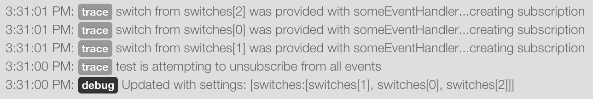
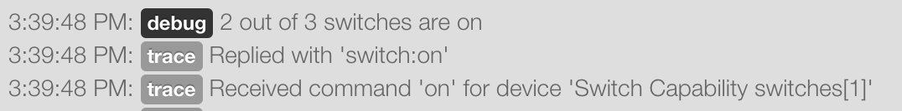
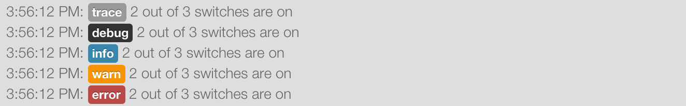

.. _logging:

Logging
=======

SmartApps and Device Handlers can log debugging messages using a built-in logger.
This is very useful for debugging purposes.

----

Overview
--------

There is an instance of a logger (``log``) injected into each SmartApp/Device Handler available for your use.
SmartThings does not currently support a line-by-line, step-through debugger tool; instead, we use logging to debug our custom code.
To view the logs, organized by app, click on the *Live Logging* link at the top of the IDE.

----

Logging Levels
--------------

The log instance currently supports these log levels, in decreasing order of severity:

===== ======================================= ====================================================================
Level Usage                                   Description
===== ======================================= ====================================================================
ERROR ``log.error(String, Throwable = null)`` Runtime errors or unexpected conditions.
WARN  ``log.warn(String, Throwable = null)``  Runtime situations that are unexpected, but not wrong.
                                              Can also be used to log use of deprecated APIs.
INFO  ``log.info(String, Throwable = null)``  Interesting runtime events. For example, turning a switch on or off.
DEBUG ``log.debug(String, Throwable = null)`` Detailed information about the flow of the SmartApp.
TRACE ``log.trace(String, Throwable = null)`` Most detailed information.
===== ======================================= ====================================================================

----

.. _logging_exceptions:

Logging Exceptions
------------------

All log methods accept a second, optional parameter of type ``Throwable``.
This is useful when catching an exception - you can pass the exception to any of the log methods, and it will include the exception message along with the line number that caused it.

Consider the following example that simply forces a ``NullPointerException`` by invoking a method on an object that does not exist:

*(Real applications should never attempt to handle possible NullPointerExceptions like this, of course. It is shown here only to illustrate how to pass the exception to the log methods.)*

.. code-block:: groovy

    def initialize() {
        try {
            // foo doesn't exist, causing exception
            foo.boom()
        } catch (e) {
            log.error("caught exception", e)
        }
    }

Executing the above code would result in the following message in Live Logging:

.. code-block:: bash

    12:42:03 PM: debug caught exception java.lang.NullPointerException: Cannot invoke method boom() on null object @ line 47

----

Logging Examples
----------------

Consider the following simple SmartApp which sets up some switch devices
and has an event handler method that will log how many switches are currently
turned on.

.. code-block:: groovy

    preferences {
        section {
            input "switches", "capability.switch", multiple: true
        }
    }

    def installed() {
        log.debug "Installed with settings: ${settings}"
        initialize()
    }

    def updated() {
        log.debug "Updated with settings: ${settings}"
        unsubscribe()
        initialize()
    }

    def initialize() {
        subscribe(switches, "switch", someEventHandler)
    }

    def someEventHandler(evt) {
        // returns a list of the values for all switches
        def currSwitches = switches.currentSwitch

        def onSwitches = currSwitches.findAll { switchVal ->
            switchVal == "on" ? true : false
        }

        log.debug "${onSwitches.size()} out of ${switches.size()} switches are on"
    }

Let's start the above SmartApp execution in the IDE. The first thing that
we can see are messages like this:

It is easy to see that the *debug* message came from the ``updated()`` method

.. code-block:: groovy

    def updated() {
        log.debug "Updated with settings: ${settings}"
        ...
    }

But where did the other *trace* messages come from?
These messages are coming from the SmartApp framework.
The SmartApp framework automatically will provide certain information like this during the execution of a SmartApp.
Try turning one of the switches on in the IDE.
You will see some more of these trace messages coming from the SmartApp framework.
You will also see the *debug* message in the ``someEventHandler()`` method.

.. code-block:: groovy

    log.debug "${onSwitches.size()} out of ${switches.size()} switches are on"

You should expect to see something like this in live logging.

.. note::
    The newest messages appear at the top of the live logs, not the bottom.

Lets see an example of how each one of the log levels look when output
to live logging.
In the ``someEventHandler()`` method, I've added the following log messages for this example.

.. code-block:: groovy

    log.error "${onSwitches.size()} out of ${switches.size()} switches are on"
    log.warn "${onSwitches.size()} out of ${switches.size()} switches are on"
    log.info "${onSwitches.size()} out of ${switches.size()} switches are on"
    log.debug "${onSwitches.size()} out of ${switches.size()} switches are on"
    log.trace "${onSwitches.size()} out of ${switches.size()} switches are on"

The output is nice and color coordinated so we can visually see the severity of
the various levels.

Finally, an example of how the logger can be used in a try/catch block instead
of getting the exception.

.. code-block:: groovy

    try {
        def x = "some string"
        x.somethingThatDoesNotExist
    } catch (all) {
        log.error("Something went horribly wrong!", all)
    }
